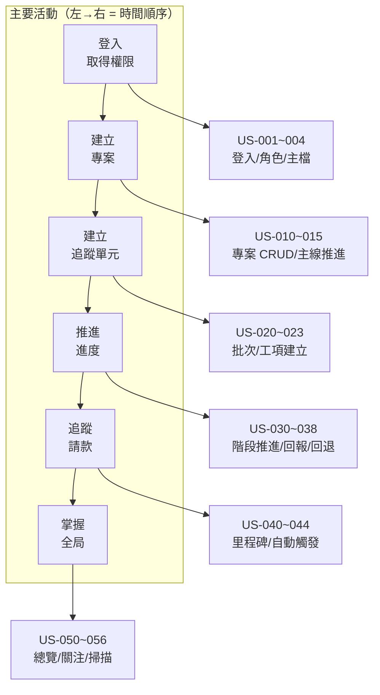

# 03 — User Story 與驗收條件

> 鐵正綱工程 內部管理系統
> 版本 v0.1｜2026-08-01｜狀態：**待確認**

---

## 1. 撰寫規範

### 1.1 Story 格式

```
US-xxx  身為 <角色>，我想要 <做什麼>，以便 <得到什麼價值>
```

每則 Story 都標註：

| 欄位 | 說明 |
|---|---|
| **優先序** | `M` Must（不做就上不了線）｜`S` Should（重要但可延後）｜`C` Could（有更好）｜`W` Won't（本階段不做） |
| **畫面** | **`既有`** 掛在現有畫面上 ／ **`新增`** 需要新畫面 ／ **`後台`** 用 Django Admin，不寫前端 |
| **裝置** | 📱 手機必須好用 ／ 💻 桌機為主 ／ 📱💻 兩者都要 |
| **點數** | 1／2／3／5／8（相對複雜度） |
| **UC** | 對應的 Use Case 編號 |

### 1.2 「畫面」欄位的意義（UI 節制原則）

> **預設答案是 `既有`。標成 `新增` 的必須說明理由。**

`後台` 是最省力的選項——主檔維護（客戶、廠商、使用者、部門、階段模板）**全部用 Django Admin**，
不寫任何前端畫面。這一項決定就省下約 2–3 週工時。

---

## 2. P1 畫面盤點

第一階段**只做 7 個畫面**：

| # | 畫面 | 回答什麼問題 | 導航 | 裝置 |
|---|---|---|---|---|
| S1 | 登入 | — | 無 | 📱💻 |
| S2 | **營運總覽** | 「公司現在整體狀況如何？」 | 分頁 1 | 💻（手機簡化） |
| S3 | **專案** | 「這個案子進行到哪？」 | 分頁 2 | 📱💻 |
| S4 | **追蹤看板** | 「東西現在卡在哪一站？」 | 分頁 3 | 💻（手機橫捲） |
| S5 | **請款收款** | 「錢收得回來嗎？」 | 分頁 4 | 💻 |
| S6 | **產線** | 「機台在忙什麼？」 | 分頁 5 | 💻 |
| S7 | **我的工作** | 「我今天該做什麼？」 | worker 首頁 | 📱 |
| — | 設定／主檔 | — | **Django Admin** | 💻 |

**導航分頁 = 5 個**（符合「≤ 6 個主分頁」原則）。
`worker` 角色只看到 S7，不顯示其他分頁。

---

## 3. Story Map（P1）



---

## 4. P1 User Stories

### Epic 1｜平台基礎與權限

---

#### US-001 登入系統

> 身為**任何員工**，我想要用帳號密碼登入，以便存取屬於我的資料。

| 優先序 | 畫面 | 裝置 | 點數 | UC |
|---|---|---|---|---|
| **M** | `新增` S1 登入 | 📱💻 | 3 | UC-M0-01 |

**驗收條件**

```gherkin
Scenario: 成功登入
  Given 我有一個啟用中的帳號
  When 我輸入正確的帳號密碼並送出
  Then 我被導向我的角色預設首頁
  And 系統記住我的登入狀態 8 小時

Scenario: 密碼錯誤
  Given 我有一個啟用中的帳號
  When 我輸入錯誤的密碼
  Then 我看到「帳號或密碼錯誤」
  And 訊息不透露究竟是帳號錯還是密碼錯

Scenario: 連續失敗鎖定
  Given 我已連續輸錯 5 次密碼
  When 我再次嘗試登入
  Then 我看到「嘗試次數過多，請 15 分鐘後再試」

Scenario: 現場人員的預設首頁
  Given 我的角色是「現場人員」
  When 我成功登入
  Then 我被導向「我的工作」，而不是「營運總覽」
```

---

#### US-002 依角色顯示導航

> 身為**現場師傅**，我不想看到跟我無關的分頁，以便不被資訊淹沒。

| 優先序 | 畫面 | 裝置 | 點數 | UC |
|---|---|---|---|---|
| **M** | `既有` 全域導航 | 📱💻 | 2 | UC-M0-01 |

```gherkin
Scenario: 現場人員只看到我的工作
  Given 我的角色是「現場人員」
  When 我進入系統
  Then 我只看到「我的工作」一個分頁
  And 我看不到請款收款、產線

Scenario: 廠長看不到財務數字
  Given 我的角色是「廠長」
  When 我進入營運總覽
  Then 我看不到「資金收攏率」與「應收未收」卡片
  And 我看得到「進行中專案數」「需要關注」「平均稼動」

Scenario: 後端才是權限的真相
  Given 我是現場人員
  When 我直接呼叫 /api/billing-milestones/ 這個 API
  Then 系統回傳 403，而不是資料
```

---

#### US-003 維護主檔資料

> 身為**系統管理員**，我想要維護客戶、廠商、部門、使用者，以便系統有正確的基礎資料。

| 優先序 | 畫面 | 裝置 | 點數 | UC |
|---|---|---|---|---|
| **M** | **`後台`** Django Admin | 💻 | 3 | UC-M0-02/03/05/06 |

> 💡 **不寫前端畫面**。Django Admin 提供列表、搜尋、篩選、新增、編輯、刪除、批次操作，全部免費。

```gherkin
Scenario: 新增客戶
  Given 我是管理員並登入 Django Admin
  When 我新增一筆客戶「固越企業」
  Then 該客戶可在前端建立專案時被選取

Scenario: 廠商分類
  Given 我在新增廠商
  When 我勾選類型「外包加工」與「運輸行」
  Then 這家廠商同時出現在批次的「協力廠」與「運輸廠商」選單

Scenario: 停用而非刪除
  Given 有一家廠商已被 12 筆資料引用
  When 我嘗試刪除它
  Then 系統阻擋並提示「已被 12 筆資料使用，請改為停用」
```

---

#### US-004 設定階段模板

> 身為**系統管理員**，我想要設定各類型的階段流程，以便系統符合我們實際的作業方式。

| 優先序 | 畫面 | 裝置 | 點數 | UC |
|---|---|---|---|---|
| **M** | **`後台`** Django Admin | 💻 | 5 | UC-M0-04 |

```gherkin
Scenario: 建立鋼構批次模板
  Given 我在 Django Admin 的階段模板頁
  When 我建立模板「鋼構構件批次」並依序加入 8 個階段
  And 我為「進場簽收」勾選「觸發請款」與「需簽收」
  And 我為「表面處理」勾選「需填協力廠」
  And 我為「置料區」勾選「等待中」
  Then 新建立的鋼構批次會套用這個流程

Scenario: 保護使用中的階段
  Given 「加工」階段目前有 5 筆批次
  When 我嘗試刪除「加工」階段
  Then 系統阻擋並提示「有 5 筆資料正使用此階段，請改為停用」

Scenario: 重複的請款觸發點
  Given 我已為「進場簽收」勾選觸發請款
  When 我再為「安裝」也勾選觸發請款
  Then 系統顯示警告「一個模板建議只有一個請款觸發點」
  But 仍允許我儲存
```

---

#### US-005 檢視稽核軌跡

> 身為**經營者**，我想要知道某筆資料是誰、什麼時候改的，以便釐清責任。

| 優先序 | 畫面 | 裝置 | 點數 | UC |
|---|---|---|---|---|
| **S** | **`後台`** Django Admin | 💻 | 2 | UC-M0-08 |

```gherkin
Scenario: 查詢專案的修改歷史
  Given 「固越企業總部案」的合約金額被改過
  When 我在 Django Admin 檢視該專案的 History
  Then 我看到每次修改的時間、修改者、修改前後的值
```

---

### Epic 2｜專案管理

---

#### US-010 建立專案

> 身為**專案負責人**，我想要用最少的欄位快速建立一個案子，以便馬上開始追蹤。

| 優先序 | 畫面 | 裝置 | 點數 | UC |
|---|---|---|---|---|
| **M** | `新增` S3 專案（表單） | 📱💻 | 3 | UC-M1-01 |

```gherkin
Scenario: 只填必填欄位就能建立
  Given 我在專案清單畫面
  When 我點「新增專案」
  Then 表單只顯示 7 個必填欄位：案名、客戶、專案類型、合約總額、負責人、開工日、預計完工
  And 其餘欄位收在「更多設定」中且預設收合

Scenario: 依類型自動套用階段模板
  Given 我在新增專案
  When 我選擇專案類型「鋼構」
  Then 系統自動套用「鋼構構件批次」作為追蹤單元的預設模板

Scenario: 混合型專案
  Given 我建立一個類型為「混合」的專案
  When 我要新增追蹤單元
  Then 我可以選擇建立「構件批次」或「工項」

Scenario: 自動編號
  Given 今年已有 14 個專案
  When 我建立第 15 個
  Then 系統自動給予編號 P-2026-015
  And 我不能修改這個編號

Scenario: 投標中金額未定
  Given 我在建立一個還在投標的案子
  When 我把合約總額留空
  Then 系統允許儲存
  And 專案卡片顯示「金額待確認」
```

---

#### US-011 檢視專案清單

> 身為**專案負責人**，我想要看到所有案子的狀態，以便知道哪個需要處理。

| 優先序 | 畫面 | 裝置 | 點數 | UC |
|---|---|---|---|---|
| **M** | `新增` S3 專案 | 📱💻 | 5 | UC-M1-06 |

```gherkin
Scenario: 專案卡片顯示的資訊
  Given 我在專案清單
  Then 每張卡片顯示：案名、狀態燈號、客戶、合約額、負責人
  And 顯示 7 階段主線進度條，目前階段被標示出來
  And 顯示追蹤單元數、已收款金額與百分比、預計完工日

Scenario: 逾期用顏色標示
  Given 有一個專案的預計完工日已過但尚未結案
  Then 該專案的完工日顯示為紅色

Scenario: 可見範圍
  Given 我是專案負責人，負責 2 個案子
  When 我檢視專案清單
  Then 我看到全部 5 個案子
  And 我負責的 2 個顯示完整資訊
  And 另外 3 個只顯示案名、客戶、狀態，不顯示金額

Scenario: 手機版單欄
  Given 我用手機開啟專案清單
  Then 卡片以單欄堆疊顯示
  And 頁面沒有橫向捲軸
```

---

#### US-012 推進專案主線階段

> 身為**專案負責人**，我想要把案子推進到下一階段，以便反映真實進度。

| 優先序 | 畫面 | 裝置 | 點數 | UC |
|---|---|---|---|---|
| **M** | `既有` S3 專案卡片 | 📱💻 | 3 | UC-M1-03 |

```gherkin
Scenario: 推進一階
  Given 「固越企業總部案」目前在「報價」
  When 我點「推進主線」並確認
  Then 專案階段變成「採購備料」
  And 系統記錄一筆歷程：誰、何時、報價→採購備料
  And 活動動態出現「固越企業總部案 推進至 採購備料」

Scenario: 不能跳階
  Given 專案在「報價」階段
  Then 我無法直接推進到「施工中」
  And 我一次只能推進一階

Scenario: 退回必填原因
  Given 專案在「採購備料」
  When 我點退回按鈕
  Then 系統要求我填寫原因
  And 原因空白時無法送出

Scenario: 結案前的檢查
  Given 專案有 2 筆里程碑尚未收款，共 NT$ 1,200 萬
  When 我要推進到「結案」
  Then 系統警告「尚有 2 筆款項未收，共 1,200 萬，確定結案？」
  And 我可以選擇繼續或取消

Scenario: 最後階段
  Given 專案已在「結案」
  Then 「推進主線」按鈕是停用狀態
```

---

#### US-013 維護專案合約與文件資訊

> 身為**專案負責人**，我想要把合約條款、報價資訊、圖紙連結記在專案上，以便隨時查得到。

| 優先序 | 畫面 | 裝置 | 點數 | UC |
|---|---|---|---|---|
| **S** | `既有` S3 專案展開層 | 💻 | 2 | UC-M1-02 |

```gherkin
Scenario: 展開才看得到
  Given 專案卡片預設是收合的
  When 我點「展開」
  Then 我看到合約內容、報價資訊、文件連結三個區塊
  And 沒有填寫的區塊不顯示（不顯示空白欄位）

Scenario: P1 只存文字與連結
  Given 我要記錄圖紙位置
  Then 我可以貼上雲端連結
  And P1 階段不支援上傳實體 PDF 檔（P2 再做）
```

---

#### US-014 建立期別／標段

> 身為**專案負責人**，我想要把大案子分成幾期，以便分期請款與分期追蹤。

| 優先序 | 畫面 | 裝置 | 點數 | UC |
|---|---|---|---|---|
| **S** | **`後台`** Django Admin | 💻 | 2 | UC-M1-04 |

```gherkin
Scenario: 建立期別
  Given 「固越企業總部案」分三期施工
  When 我建立期別「第一期」「第二期」「第三期」
  Then 建立追蹤單元時可以指定所屬期別
  And 請款里程碑也可以指定所屬期別

Scenario: 期別是選填
  Given 一個小案子不需要分期
  When 我建立追蹤單元而不指定期別
  Then 系統允許，期別欄位留空
```

---

### Epic 3｜進度追蹤（核心）

---

#### US-020 建立構件批次

> 身為**廠長**，我想要為鋼構案建立一批要生產的構件，以便追蹤它走到哪一站。

| 優先序 | 畫面 | 裝置 | 點數 | UC |
|---|---|---|---|---|
| **M** | `既有` S3 專案展開層 ＋ S4 看板 | 💻 | 3 | UC-M2-01 |

```gherkin
Scenario: 建立批次
  Given 我在「固越企業總部案」的展開層
  When 我點「新增批次」
  Then 表單顯示必填：批次名稱、總數量、單位、負責人
  And 單位可選：支／組／噸／片／件
  When 我儲存
  Then 批次出現在看板的「進料驗收」欄
  And 完成數量預設為 0

Scenario: 選外包才顯示協力廠欄位
  Given 我在新增批次表單
  When 作業方式選「鐵正綱自行」
  Then 協力廠、進廠日、出廠日欄位完全不顯示
  When 我改選「外包協力廠」
  Then 這三個欄位才展開出現

Scenario: 數量驗證
  When 我把總數量填 0 或負數
  Then 系統阻擋並提示「總數量必須大於 0」
```

---

#### US-021 建立土建工項

> 身為**工地主任**，我想要建立一個施工項目並指定分包商，以便追蹤現場進度。

| 優先序 | 畫面 | 裝置 | 點數 | UC |
|---|---|---|---|---|
| **M** | `既有` S3 專案展開層 | 📱💻 | 3 | UC-M2-02 |

```gherkin
Scenario: 建立工項
  Given 我在一個土建專案的展開層
  When 我點「新增工項」
  Then 表單顯示必填：工項名稱、分包商、預計起迄日
  And 分包商選單只列出類型含「分包商」的廠商
  When 我儲存
  Then 工項建立，完成百分比為 0%，階段為「放樣定位」

Scenario: 自行施作
  Given 某個工項是自己做不發包
  When 我在分包商選「自行施作」
  Then 系統允許儲存

Scenario: 進度表達方式不同
  Given 我檢視一個工項
  Then 進度顯示為百分比（如 65%）
  And 不顯示「完成數量／總數量」
```

---

#### US-030 推進追蹤單元階段 ★

> 身為**廠長／工地主任／師傅**，我想要一鍵把批次推到下一站，以便讓大家知道現在的狀態。

| 優先序 | 畫面 | 裝置 | 點數 | UC |
|---|---|---|---|---|
| **M** | `既有` S4 看板 ＋ S7 我的工作 | **📱**💻 | 5 | UC-M2-03 |

> 💡 **這是全系統被點擊最多次的按鈕，也是所有資料的來源。手機上必須單手可操作。**

```gherkin
Scenario: 推進一階
  Given 「第一期-1F鋼柱」目前在「品檢」
  When 我點「下一步」並確認
  Then 該批次移動到「置料區」欄
  And 系統記錄歷程：誰、何時、品檢→置料區、備註
  And 活動動態出現「固越案·第一期-1F鋼柱 進入 置料區」

Scenario: 觸發請款
  Given 「第一期-1F鋼柱」在「安裝」的前一站「出貨進場」
  And 「進場簽收」階段有「觸發請款」與「需簽收」旗標
  And 專案的「第一期請款」里程碑目前是「未到」
  When 我把批次推進到「出貨進場」
  Then 「第一期請款」自動變成「可請款」
  And 所有會計角色收到站內通知

Scenario: 進入外包階段提示補資料
  Given 批次要進入「表面處理」（有「需填協力廠」旗標）
  When 我推進到該階段但沒填協力廠
  Then 系統仍允許推進
  But 該批次立即出現在「需要關注」，原因為「外包資料未填」

Scenario: 師傅只能動自己的
  Given 我是現場人員
  And 「第二期-2F鋼柱」不是指派給我的
  When 我在系統中尋找該批次
  Then 我根本看不到它
  And 若我直接呼叫 API 嘗試推進，系統回傳 403

Scenario: 失敗不留爛帳
  Given 資料庫在寫入歷程時失敗
  Then 階段變更也一併回滾
  And 我看到「操作失敗，請重試」
  And 絕不會出現「階段變了但沒有歷程」的狀況

Scenario: 手機可單手操作
  Given 我用手機檢視「我的工作」
  Then 「下一步」按鈕的觸控區域至少 44×44 像素
  And 從點擊到畫面更新在 1 秒內完成
```

---

#### US-031 回報數量進度

> 身為**現場師傅**，我想要快速回報今天做了幾支，以便不用寫紙本日報。

| 優先序 | 畫面 | 裝置 | 點數 | UC |
|---|---|---|---|---|
| **M** | `既有` S7 我的工作 | **📱** | 3 | UC-M2-05 |

```gherkin
Scenario: 用快速按鈕回報
  Given 「第一期-1F鋼柱」目前完成 48/80 支
  When 我在手機上點該批次
  Then 我看到大字顯示「48 / 80 支」
  And 我看到快速按鈕 +1、+5、+10
  When 我點兩次 +5
  Then 完成數變成 58，進度條更新為 73%

Scenario: 手動輸入
  When 我點數字直接輸入
  Then 手機自動彈出數字鍵盤（不是全鍵盤）

Scenario: 不能超過總數
  Given 總數量是 80
  When 我嘗試輸入 85
  Then 系統阻擋並提示「已完成數量不可超過總數量」

Scenario: 往回改要說明
  Given 目前完成數是 58
  When 我改成 50
  Then 系統要求填寫備註
  And 備註空白時無法送出

Scenario: 做完提示推進
  When 我把完成數填到 80（100%）
  Then 系統提示「已達 100%，是否推進至下一階段？」
  And 我可以選擇推進或稍後

Scenario: 進度與階段是兩件事
  Given 批次在「加工」階段完成 60%
  Then 系統不會自動推進階段
  And 我可以停留在「加工」階段繼續累積數量
```

---

#### US-032 回報工項百分比

> 身為**工地主任**，我想要回報工項完成幾成，以便業主與公司知道現場進度。

| 優先序 | 畫面 | 裝置 | 點數 | UC |
|---|---|---|---|---|
| **M** | `既有` S7 我的工作 | **📱** | 2 | UC-M2-05 |

```gherkin
Scenario: 用滑桿回報
  Given 「B1 結構體」目前完成 40%
  When 我在手機上拖動滑桿到 65%
  Then 進度更新為 65%
  And 系統記錄歷程

Scenario: 百分比上限
  When 我嘗試輸入超過 100
  Then 系統阻擋
```

---

#### US-033 回退階段並記錄原因

> 身為**品保**，我想要把不合格的批次退回重工並記錄原因，以便日後統計品質成本。

| 優先序 | 畫面 | 裝置 | 點數 | UC |
|---|---|---|---|---|
| **M** | `既有` S4 看板 | 📱💻 | 3 | UC-M2-04 |

```gherkin
Scenario: 退回必須選原因類別
  Given 「桁架 B 區」在「品檢」階段檢驗不合格
  When 我點退回按鈕
  Then 系統要求我選擇原因類別
  And 類別包含：品檢不合格／尺寸錯誤／材料問題／施工缺失／業主變更／其他
  And 我必須另外填寫文字說明

Scenario: 退回後狀態改變
  When 我完成退回
  Then 批次回到「加工」階段
  And 批次狀態自動變成「注意」
  And 專案負責人收到通知
  And 歷程中這筆被標記為「回退」

Scenario: 反覆退回升級警示
  Given 「桁架 B 區」已經被退回過 1 次
  When 我第 2 次退回它
  Then 批次狀態自動升級為「延誤」

Scenario: 歷程不被覆蓋
  Given 批次原本有 3 筆歷程
  When 我退回一階
  Then 歷程變成 4 筆（新增一筆方向相反的）
  And 原本的 3 筆完全沒有被修改
```

---

#### US-034 檢視階段看板

> 身為**廠長**，我想要一眼看出東西卡在哪一站，以便決定今天先處理什麼。

| 優先序 | 畫面 | 裝置 | 點數 | UC |
|---|---|---|---|---|
| **M** | `新增` S4 追蹤看板 | 💻（📱橫捲） | 8 | UC-M2-07 |

```gherkin
Scenario: 看板依階段分欄
  Given 我進入追蹤看板
  Then 每個階段是一欄，依模板順序由左至右
  And 每欄標題顯示該階段的批次數量
  And 觸發請款的階段標題有錢幣圖示
  And 需外包的階段標題有貨車圖示

Scenario: 卡片資訊
  Then 每張卡片顯示：批次名稱、所屬專案、進度條與數量、作業方式、狀態燈號、負責人
  And 卡片底部有「←」與「下一步」兩個按鈕

Scenario: 依專案篩選
  Given 看板顯示全部批次
  When 我選擇篩選「固越企業總部案」
  Then 只顯示該案的批次

Scenario: 空欄位
  Given 「表面處理」階段目前沒有批次
  Then 該欄顯示一個虛線框與「—」，不是空白

Scenario: 手機橫向捲動
  Given 我用手機檢視看板
  Then 我可以左右滑動瀏覽各階段欄位
  And 每欄寬度固定，內容不被壓縮到無法閱讀
```

---

#### US-035 追蹤外包協力廠

> 身為**廠長**，我想要知道送出去的料什麼時候回來，以便不會有東西在外面失聯。

| 優先序 | 畫面 | 裝置 | 點數 | UC |
|---|---|---|---|---|
| **M** | `既有` S4 看板卡片＋表單 | 💻 | 3 | UC-M2-06 |

```gherkin
Scenario: 卡片顯示外包資訊
  Given 「第一期-樓板鋼樑」外包給「全興噴砂廠」，06/05 進廠
  Then 卡片上顯示「外包·全興噴砂廠 · 進 06-05」

Scenario: 逾期未回廠自動示警
  Given 某批次的預計出廠日是昨天
  And 實際出廠日仍空白
  When 每日掃描執行
  Then 該批次狀態變成「注意」
  And 出現在需要關注清單，原因為「外包逾期未回廠」

Scenario: 逾期超過 7 天升級
  Given 預計出廠日已過 8 天且仍未回廠
  When 每日掃描執行
  Then 狀態升級為「延誤」
  And 廠長與專案負責人收到通知
```

---

#### US-036 檢視階段異動歷程

> 身為**專案負責人**，我想要看到這批東西過去發生了什麼，以便回答客戶的質疑。

| 優先序 | 畫面 | 裝置 | 點數 | UC |
|---|---|---|---|---|
| **M** | `既有` S4 卡片點入的抽屜 | 📱💻 | 3 | UC-M2-08 |

```gherkin
Scenario: 時間軸顯示
  Given 「第一期-1F鋼柱」經過 6 次階段異動
  When 我點卡片查看歷程
  Then 我看到由新到舊的時間軸
  And 每筆顯示：時間、操作者、從哪個階段到哪個階段、備註
  And 回退的紀錄用不同顏色標示

Scenario: 歷程不可修改
  Then 歷程沒有編輯與刪除按鈕
  And 即使是管理員也不能從前端修改歷程
```

---

#### US-037 檢視「我的工作」

> 身為**現場師傅**，我想要打開就看到今天要做的事，以便不用在一堆資料裡找。

| 優先序 | 畫面 | 裝置 | 點數 | UC |
|---|---|---|---|---|
| **M** | `新增` S7 我的工作 | **📱** | 5 | UC-M2-09 |

```gherkin
Scenario: 只看到自己的
  Given 系統中有 30 個追蹤單元，其中 4 個指派給我
  When 我開啟「我的工作」
  Then 我只看到那 4 個

Scenario: 依急迫性排序
  Given 我的 4 個單元中，1 個延誤、1 個注意、2 個正常
  Then 延誤的排最上面，然後是注意，最後是正常

Scenario: 卡片只有兩個操作
  Then 每張卡片只有「回報進度」與「下一步」兩個按鈕
  And 沒有編輯、刪除等其他操作

Scenario: 看不到金額
  Then 卡片上完全不顯示任何金額資訊

Scenario: 沒有工作時
  Given 目前沒有任何單元指派給我
  Then 我看到「目前沒有指派給你的工作」
  And 不顯示空白的表格或列表
```

---

#### US-038 維護產線狀態

> 身為**廠長**，我想要記錄每條產線在做什麼，以便知道產能狀況。

| 優先序 | 畫面 | 裝置 | 點數 | UC |
|---|---|---|---|---|
| **S** | `新增` S6 產線 | 💻 | 3 | UC-M2-10 |

```gherkin
Scenario: 產線卡片
  Given 有 5 條產線
  Then 每張卡片顯示：產線名稱、狀態、稼動率進度條、當前工單、今日產出
  And 狀態可為：運轉中／換線中／維修／閒置
  And 卡片頂端色條依狀態變色

Scenario: 稼動率顏色分級
  Given 某產線稼動率 85%
  Then 進度條顯示綠色（≥75%）
  Given 另一產線稼動率 62%
  Then 進度條顯示黃色（55–74%）
  Given 另一產線稼動率 45%
  Then 進度條顯示紅色（<55%）

Scenario: P1 是人工填寫
  Then 稼動率由廠長手動輸入
  And P3 階段才改為由報工資料自動計算 OEE
```

---

### Epic 4｜請款追蹤

---

#### US-040 維護請款里程碑

> 身為**專案負責人**，我想要依合約設定分期請款條件，以便系統能在對的時機提醒。

| 優先序 | 畫面 | 裝置 | 點數 | UC |
|---|---|---|---|---|
| **M** | `新增` S5 請款收款 | 💻 | 3 | UC-M3-01 |

```gherkin
Scenario: 建立里程碑
  Given 「固越企業總部案」合約 8,000 萬，請款條件 30/30/30/10
  When 我建立 4 筆里程碑
  Then 每筆填寫：名稱、觸發條件、百分比
  And 系統自動計算金額（8,000 萬 × 30% = 2,400 萬）
  And 金額欄位是唯讀的，不能手改

Scenario: 百分比總和檢查
  Given 我已建立的里程碑百分比加總為 90%
  Then 專案畫面顯示警告「請款比例總和 90%，尚缺 10%」

Scenario: 綁定期別
  Given 專案有三個期別
  When 我建立「第一期請款」
  Then 我可以指定它對應「第一期」
  And 第一期的批次出貨時，只會觸發這一筆
```

---

#### US-041 自動觸發可請款 ★

> 身為**會計**，我想要在構件出貨時自動被通知可以請款了，以便不會漏掉請款時機。

| 優先序 | 畫面 | 裝置 | 點數 | UC |
|---|---|---|---|---|
| **M** | `既有` 通知 ＋ S5 | 📱💻 | 5 | UC-M3-02 |

> 💡 **這則 Story 直接解決「出貨後隔數週才想起請款」的現金流問題。**

```gherkin
Scenario: 自動轉為可請款
  Given 「第一期請款」目前狀態是「未到」
  When 「第一期-1F鋼柱」被推進到「出貨進場」
  Then 「第一期請款」狀態自動變成「可請款」
  And 所有會計角色收到站內通知
  And 活動動態記錄這件事

Scenario: 不重複觸發
  Given 「第一期請款」已經是「已請款」
  When 同期別的另一批構件也推進到「出貨進場」
  Then 該里程碑狀態不變
  And 不再發送通知

Scenario: 找不到對應里程碑
  Given 某專案完全沒設定請款里程碑
  When 有批次推進到「出貨進場」
  Then 階段推進仍然成功
  And 系統在需要關注清單顯示「已出貨但未設定請款里程碑」

Scenario: 觸發是建議不是執行
  Then 系統只把狀態改成「可請款」
  And 系統不會自動開立請款單
  And 仍需會計人工確認後才轉「已請款」
```

---

#### US-042 轉換里程碑狀態

> 身為**會計**，我想要記錄請款與收款的實際日期，以便掌握現金流。

| 優先序 | 畫面 | 裝置 | 點數 | UC |
|---|---|---|---|---|
| **M** | `既有` S5 請款收款 | 💻 | 3 | UC-M3-03 |

```gherkin
Scenario: 轉為已請款
  Given 「第一期請款」狀態是「可請款」
  When 我點狀態徽章並選「已請款」
  Then 系統要求填寫請款日，預設帶入今天
  When 我確認
  Then 狀態變成「已請款」

Scenario: 日期邏輯驗證
  Given 請款日是 2026-06-08
  When 我輸入收款日 2026-06-01
  Then 系統阻擋並提示「收款日不可早於請款日」

Scenario: 往回改要說明
  Given 狀態是「已請款」
  When 我要改回「可請款」
  Then 系統要求填寫原因
  And 專案負責人收到通知

Scenario: 即時反映到儀表板
  When 我把某筆 2,400 萬的里程碑標記為「已收款」
  Then 營運總覽的「資金收攏率」立即重新計算
  And 「應收未收」金額減少 2,400 萬
```

---

#### US-043 檢視收款進度

> 身為**經營者**，我想要一眼看出每個案子收了多少錢，以便掌握資金狀況。

| 優先序 | 畫面 | 裝置 | 點數 | UC |
|---|---|---|---|---|
| **M** | `既有` S2 總覽 ＋ S5 | 💻 | 3 | — |

```gherkin
Scenario: 各案收款進度條
  Given 我在營運總覽
  Then 我看到每個專案一條進度條
  And 標示「已收 X 萬 / 合約 Y 萬 · Z%」
  And 收攏率 ≥60% 顯示綠色、30–59% 黃色、<30% 紅色

Scenario: 整體收攏進度
  Given 我在請款收款畫面
  Then 我看到一條堆疊進度條
  And 綠色 = 已入帳、黃色 = 已請款/可請款待收、灰色 = 未到期
```

---

### Epic 5｜儀表板與關注清單

---

#### US-050 檢視營運總覽

> 身為**經營者**，我想要一個畫面看完公司現況，以便快速判斷該關心什麼。

| 優先序 | 畫面 | 裝置 | 點數 | UC |
|---|---|---|---|---|
| **M** | `新增` S2 營運總覽 | 💻（📱簡化） | 8 | UC-M12-01 |

```gherkin
Scenario: 五張 KPI 卡片
  Then 我看到：進行中專案數、需要關注數、資金收攏率、應收未收、平均稼動率
  And 每個數字用顏色反映好壞（綠/黃/紅）

Scenario: 一頁不超過 7 個區塊
  Then 整個頁面的資訊區塊數量不超過 7 個

Scenario: 數字可下鑽
  When 我點「需要關注 5 項」
  Then 我被帶到需要關注的完整清單

Scenario: 角色差異
  Given 我的角色是廠長
  Then 我看不到「資金收攏率」與「應收未收」兩張卡片

Scenario: 首屏效能
  Then 頁面在 2 秒內完成首次渲染
  And 所有資料由單一 API 提供，不發出 5 個以上的請求

Scenario: 手機版
  Given 我用手機檢視
  Then KPI 卡片改為 2 欄排列
  And 階段分布圖可橫向捲動
  And 頁面沒有橫向捲軸
```

---

#### US-051 檢視需要關注清單

> 身為**任何管理者**，我想要問題自己浮出來，以便不用靠記憶追蹤。

| 優先序 | 畫面 | 裝置 | 點數 | UC |
|---|---|---|---|---|
| **M** | `既有` S2 總覽區塊＋下鑽 | 📱💻 | 5 | UC-M12-02 |

```gherkin
Scenario: 關注項目來源
  Then 清單包含以下來源的項目：
    | 來源 | 判定 |
    | 專案狀態異常 | 狀態非正常 |
    | 追蹤單元狀態異常 | 狀態非正常 |
    | 專案逾期 | 預計完工日已過且未結案 |
    | 外包逾期未回廠 | 有預計出廠日但實際出廠日空白且已過期 |
    | 停滯過久 | 同一階段停留超過設定天數 |
    | 請款逾時 | 可請款>7天未請款，或已請款>60天未收款 |
    | 出貨未設里程碑 | 已觸發請款但找不到對應里程碑 |

Scenario: 依嚴重度排序
  Then 延誤的排在注意的前面

Scenario: 一鍵跳轉
  When 我點清單中任何一筆
  Then 我直接跳到該項目的詳細位置

Scenario: 依可見範圍過濾
  Given 我是工地主任，負責 A 工地
  Then 我只看到 A 工地相關的關注項目

Scenario: 沒問題時
  Given 目前沒有任何異常
  Then 顯示「一切正常 ✓」
```

---

#### US-052 檢視最近動態

> 身為**專案負責人**，我想要知道最近發生了什麼，以便掌握團隊動向。

| 優先序 | 畫面 | 裝置 | 點數 | UC |
|---|---|---|---|---|
| **S** | `既有` S2 總覽區塊 | 💻 | 2 | — |

```gherkin
Scenario: 動態顯示
  Then 顯示最近 7 筆動態
  And 每筆顯示描述文字與相對時間（剛剛／N 分鐘前／N 小時前／日期）

Scenario: 動態來源
  Then 動態包含：專案階段推進、追蹤單元階段異動、請款狀態變更、資料新增與刪除
```

---

### Epic 6｜自動化與排程

---

#### US-060 每日掃描逾期與異常

> 身為**系統**，我要每天自動檢查一次，以便該提醒的事不會被忘記。

| 優先序 | 畫面 | 裝置 | 點數 | UC |
|---|---|---|---|---|
| **M** | 無介面（cron） | — | 5 | UC-M12-03 |

```gherkin
Scenario: 每日執行
  Given cron 設定在每個工作日 08:00
  When 排程觸發 python manage.py scan_alerts
  Then 系統掃描所有逾期與異常條件
  And 更新對應項目的狀態
  And 建立站內通知給相關角色

Scenario: 週末不執行
  Given 今天是星期六
  When cron 觸發
  Then 系統不發送任何通知

Scenario: 避免通知疲勞
  Given 某批次已連續 5 天處於逾期狀態
  And 系統前天已針對它發過通知
  When 今天掃描再次命中
  Then 系統不重複發送（每項目每 3 天最多一次）

Scenario: 冪等性
  Given 我在同一天執行了兩次 scan_alerts
  Then 不會產生重複的通知或重複的狀態變更

Scenario: 記憶體限制
  Given 系統中有 10,000 筆追蹤單元
  When 掃描執行
  Then 使用 queryset.iterator() 分批處理
  And 程序記憶體用量不超過 200MB
  And 執行時間不超過 60 秒
```

---

#### US-061 站內通知

> 身為**會計**，我想要在系統裡看到該我處理的提醒，以便不漏掉重要的事。

| 優先序 | 畫面 | 裝置 | 點數 | UC |
|---|---|---|---|---|
| **M** | `既有` 全域頂欄鈴鐺 | 📱💻 | 3 | UC-M0-09 |

```gherkin
Scenario: 未讀提示
  Given 我有 3 則未讀通知
  Then 頂欄鈴鐺顯示紅點與數字 3

Scenario: 點擊跳轉
  When 我點某則「第一期請款 已達可請款條件」
  Then 我被帶到該里程碑的位置
  And 該通知標記為已讀

Scenario: P1 不做即時推播
  Then 通知只在使用者開啟頁面時載入
  And 不使用 WebSocket 或推播服務
```

---

## 5. P1 Story 統計

| Epic | Story 數 | 總點數 | 需要新畫面 | 用 Django Admin |
|---|---:|---:|---:|---:|
| E1 平台基礎與權限 | 5 | 15 | 1 | 3 |
| E2 專案管理 | 5 | 16 | 2 | 1 |
| E3 進度追蹤 | 9 | 35 | 2 | 0 |
| E4 請款追蹤 | 4 | 14 | 1 | 0 |
| E5 儀表板 | 3 | 15 | 1 | 0 |
| E6 自動化 | 2 | 8 | 0 | 0 |
| **合計** | **28** | **103** | **7** | **4** |

**103 點 ≈ 6–8 週**（單人開發，含測試與部署）。

> **7 個新畫面**符合 §2 的畫面盤點。**4 則 Story 完全用 Django Admin 解決**，這是最大的省力來源。

---

## 6. P2–P4 Story 摘要

<details>
<summary>展開後續階段的 Epic 清單</summary>

### P2（約 6–8 週）

| Epic | 重點 Story | 新畫面 |
|---|---|---|
| E7 採購 | 請購→詢比議→採購單→收料、7.5 萬門檻提醒、供應商五維度評分 | 3 |
| E8 庫存 | 入出庫、批號材證追溯、呆滯料 30/90/180/365 分級、週轉率 | 3 |
| E9 財務 | 請款單、應收應付、費用報銷、現金流預測、專案損益 | 4 |
| E10 成本 KPI | 完全成本核算、標準/實際差異分析、六階段成本地圖、KPI 儀表板 | 3 |

### P3（約 8–10 週）

| Epic | 重點 Story | 新畫面 |
|---|---|---|
| E11 生產 | 工單、途程、派工、報工、換線 SMED 紀錄、OEE 採集與計算 | 5 |
| E12 品質 | IQC/IPQC/OQC、不良單、重工報廢、PAF 品質成本、1-10-100 分析 | 4 |
| E13 交付 | 出貨單、裝載率、OTD 準時率、簽收 | 3 |

### P4（約 8–10 週）

| Epic | 重點 Story | 新畫面 |
|---|---|---|
| E14 人力薪資 | 排班派駐、出勤請假加班、證照到期、勞健保勞退所得稅計算 | 5 |
| E15 行政簽核 | 表單設計器、核決權限表、簽核與退回、代理人 | 3 |
| E16 SOP | SOP 編輯、版本控管、掛勾流程節點、閱讀確認 | 2 |

</details>

---

## 7. 本文件的確認方式

- [ ] §2 七個畫面夠用嗎？有沒有你覺得少了的
- [ ] §4 US-003/004/014 決定用 **Django Admin** 而不做前端——你能接受管理員用兩套介面嗎？
- [ ] US-030 推進階段：實務上誰按這個按鈕？師傅自己還是班長代填？
- [ ] US-031 快速按鈕 `+1/+5/+10` 的級距合理嗎？
- [ ] US-035 外包逾期幾天算「注意」、幾天算「延誤」？（目前設 1 天／7 天）
- [ ] US-042 已請款超過幾天未收款算逾期？（目前設 60 天）
- [ ] US-060 每日 08:00 掃描的時間合適嗎？

---

## 相關文件

`02_Use_Case規格.md`｜`04_資料庫規劃.md`｜`08_UI設計原則.md`
