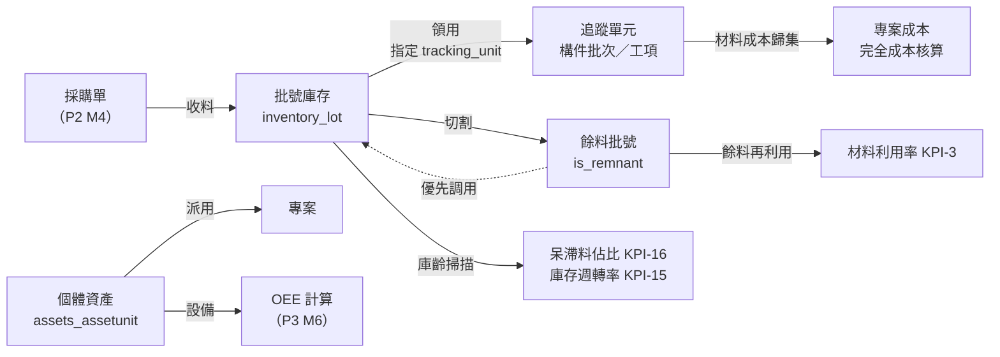

# 09 — 資產與庫存管理

> 鐵正綱工程 內部管理系統｜模組 M5
> 版本 v0.1｜2026-08-01｜狀態：**待確認**

---

## 1. 這個模組要回答的問題

> **「公司現在到底有什麼東西？在哪裡？什麼狀態？要用在哪個案子？」**

一個畫面同時回答這四件事。目前這些資訊分散在倉管的 Excel、廠長的記憶、工地主任的 LINE 訊息裡。

### 1.1 具體要能查到的事

| 問題 | 例子 |
|---|---|
| 有沒有這個料？ | 「6mm 的 SS400 鋼板還有幾張？」 |
| **規格是什麼？** | 「H400×200×8×13，長 6 米，單支重 331kg」 |
| 在哪裡？ | 「A 倉 3 排 2 層」「已送全興噴砂廠」「在南投工地」 |
| 什麼狀態？ | 「待驗收」「可用」「已預留給固越案」「品質凍結」 |
| 要用在哪個案子？ | 「這批已配給固越第二期」 |
| 工具在誰手上？ | 「3 號電焊機在陳師傅那裡，用在彰化案」 |
| 有沒有餘料可用？ | 「有沒有長度 ≥1200mm 的 6mm 鋼板料頭？」 |
| 什麼東西該處理了？ | 「這批料放 200 天沒動」「扭力扳手該校驗了」 |

---

## 2. 核心設計：一張主檔，兩種追蹤方式

公司的「東西」在管理上分成兩種，硬要用同一套流程管會很痛苦：

```
                     公司所有物品（Item 主檔）
                              │
          ┌───────────────────┴───────────────────┐
          ▼                                       ▼
   【數量型 quantity】                     【個體型 individual】
   可分割、會消耗、用批號管                唯一、會歸還、有財產編號
   問的是「還剩多少」                      問的是「在誰手上」
          │                                       │
   ┌──────┴──────┐                        ┌──────┴──────┐
   ▼             ▼                        ▼             ▼
 建材          零件耗材                  工具          設備
 鋼板/型鋼    螺栓/焊條/砂輪片          電焊機/扳手   雷射切割機/天車
          │                                       │
   inventory_lot（批號庫存）              assets_assetunit（一物一筆）
   inventory_stocktransaction             assets_assetmovement
   （入庫/領用/退料/移轉/盤點/報廢）      （派用/歸還/移轉/維修/報廢）
```

> 💡 **為什麼不硬湊成一張表**：一支電焊機不會「用掉 0.3 支」，一張鋼板也不會「歸還」。
> 但兩者共用同一份**物品主檔**、同一套**位置**與**專案歸屬**，
> 所以「一目了然」的總覽畫面仍然是一個查詢就搞定。

### 2.1 四大類物品

| `item_kind` | 中文 | 追蹤方式 | 例子 | 關鍵管理點 |
|---|---|---|---|---|
| `material` | **建材** | 數量型＋批號 | 鋼板、H型鋼、角鋼、鋼筋 | 材質證明、餘料、呆滯 |
| `part` | **零件耗材** | 數量型 | 高強度螺栓、焊條、砂輪片、油漆 | 安全存量、消耗速度 |
| `tool` | **工具** | 個體型 | 電焊機、砂輪機、扭力扳手、吊帶 | 誰在用、校驗到期 |
| `equipment` | **設備** | 個體型 | 雷射切割機、CNC 鑽床、天車 | 保養、OEE（P3） |

---

## 3. 建材規格模型 ★

鋼構的料，「型號」就是它的身分證。規格記不清楚，就會買錯、切錯、算錯重量。

### 3.1 常見料型與關鍵尺寸

| 料型 `profile_type` | 規格寫法 | 需要記錄的尺寸 |
|---|---|---|
| `plate` 鋼板 | `SS400 6t × 1524 × 3048` | 厚 × 寬 × 長 |
| `h_beam` H型鋼 | `H400×200×8×13 L=6000` | 高 × 翼寬 × 腹板厚 × 翼板厚 × 長 |
| `angle` 角鋼 | `L75×75×6 L=6000` | 邊長 × 邊長 × 厚 × 長 |
| `channel` 槽鋼 | `C150×75×20×3.2` | 高 × 寬 × 折邊 × 厚 |
| `sq_tube` 方管 | `□100×100×4.0t L=6000` | 邊 × 邊 × 厚 × 長 |
| `rd_tube` 圓管 | `Ø114.3×4.5t L=6000` | 外徑 × 厚 × 長 |
| `rebar` 鋼筋 | `#5 (D16) L=12000` | 直徑 × 長 |
| `bolt` 螺栓 | `M20×70 F10T` | 牙徑 × 長 × 等級 |
| `other` 其他 | 自由填寫 | — |

### 3.2 規格欄位設計

尺寸用**固定欄位**而非 JSON——因為要能搜尋「厚度 = 6mm 的鋼板」「長度 ≥ 1200mm 的餘料」。
表單依 `profile_type` **只顯示該料型用得到的欄位**，不會讓使用者面對一堆空格。

| 欄位 | 型別 | 說明 |
|---|---|---|
| `profile_type` | enum | 料型（決定表單顯示哪些尺寸欄位） |
| `spec_label` | varchar(100) | **完整規格標示**，如 `H400×200×8×13`（可由尺寸自動組出，也可手改） |
| `material_grade` | varchar(30) | 材質：`SS400`／`SN490B`／`A36`／`A572`／`SD420W` |
| `standard` | varchar(20) | 標準：`CNS`／`JIS`／`ASTM` |
| `thickness_mm` | numeric(8,2) | 厚度 |
| `width_mm` | numeric(8,2) | 寬 / 翼板寬 |
| `height_mm` | numeric(8,2) | 高 / 腹板高 |
| `length_mm` | numeric(10,2) | 長度 |
| `diameter_mm` | numeric(8,2) | 外徑 / 鋼筋直徑 |
| `web_thickness_mm` | numeric(8,2) | 腹板厚（型鋼用） |
| `flange_thickness_mm` | numeric(8,2) | 翼板厚（型鋼用） |
| **`unit_weight_kg`** | numeric(10,3) | **單位重量**（kg/支 或 kg/m）★ 鋼構論噸計費必備 |
| `surface_treatment` | enum | `raw` 裸材／`galvanized` 鍍鋅／`primed` 防鏽底漆 |
| `requires_mill_cert` | boolean | 是否需材質證明（公共工程必要） |

> 💡 **`unit_weight_kg` 為什麼重要**：鋼構報價與運費都論噸算。
> 有了單位重量，系統可以自動回答「這批 80 支 H400 共幾噸」「這車裝了幾噸、裝載率多少」（KPI-13）。

---

## 4. 物理位置模型

位置是**階層式**的，而且「在外包廠」「在工地」也算位置——這是鋼構業的關鍵。

```
location_type
├─ warehouse  倉庫      廠內原料倉、成品倉
│   └─ rack   儲位      A區-3排-2層          ← 可再往下分層
├─ yard       置料區    半成品置料區          ← 對應批次階段「置料區」
├─ site       工地      → 關聯 project        ← 料已進場
├─ vendor     外包廠    → 關聯 vendor         ← ★ 料在全興噴砂廠
├─ vehicle    車輛      運送中
├─ office     辦公室    工具借用
└─ scrap      廢料區    待處置
```

> 💡 **`vendor` 與 `site` 型位置解決一個真實痛點**：
> 送去外包噴砂的料，在傳統倉儲系統裡「已出庫」＝消失。
> 這裡它仍然是公司資產，只是位置在「全興噴砂廠」——
> 直接接上 `04_資料庫規劃.md` §4.13 的外包逾期追蹤。

---

## 5. 狀態模型

### 5.1 數量型批號狀態 `lot_status`

| 狀態 | 說明 | 可否領用 |
|---|---|---|
| `quarantine` | **待驗收**（進料未檢驗） | ❌ |
| `available` | 可用 | ✅ |
| `reserved` | **已預留**（配給某案，還沒領） | ⚠️ 僅該案 |
| `issued` | 已領用（在生產中） | — |
| `hold` | **品質凍結**（異常暫扣） | ❌ |
| `scrapped` | 已報廢 | ❌ |

### 5.2 個體型資產狀態 `asset_status`

| 狀態 | 說明 |
|---|---|
| `idle` | 閒置可用 |
| `in_use` | **使用中**（記錄用在哪案、誰在用） |
| `lent` | 借出（給協力廠或他案） |
| `maintenance` | 維修中 |
| `calibration` | **校驗中**（扭力扳手、量具需定期校驗） |
| `scrapped` | 報廢 |
| `lost` | 遺失 |

### 5.3 庫齡狀態（自動計算，手冊 8.4）

由 `scan_alerts` 每日更新：

| `aging_status` | 天數 | 系統行為 |
|---|---|---|
| `normal` | < 30 | — |
| `slow` | 30–90 | 列入報表 |
| `stagnant` | 90–180 | **計入呆滯料佔比**（KPI-16）＋ 通知倉管 |
| `dead` | 180–365 | 通知倉管 ＋ 經營者 |
| `scrap_candidate` | > 365 | 強制列入季度棄舊檢視（手冊 21.3） |

---

## 6. 餘料管理 ★ 鋼構特有

切割後剩下的料頭仍然值錢，而且直接影響**材料利用率 KPI（目標 ≥85%，手冊附錄 A）**。

```
原始鋼板 6t × 1524 × 3048
        │  切割
        ├─→ 成品構件（進入追蹤單元）
        └─→ 餘料 6t × 1524 × 1180      ← is_remnant = true
                 │
                 └─→ 下次有需要 ≤1180mm 的料時，優先調用
```

**餘料批號的特殊處理**

| 欄位 | 說明 |
|---|---|
| `is_remnant` | 標記為餘料 |
| `parent_lot` | 從哪個批號切出來的（可追溯材證） |
| `actual_length_mm` / `actual_width_mm` | **實際剩餘尺寸**（與原規格不同） |
| `usable` | 是否還堪用（太小就直接報廢） |

**查詢介面**：「找料」功能——輸入需要的尺寸與材質，系統列出**可用餘料**，
避免開新料。這是把材料利用率從 75% 拉到 88% 最直接的手段（手冊 10.7）。

---

## 7. 資料表規格

### 7.1 `masters_itemcategory` 物品分類（樹狀）

| 欄位 | 型別 | 說明 |
|---|---|---|
| `id` / `code` / `name` | | 如 `STEEL_PLATE` 鋼板 |
| `parent_id` | FK self | 階層 |
| `item_kind` | enum | 該分類下的物品類型 |
| `sort_order` / `is_active` | | |

### 7.2 `masters_item` 物品主檔 ★

| 欄位 | 型別 | 約束 | 說明 |
|---|---|---|---|
| `id` | BigAuto | PK | |
| `code` | varchar(30) | UNIQUE | 料號 |
| `name` | varchar(150) | NOT NULL | 品名 |
| `category_id` | FK | PROTECT | 分類 |
| **`item_kind`** | enum | NOT NULL | `material`／`part`／`tool`／`equipment` |
| **`tracking_mode`** | enum | NOT NULL | `quantity`／`individual` |
| `unit_of_measure` | varchar(10) | | 支／張／組／kg／噸／件 |
| — **規格（見 §3.2）** — | | | `profile_type`、`spec_label`、`material_grade`、`standard`、七個尺寸欄位、`unit_weight_kg`、`surface_treatment`、`requires_mill_cert` |
| `default_location_id` | FK Location | SET_NULL | 預設存放位置 |
| `safety_stock` | numeric(12,2) | NULL | 安全存量（低於此值警示） |
| `standard_cost` | numeric(12,2) | NULL | 標準單價（成本核算用） |
| `preferred_vendor_id` | FK Vendor | SET_NULL | 慣用供應商 |
| `photo` | varchar(300) | NULL | 照片 |
| `note` / `is_active` | | | |

**索引**：`(item_kind, is_active)`、`(category_id)`、`(profile_type, material_grade, thickness_mm)`、`code` 與 `name` 的全文檢索

### 7.3 `inventory_location` 位置（階層）

| 欄位 | 型別 | 說明 |
|---|---|---|
| `code` / `name` | | 如 `WH-A-3-2` / `A倉3排2層` |
| `location_type` | enum | 見 §4 |
| `parent_id` | FK self | 階層 |
| `project_id` | FK Project | **`site` 型必填** |
| `vendor_id` | FK Vendor | **`vendor` 型必填** |
| `capacity_note` | varchar(100) | 容量備註 |
| `is_active` | | |

### 7.4 `inventory_lot` 批號庫存（數量型）

| 欄位 | 型別 | 說明 |
|---|---|---|
| `lot_no` | varchar(40) UNIQUE | 批號 |
| `item_id` | FK Item PROTECT | |
| `location_id` | FK Location PROTECT | **目前位置** |
| `qty_on_hand` | numeric(12,2) | 現有量 |
| `qty_reserved` | numeric(12,2) | 已預留量 |
| `unit_cost` / `total_value` | numeric(12,2)/(14,2) | 成本與帳面價值 |
| **`lot_status`** | enum | 見 §5.1 |
| **`reserved_for_project_id`** | FK Project SET_NULL | **預留給哪個案子** |
| `received_date` | date | 入庫日 |
| `last_move_date` | date | 最後異動日（庫齡計算基準） |
| `aging_status` | enum | 由排程更新 |
| `source_po_no` | varchar(30) | 來源採購單（P2） |
| `mill_cert_no` | varchar(50) | 材質證明編號 |
| `heat_no` | varchar(30) | 爐號（鋼材追溯） |
| **`is_remnant`** | boolean | **是否為餘料** |
| `parent_lot_id` | FK self SET_NULL | 從哪個批號切出 |
| `actual_length_mm` / `actual_width_mm` | numeric(10,2) | 餘料實際尺寸 |
| `note` | varchar(300) | |

**CHECK 約束**
```sql
CHECK (qty_on_hand >= 0)
CHECK (qty_reserved >= 0 AND qty_reserved <= qty_on_hand)
CHECK (NOT is_remnant OR parent_lot_id IS NOT NULL)
```

**索引**：`(item_id, lot_status)`、`(location_id)`、`(reserved_for_project_id)`、`(aging_status, last_move_date)`、`(is_remnant, actual_length_mm) WHERE is_remnant`

> 💡 最後一個是**部分索引**：找餘料的查詢只掃餘料，不掃全部庫存。

### 7.5 `inventory_stocktransaction` 庫存異動（不可變）

| 欄位 | 型別 | 說明 |
|---|---|---|
| `lot_id` | FK Lot PROTECT | |
| `txn_type` | enum | `receipt` 入庫／`issue` 領用／`return` 退料／`transfer` 移轉／`adjust` 盤盈虧／`scrap` 報廢／`split` 切割分批 |
| `qty` | numeric(12,2) | **正負皆可** |
| `qty_before` / `qty_after` | numeric(12,2) | 前後結存（稽核用） |
| `from_location_id` / `to_location_id` | FK Location | |
| **`project_id`** | FK Project SET_NULL | **領用給哪個案子** ★ |
| **`tracking_unit_id`** | FK TrackingUnit SET_NULL | **領用給哪個批次／工項** ★ |
| `ref_doc_type` / `ref_doc_no` | varchar | 來源單據 |
| `unit_cost` / `amount` | numeric | 成本 |
| `operator_id` | FK User | |
| `occurred_at` | timestamptz | |
| `note` | varchar(300) | |

**索引**：`(lot_id, occurred_at DESC)`、`(project_id, occurred_at)`、`(tracking_unit_id)`、`(txn_type, occurred_at)`

> 💡 **`tracking_unit_id` 是關鍵串接**：領料時指定給哪個構件批次，
> 材料成本就自動歸集到那個批次 → 專案成本 → 完全成本核算（`06`§5.2）。
> 沒有這個欄位，成本核算就只能靠人工分攤。

### 7.6 `assets_assetunit` 個體資產（一物一筆）

| 欄位 | 型別 | 說明 |
|---|---|---|
| `asset_no` | varchar(30) UNIQUE | **財產編號** |
| `item_id` | FK Item PROTECT | 是哪一種東西 |
| `serial_no` | varchar(60) | 製造商序號 |
| `brand` / `model` | varchar(50) | 廠牌型號 |
| `location_id` | FK Location PROTECT | **目前位置** |
| `holder_id` | FK User SET_NULL | **目前在誰手上** ★ |
| **`asset_status`** | enum | 見 §5.2 |
| **`current_project_id`** | FK Project SET_NULL | **目前用在哪個案子** ★ |
| `purchase_date` / `purchase_cost` | date / numeric(12,2) | |
| `depreciation_years` | smallint | 折舊年限 |
| `book_value` | numeric(12,2) | 帳面價值（排程計算） |
| `last_maintenance_date` / `next_maintenance_date` | date | 保養 |
| `calibration_due_date` | date | **校驗到期日**（量具、吊具） |
| `photo` | varchar(300) | |
| `note` / `is_active` | | |

**索引**：`(asset_status)`、`(current_project_id)`、`(holder_id)`、`(location_id)`、`(next_maintenance_date)`、`(calibration_due_date)`

### 7.7 `assets_assetmovement` 資產異動（不可變）

| 欄位 | 說明 |
|---|---|
| `asset_id` | FK AssetUnit CASCADE |
| `movement_type` | `assign` 派用／`return` 歸還／`transfer` 移轉／`lend` 借出／`maintenance_in`／`maintenance_out`／`calibrate`／`scrap`／`lost` |
| `from_location_id` / `to_location_id` | |
| `from_holder_id` / `to_holder_id` | |
| `from_project_id` / `to_project_id` | ★ |
| `operator_id` / `occurred_at` / `note` | |

### 7.8 其他

| 表 | 說明 | 階段 |
|---|---|---|
| `assets_maintenancerecord` | 保養／校驗紀錄、費用、廠商 | P2 |
| `inventory_stockcount` / `stockcountline` | 盤點單與明細（含盤盈虧） | P2 |

---

## 8. 統一總覽：一個查詢回答四個問題

### 8.1 `GET /api/v0.1/assets/overview`

**這是「一目了然」的核心端點**——把數量型與個體型合併成同一種列表格式。

**查詢參數**

| 參數 | 說明 |
|---|---|
| `view` | `by_kind`／`by_location`／`by_project`／`by_status`（決定分組方式） |
| `item_kind` | `material`／`part`／`tool`／`equipment`（可多值） |
| `location` | 位置 id（含下層） |
| `project` | 專案 id（預留給／使用中） |
| `status` | 狀態（可多值） |
| `aging_status` | 庫齡 |
| `is_remnant` | 只看餘料 |
| `q` | 搜尋料號、品名、規格、批號、財產編號 |

**回應**

```json
{
  "summary": {
    "total_items": 342,
    "total_value": "18420000.00",
    "by_kind": {"material": 128, "part": 156, "tool": 46, "equipment": 12},
    "alerts": { "stagnant": 8, "below_safety_stock": 5,
                "calibration_due": 3, "quarantine": 2 }
  },
  "groups": [
    {
      "key": "material",
      "label": "建材",
      "count": 128,
      "value": "16800000.00",
      "rows": [
        {
          "kind": "lot",
          "id": 501,
          "item_code": "PL-SS400-6",
          "name": "鋼板 SS400",
          "spec_label": "6t × 1524 × 3048",
          "material_grade": "SS400",
          "dimensions": { "thickness_mm": 6, "width_mm": 1524, "length_mm": 3048 },
          "unit_weight_kg": "218.500",
          "lot_no": "L-2026-0338",
          "qty_on_hand": "12.00",
          "qty_reserved": "8.00",
          "unit_of_measure": "張",
          "total_weight_kg": "2622.00",
          "status": "reserved",
          "status_label": "已預留",
          "location": { "id": 7, "name": "A倉3排2層", "type": "warehouse" },
          "project": { "id": 1, "name": "固越企業總部案" },
          "aging_status": "normal",
          "aging_days": 12,
          "is_remnant": false,
          "value": "441000.00"
        },
        {
          "kind": "lot",
          "id": 622,
          "item_code": "PL-SS400-6",
          "name": "鋼板 SS400（餘料）",
          "spec_label": "6t × 1524 × 1180",
          "dimensions": { "thickness_mm": 6, "width_mm": 1524, "length_mm": 1180 },
          "qty_on_hand": "3.00",
          "status": "available",
          "location": { "id": 9, "name": "餘料區", "type": "yard" },
          "project": null,
          "is_remnant": true,
          "parent_lot_no": "L-2026-0201",
          "aging_status": "slow",
          "aging_days": 45
        }
      ]
    },
    {
      "key": "tool",
      "label": "工具",
      "count": 46,
      "rows": [
        {
          "kind": "asset",
          "id": 88,
          "asset_no": "TL-0031",
          "name": "CO2 半自動電焊機",
          "brand": "OTC", "model": "DM-350",
          "serial_no": "9F2210338",
          "status": "in_use",
          "status_label": "使用中",
          "location": { "id": 21, "name": "彰化食品廠工地", "type": "site" },
          "holder": { "id": 7, "name": "陳師傅" },
          "project": { "id": 2, "name": "彰化食品廠房擴建" },
          "calibration_due_date": null,
          "next_maintenance_date": "2026-09-15",
          "book_value": "42000.00"
        }
      ]
    }
  ]
}
```

### 8.2 找料端點（餘料再利用）

```
GET /api/v0.1/inventory/find-material
    ?material_grade=SS400&thickness_mm=6&min_length_mm=1200&min_width_mm=800
```

回傳**可用餘料優先、原料次之**的清單，直接支援材料利用率 KPI。

### 8.3 其他端點

| 方法 | 路徑 | 說明 |
|---|---|---|
| GET | `/inventory/lots` | 批號清單 |
| POST | `/inventory/lots/{id}/issue` | **領用**（指定專案與追蹤單元） |
| POST | `/inventory/lots/{id}/return` | 退料 |
| POST | `/inventory/lots/{id}/transfer` | 移轉位置 |
| POST | `/inventory/lots/{id}/split` | **切割分批**（產生餘料批號） |
| POST | `/inventory/lots/{id}/adjust` | 盤盈虧 |
| POST | `/inventory/lots/{id}/scrap` | 報廢 |
| GET | `/inventory/lots/{id}/transactions` | 異動歷程 |
| GET | `/assets/units` | 資產清單 |
| POST | `/assets/units/{id}/assign` | **派用**（指定專案與持有人） |
| POST | `/assets/units/{id}/return` | 歸還 |
| POST | `/assets/units/{id}/maintenance` | 送修／校驗 |
| GET | `/assets/units/{id}/movements` | 異動歷程 |
| GET | `/inventory/locations` | 位置樹 |

---

## 9. 畫面設計：S8 資產總覽

**新增第 8 個畫面。** 它回答一個明確的問題，符合「一個畫面一個問題」原則。

```
┌──────────────────────────────────────────────────────────────────────┐
│ 資產總覽                                          🔍 搜尋料號/品名/規格 │
├──────────────────────────────────────────────────────────────────────┤
│ 檢視： [依類型] 依位置  依專案  依狀態                                 │
│ 篩選： [全部類型▾] [全部位置▾] [全部專案▾] [全部狀態▾] □只看餘料      │
├──────────────────────────────────────────────────────────────────────┤
│ ┌────────┬────────┬────────┬────────┐                                │
│ │ 建材   │ 零件   │ 工具   │ 設備   │  總值 1,842 萬                  │
│ │ 128 項 │ 156 項 │ 46 項  │ 12 項  │  ⚠ 呆滯8 低於安全存量5 待校驗3 │
│ └────────┴────────┴────────┴────────┘                                │
├──────────────────────────────────────────────────────────────────────┤
│ ▼ 建材 (128)                                            1,680 萬      │
│ ┌──────────────────────────────────────────────────────────────────┐ │
│ │ 品名／規格            數量      狀態      位置        用於        │ │
│ ├──────────────────────────────────────────────────────────────────┤ │
│ │ 鋼板 SS400            12 張    ●已預留   A倉3排2層   固越總部案   │ │
│ │ 6t×1524×3048          2,622kg           L-2026-0338              │ │
│ ├──────────────────────────────────────────────────────────────────┤ │
│ │ H型鋼 SN490B          24 支    ●可用     A倉1排      —            │ │
│ │ H400×200×8×13 L=6000  7,944kg           L-2026-0341              │ │
│ ├──────────────────────────────────────────────────────────────────┤ │
│ │ ✂ 鋼板 SS400（餘料）   3 張    ●可用     餘料區      —            │ │
│ │ 6t×1524×1180                            切自 L-2026-0201  ●緩動  │ │
│ └──────────────────────────────────────────────────────────────────┘ │
│ ▼ 工具 (46)                                                          │
│ ┌──────────────────────────────────────────────────────────────────┐ │
│ │ CO2 半自動電焊機      TL-0031  ●使用中   彰化工地    彰化食品廠   │ │
│ │ OTC DM-350                              持有：陳師傅              │ │
│ ├──────────────────────────────────────────────────────────────────┤ │
│ │ 扭力扳手 700N·m       TL-0044  ●閒置     A倉工具櫃   —            │ │
│ │ Tohnichi                                ⚠ 校驗到期 2026-08-20    │ │
│ └──────────────────────────────────────────────────────────────────┘ │
└──────────────────────────────────────────────────────────────────────┘
```

**手機版**：改為卡片式單欄，優先顯示「品名／規格／數量／狀態／位置」，
用於現場臨時查料。領用與派用操作也可在手機完成。

---

## 10. 與其他模組的串接



| 串接點 | 價值 |
|---|---|
| 領用 → `tracking_unit` | **材料成本自動歸集到批次**，不用人工分攤 |
| 位置 = `vendor` 型 | 送外包的料仍在帳上，接上外包逾期追蹤 |
| 位置 = `site` 型 | 「料已進場」變成可查詢的事實 |
| 餘料 → 找料 | 材料利用率 75% → 88%（手冊 10.7） |
| 庫齡掃描 | 呆滯料佔比、庫存週轉率、資金占用（手冊 8.3、8.7） |
| 設備 → OEE | P3 的設備效率計算基礎 |

---

## 11. 分階段建議 ⚠️ 需要你決定

這個模組原本規劃在 **P2**。但你強調「一目了然」，我提三個選項：

| 方案 | 內容 | P1 時程 | 何時看得到「一目了然」 |
|---|---|---|---|
| **A. 維持原計畫** | P1 只做進度追蹤，資產整包放 P2 | 6–8 週 | 第 14–16 週 |
| **B. P1 加輕量資產清冊**（推薦） | P1 加「物品主檔＋位置＋批號／資產＋狀態＋專案歸屬＋總覽畫面」，**維護走 Django Admin，不做出入庫流程** | **+2 週 = 8–10 週** | **第 8–10 週** |
| **C. 對調 P1／P2** | 先做資產可視化，再做進度追蹤 | — | 第 8 週，但進度追蹤延後 |

**推薦 B 的理由**：
- 「一目了然」的價值主要來自**看得到**，不是來自**流程完整**
- 主檔與清冊用 Django Admin 維護，前端只做一個唯讀總覽畫面 → 成本低
- 領用、盤點、切割餘料這些**流程**才是重工，留在 P2
- 資料結構一次做對，P2 補流程時不用改結構

**方案 B 的 P1 範圍**

| 做 | 不做（留 P2） |
|---|---|
| ✅ 物品主檔（含完整規格尺寸） | ❌ 領用／退料／移轉流程 |
| ✅ 位置階層 | ❌ 盤點 |
| ✅ 批號庫存（數量、狀態、位置、專案） | ❌ 切割產生餘料的流程 |
| ✅ 個體資產（狀態、持有人、專案） | ❌ 採購收料自動入庫 |
| ✅ **S8 資產總覽畫面**（唯讀＋搜尋＋篩選） | ❌ 材料成本自動歸集 |
| ✅ Django Admin 維護與批次匯入 | ❌ 保養／校驗排程 |
| ✅ 安全存量與庫齡警示 | ❌ 找料（餘料媒合） |

---

## 12. 本文件的確認方式

- [ ] §2.1 四大類物品的分法，符合你們的實際管理方式嗎？
- [ ] §3.1 料型清單有沒有漏掉的？（如：鋼承板、剪力釘、伸縮縫、預埋件）
- [ ] §3.2 建材規格欄位夠嗎？還需要記什麼？（爐號？進口證明？）
- [ ] §4 位置階層要分到多細？（分到「排」還是「層」？工地要不要再分區？）
- [ ] §6 **餘料目前怎麼管？** 有在記錄嗎？還是憑師傅記憶
- [ ] §7.6 工具要編財產編號嗎？目前有幾件工具需要追蹤？
- [ ] §7.6 有哪些器具需要定期校驗／檢查？（扭力扳手、吊帶、吊具、壓力容器）
- [ ] §9 資產總覽畫面的欄位順序合理嗎？
- [ ] **§11 ⚠️ 三個方案選哪個？**（推薦 B：P1 +2 週，第 8–10 週就看得到）

---

## 相關文件

`00_網站目的與範圍.md`｜`04_資料庫規劃.md`｜`05_API規格.md`｜`06_KPI與成本計算規格.md`｜`08_UI設計原則.md`
