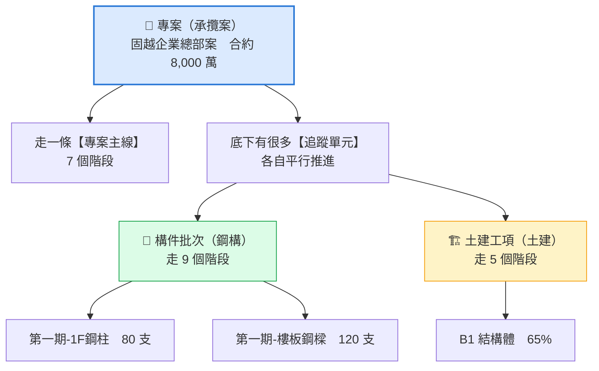
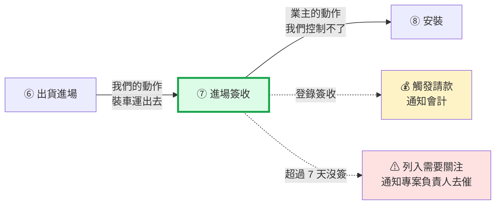
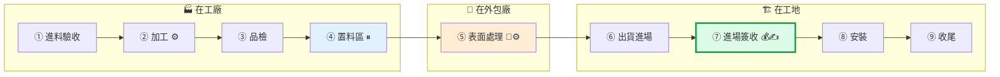
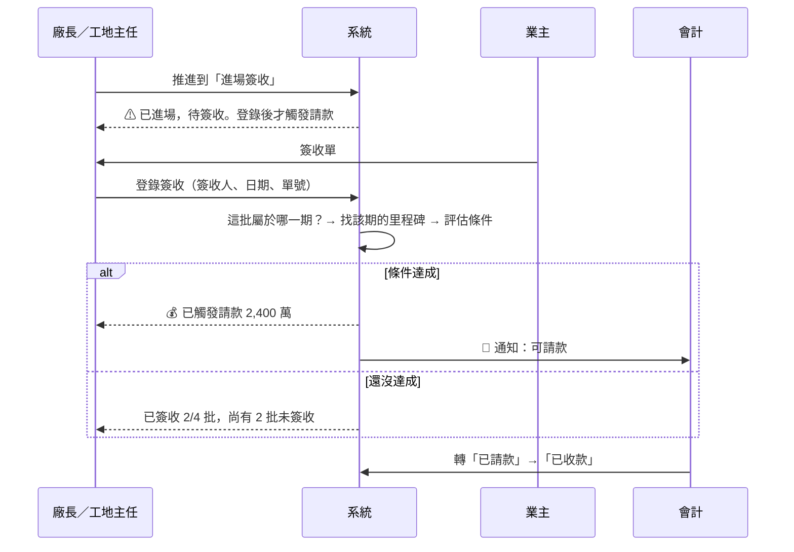

# 鐵正綱工程 內部管理系統 — 員工手冊

> 2026-08-02｜**這是唯一一份你需要看的文件**
>
> 網址 http://localhost:30080　初始密碼 `28494320`（第一次登入會要求你改）

---

## 怎麼看這份手冊

| 你想知道 | 看哪一段 | 大約幾分鐘 |
|---|---|---|
| **我今天就要開始用** | [Part 3 實際操作](#part-3實際操作) | 10 分鐘照著做一次 |
| 這個系統到底在幹嘛 | [Part 1 系統在做什麼](#part-1系統在做什麼) | 3 分鐘 |
| 有幾個名詞我搞不懂 | [Part 2 六個核心觀念](#part-2六個核心觀念) | 遇到再查 |
| 我能做什麼、不能做什麼 | [Part 4 權限與設定](#part-4權限與設定) | 1 分鐘 |
| 為什麼要這樣設計 | 各段落的 **「為什麼」** 區塊 | — |

**急著用就直接跳 Part 3。** 其餘的等你撞到問題再回來查。

---

# Part 1｜系統在做什麼

## 1.1 一句話

> **每個「東西」沿著一條可設定的流程往前走，走到特定站點時，系統自動做該做的事。**

最重要的那件「自動做的事」是：**業主簽收 → 自動轉成可請款 → 通知會計。**
現場的一個動作直接變成財務上可以請的一筆錢，中間沒有人要記得去通知誰。

## 1.2 三層結構



**主線只有一條，底下的追蹤單元有很多條、且各自進度不同。**

固越案現在在「施工中」，但底下同時有：1F鋼柱已運到工地、樓梯鋼構堆在置料區、
2F鋼柱送外廠噴砂。傳統的「專案完成 65%」這種單一數字，反映不出這個狀況。

## 1.3 八個畫面，各回答一個問題

| 畫面 | 回答的問題 | 誰看得到 |
|---|---|---|
| **我的工作** | 今天我該做什麼 | 現場人員、工地主任、廠長 |
| **總覽** | 公司現在整體狀況如何 | 除現場人員外全部 |
| **專案** | 這個案子進行到哪 | 除現場人員外全部（金額另外過濾） |
| **追蹤看板** | 東西現在卡在哪一站 | 除現場人員外全部 |
| **請款收款** | 錢收得回來嗎 | 經營者、專案負責人、會計 |
| **資產** | 公司有什麼東西、在哪、用在哪案 | 除現場人員外全部 |
| **產線** | 機台現在在忙什麼 | 經營者、專案負責人、廠長、品保 |
| **設定** | 公司的客戶、廠商、員工資料 | 經營者、系統管理員 |

> **為什麼一個畫面只回答一個問題**：答不出來的畫面就該砍掉，不是往裡面塞更多東西。
> 你看到的分頁是依你的角色決定的——**用不到的分頁根本不會出現**，不是變灰。

## 1.4 你會用到哪幾個

| 你是 | 主要用 | 裝置 |
|---|---|---|
| 現場師傅 | **我的工作**（只有這一頁） | 手機 |
| 工地主任 | 我的工作 ＋ 看板 | 手機 |
| 廠長 | 追蹤看板 ＋ 產線 | 桌機 |
| 專案負責人 | 專案 ＋ 需要關注 | 桌機／手機 |
| 會計 | 請款收款 | 桌機 |
| 採購／倉管 | 資產 | 桌機 |
| 經營者 | 營運總覽 | 桌機 |

---

# Part 2｜六個核心觀念

搞混這六個，操作就會卡住。**遇到再查就好，不用一次讀完。**

---

## 2.1 追蹤單元：兩種，差在「東西」與「事情」

| | 🔩 構件批次 | 🏗 土建工項 |
|---|---|---|
| 追蹤的是 | **一批看得見的東西** | **一件要做完的事情** |
| 例子 | 第一期-1F鋼柱　80 支 | B1 結構體 |
| 進度怎麼問 | **做好幾支了？** | **做了幾成？** |
| 誰認定 | 廠內師傅回報 | **監造查驗通過**才算 |
| 幾站 | 9 站 | 5 站 |

**構件批次不是「材料準備」**——它涵蓋鋼構的整個承攬範圍，包含工地安裝：

```
進料驗收 → 加工 → 品檢 → 置料區 → 表面處理 │ 出貨進場 → 進場簽收 → 安裝 → 收尾
└──────────── 廠內 ────────────┘ └──────────── 工地 ────────────┘
```

**兩者不是同一棟樓的兩個面向，是兩種不同的承攬範圍：**

| 案子類型 | 構件批次 | 土建工項 | 例子 |
|---|:--:|:--:|---|
| 純鋼構代工 | ✔ | ✘ | 固越案——業主自己找土建包商 |
| 純土建 | ✘ | ✔ | 只承攬基礎與RC結構 |
| 統包／混合 | ✔ | ✔ | 我們同時做土建與鋼構 |

### 一個案子該有幾個追蹤單元？

**遠不止兩個。** 固越案有 7 個：

```
第一期  1F鋼柱 31.68噸 · 桁架A區 9.60噸 · 樓板鋼樑 26.28噸 · 樓梯鋼構 8.40噸
第二期  2F鋼柱 25.34噸 · 樓板鋼樑 19.71噸 · 樓梯鋼構 6.72噸
```

**判準：這一組東西會不會一起走、一起出貨、一起請款？會，就是一個追蹤單元。**

拆太粗（一個案子一批）→ 只知道「這案子在加工」，不知道哪部分卡住。
拆太細（每根柱子一筆）→ 幾百張卡片，看板就沒法看了。

---

## 2.2 階段模板：流程是設定出來的，不是寫死的

新增追蹤單元時，你選的是**階段流程**：

```
階段流程 ▾
├─ 構件批次（用數量計進度）
│    └─ 鋼構構件批次（9 站）· 預設
└─ 土建工項（用百分比計進度）
     └─ 土建工項（5 站）· 預設
```

系統管理員在 Admin 建一條「鋼構－免表面處理（7 站）」，
**它立刻出現在這個下拉裡，不用改程式、不用重新部署。**

### 每一站可以帶五個旗標

| 旗標 | 系統會做什麼 |
|---|---|
| 💰 觸發請款 | 這一站的條件達成 → 評估要不要轉「可請款」 |
| ✍ 需簽收 | 要填簽收日／簽收人／單號 |
| 🚚 外包 | 要填協力廠與進出廠日，沒填就列入「需要關注」 |
| ⏸ 等待中 | 不計入產能佔用（如置料區） |
| ⚙ 核心工序 | 工時計入加工成本 |

> ⚠️ **已經有異動紀錄的追蹤單元不能換模板**。中途換軌會讓歷程對不上、
> 請款觸發條件跟著錯。要換就建新的。

---

## 2.3 階段 vs 完成度

| | 回答的問題 | 例子 |
|---|---|---|
| **階段** | 這批東西**走到哪一站**了 | 第 3 站「品檢」（共 9 站） |
| **完成度** | **目前這一站**做了多少 | 這一站 20 / 24 支 |

**完成度不是整批從頭到尾的累計。它是「這一站的進度」，換站會歸零重算。**

```
進料驗收   驗收完 24 支  → 100% → 推進
   ↓ 歸零
加工       做完 24 支    → 100% → 推進
   ↓ 歸零
品檢       檢查 24 支……
```

**每一站都要對這 24 支做一次事。**「加工做完」不代表「品檢也檢完」——
那是兩件不同的工作，各自要從 0 數到 24。

舊的數字寫進**階段歷程**，「加工那一站到底做了幾支」永遠查得回來。

### 整體進度看哪裡？

**看階段軌道，不是看完成度。**

```
①──②──③──④──⑤──⑥──⑦──⑧──⑨
       ▲  第 3 站 / 共 9 站
```

> **為什麼不給一個「整體百分比」**：九站的工作量差很多（加工兩週、置料區放著不動）。
> 等權重平均會得到一個看起來精確、實際上騙人的數字。
> 與其給假的整體進度，不如誠實顯示「在第 3 站，這一站做了 8 成」。

---

## 2.4 期別：工程的分期，不是分期付款

```
固越企業總部案
├─ 第一期  ← 期別
│    ├─ 第一期-1F鋼柱      ← 追蹤單元
│    └─ 第一期-桁架A區
└─ 第二期
```

它做兩件事：

1. **把追蹤單元分組**
2. **決定簽收時觸發哪一筆請款里程碑**

合約寫「第一期構件全數簽收後請款 40%」時，系統要知道「哪些批次算第一期」——靠的就是期別。

**沒有分期的專案一樣能運作**，里程碑就以全案為範圍。

**在哪建**：專案頁 → 展開該案 → 期別 → 按「新增第N期」（一鍵，不用打字）

---

## 2.5 合約里程碑 vs 請款事件

> **里程碑是「合約寫的條件」，請款事件是「實際可以開的那筆錢」。**
> 里程碑是**計畫**，請款事件是**事實**。

```
專案　固越企業總部案　合約 8,000 萬
│
├─ 期別
│   ├─ 第一期 ─── 4 個批次
│   └─ 第二期 ─── 3 個批次
│                    │ 業主簽收
│                    ↓
└─ 合約里程碑（你自己建，抄合約）
    ├─ 1. 簽約訂金     30%  手動
    ├─ 2. 第一期請款   30%  該期全部簽收 ←─ 綁「第一期」
    ├─ 3. 第二期請款   30%  累計重量達 80% ←─ 綁「第二期」
    └─ 4. 完工尾款     10%  手動
             │ 條件達成，系統自動產生
             ↓
        請款事件（實際的錢）
          2,400 萬  可請款 → 已請款 → 已收款
```

| | 合約里程碑 | 請款事件 |
|---|---|---|
| **誰建的** | **你自己建**（簽完約抄合約） | **系統自動產生**（簽收觸發） |
| **什麼時候** | 接到案子就建 | 觸發條件達成的那一刻 |
| **幾筆** | 合約寫幾條就幾筆 | 看觸發方式，可能 1 筆也可能很多筆 |

**⚠️ 沒有里程碑，請款頁就永遠是空的**——簽收再多批也不會有錢跑出來，
因為系統不知道「什麼情況算可以請款」。

### 為什麼要分兩層

合約寫「按實際交貨數量分批請領」時，**一條里程碑會產生好幾筆錢**：

```
分批交付計價　5,040 萬　每批按量分批請
  ├─ 桁架A區 42 噸 → 3,024 萬　已收款  ✔
  ├─ 桁架B區 28 噸 → 2,016 萬　已請款
  └─ 桁架C區 尚未簽收 ──────────  未產生
```

三批的狀態完全不同。塞在一層裡沒辦法同時表達「已收、已請、還沒到」。

### ★「綁定」到底綁在哪

**批次不是直接綁到里程碑上的——兩邊都綁到「期別」，靠期別對上。**

```
追蹤單元 ──屬於──> 期別 <──綁定── 合約里程碑 ──產生──> 請款事件
```

某一批簽收時，系統做三件事：看它屬於**哪一期** → 找到**綁那一期的里程碑** → 評估條件達成沒。

---

## 2.6 為什麼「簽收」要獨立成一站



如果把簽收併在「出貨進場」裡，「已送到但業主還沒簽」這個訊號就被藏起來了。

獨立成一欄後，這些批次會**堆在看板第 7 欄**——**請款卡在哪，一眼看見。**

> ⚠️ **簽收不改變階段。** 推進是我們的動作，簽收是業主的動作，兩件事分開記。
> 所以簽收後卡片**不會**移到下一欄。

---

# Part 3｜實際操作

## 3.1 十分鐘走一遍（用示範資料）

先重置成乾淨狀態：

```bash
docker compose exec api python manage.py seed_demo --clear
```

用 `owner` / `28494320` 登入。

### 步驟 1｜看合約條件

**請款收款** → 專案選「固越企業總部案」→ **合約里程碑**

第 2 筆「第一期請款」卡片上會有：

```
已簽收 0/4 批，0.0/76.0 噸（0.0%）

還差這 4 批簽收才會觸發
  第一期-桁架A區    加工       還要推 5 站到「進場簽收」才能簽收
  第一期-樓梯鋼構    置料區     還要推 3 站到「進場簽收」才能簽收
  第一期-1F鋼柱     出貨進場   還要推 1 站到「進場簽收」才能簽收
  第一期-樓板鋼樑    進場簽收   ← 可以登錄簽收了
```

**這就是你的待辦清單。** 批次名稱是連結，點了跳到看板並打開那張卡。

### 步驟 2｜簽第一批

點 **第一期-樓板鋼樑** → **登錄簽收** → 填簽收人 `林監造`、日期、單號

```
✔ 已登錄簽收
  已簽收 1/4 批，26.3/76.0 噸（34.6%）
  尚有 3 批未簽收          ← 還沒觸發
```

### 步驟 3｜推一站再簽

**第一期-1F鋼柱** 在「出貨進場」欄 → 點卡片 → **推進至進場簽收**

```
✔ 已推進至 進場簽收
  已進場，待業主／監造簽收。登錄簽收後才會觸發請款
```

**推進不會觸發請款。** 再點一次卡片 → **登錄簽收** → `已簽收 2/4 批（76.3%）`

### 步驟 4｜看外包警告

**第一期-樓梯鋼構** 在「置料區 ⏸」→ 連按三次 **推進**

```
置料區 → 表面處理
  ⚠ 此階段需要外包協力廠，尚未填寫。已列入「需要關注」   ← 🚚 旗標
表面處理 → 出貨進場 → 進場簽收
```

燈號從綠色「正常」變橘色「注意」，同時出現在總覽的「需要關注」。

簽收後：`已簽收 3/4 批（87.4%）`——**已經 87.4% 還是不能請款**，因為合約寫「全數」。

### 步驟 5｜最後一批，自動化發生

**第一期-桁架A區** 從「加工」推 5 站到「進場簽收」→ 登錄簽收

```
✔ 已登錄簽收
  已簽收 4/4 批，76.0/76.0 噸（100.0%）
  💰 該期 4 批全數簽收，全額轉可請款
     產生請款事件 24,000,000 元
```

**右上角 🔔 出現紅點**——會計與經營者都收到通知了。

### 步驟 6｜會計收款

登出，用 `finance` / `28494320` 登入。**請款收款 → 請款事件**

點 **變更狀態** → 「已請款」（填請款日、單號）→ 再一次 → 「已收款」（填收款日）

上方卡片變成 `已收款 2,400 萬`，專案的**收款率變 30.0%**。

### 試試看會被擋的

| 試什麼 | 結果 |
|---|---|
| 可請款直接跳「已收款」 | `不可跳過中間狀態，請依序轉換` |
| 往回轉不填原因 | `往回轉必須填寫原因` |
| 同一批簽收兩次 | `此追蹤單元已於 YYYY-MM-DD 完成簽收` |

---

## 3.2 從零建一個新案子

```
① 建專案 → ② 建期別 → ③ 建里程碑 → ④ 建批次 → ⑤ 現場簽收 → ⑥ 會計收款
  專案頁     專案頁      請款收款頁     看板       看板        請款收款頁
```

### ① 建專案

**專案 → 新增專案**。必填：案名、類型、**客戶**、**專案負責人**、合約金額。

> 負責人決定誰看得到這個案子的金額——其他專案負責人看不到。

### ② 建期別（合約分期才需要）

**專案頁 → 展開該案 → 期別 → 按「新增第一期」**（一鍵，名稱自動帶）

要打「A標段」這種就按 **自訂…**。

### ③ 建里程碑（把合約抄進來）

**請款收款 → 選專案 → 合約里程碑 → 新增里程碑**

合約寫幾條就建幾筆。以「第一期構件全數簽收後請領 40%」為例：

| 欄位 | 填什麼 |
|---|---|
| 順序 | 自動帶下一個可用號 |
| 名稱 | 選了期別會自動帶「第一期」 |
| 合約原文 | 抄進來，日後對帳不用翻合約 |
| 比例 | `40` → 即時顯示 `5,000萬 × 40% = 2,000萬｜含這筆全案共 60%，還差 40%` |
| 觸發方式 | **該期全部簽收**（見下表） |
| **適用期別** | **第一期** ← ★ 這就是「綁定」 |

選了期別後，下面會立刻顯示 `這筆會看 4 個追蹤單元（僅 第一期），合計 76.0 噸`。

#### 四種觸發方式：看合約怎麼寫

| 合約長這樣 | 選這個 | 產生幾筆 | 觸發動作 |
|---|---|:--:|---|
| 「簽約後 7 日內支付訂金」 | **手動** | 1 | 按「建立請款」 |
| 「全數運抵並經簽收後請領」 | **該期全部簽收** | 1 | **登錄簽收** |
| 「累計交貨達 80% 得請領」 | **累計重量達門檻** | 1 | **登錄簽收** |
| 「按實際交貨數量分批請領」 | **每批按量分批請** | **N** | **登錄簽收** |

**手動**是給系統判不出來的條件用的——「簽約後 7 日」系統看不到合約簽了沒。

後兩種要靠**批次的總重量**算佔比，沒填就算不出來。

### ④ 建批次並歸到期別

**追蹤看板 → 新增**

| 欄位 | 填什麼 |
|---|---|
| 專案 / 階段流程 | 選 |
| **期別** | ← ★ 綁定的另一半 |
| 名稱 / 總數量 / 單位 | 如「第一期-1F鋼柱」/ 24 / 支 |
| **總重量** | 分批計價的分母（限廠長／專案負責人／經營者填） |

### ⑤⑥ 之後就是 3.1 的流程

---

## 3.3 「請款設定檢查」會告訴你還缺什麼

不用背上面那些。**請款收款頁選了專案，最上面有一塊檢查**：

```
⚠ 請款設定檢查　還有 1 項必須處理                    ▼

✔ 建立合約里程碑    已建立 4 筆
✔ 比例加總 100%    各期比例合計 100%
✔ 里程碑綁定期別    2 / 4 筆已綁定期別
⚠ 追蹤單元歸屬期別  有 2 個沒歸期別：樓梯鋼構、桁架B區
   該做的：編輯這些追蹤單元，選對應的期別 →
✘ 批次填寫總重量    3 / 5 個沒填總重量
   該做的：編輯這些批次填總重量 →
```

每一項都寫了**現在怎樣、為什麼重要、該去哪裡做**。「該做的」是連結。

---

## 3.4 常見狀況

### 「我簽收了但請款頁什麼都沒有」

看**請款設定檢查**，或依序確認：

1. **這個案子有里程碑嗎？** 沒有 → 什麼都不會發生
2. **里程碑綁的期別，跟這批的期別一樣嗎？** 不一樣 → 對不上
3. **觸發條件達成了嗎？**「該期全部簽收」要**全部**
4. **重量填了嗎？** 按重量計價的兩種一定要填

簽收後系統回的訊息會直接說原因。

### 「推到進場簽收了，怎麼沒觸發？」

**推進 ≠ 簽收。** 要再點卡片按「登錄簽收」。
推進只表示「我們送到了」，簽收是業主的動作。

### 「卡片上沒有『登錄簽收』按鈕」

還沒推到有 ✍ 的那一站。那不是壞掉，是還沒到那一步。

### 「金額算錯了」

金額＝**有效合約額 × 比例**。有效合約額＝原合約額＋已核准的變更追加單。

分批請款每一筆＝**里程碑金額 × 該批噸數 ÷ 該期總噸數**。
分母在**首次觸發時鎖定**，之後新增批次不影響已算過的比例。
要改必須綁一張**已核准的變更追加單**——分母變了等於計價方式變了，合約要一起改。

### 「合約改了怎麼辦」

**專案頁 → 展開該案 → 變更追加單**。這是**合約金額改變的唯一合法途徑**——
直接改專案的「合約金額」欄位是不行的，改了沒人知道為什麼改、誰准的。

```
① 專案負責人建草稿    標題、金額（追加正數／減帳負數）、變更原因
② 送簽               草稿 → 已送簽
③ 經營者核准         ★ 只有經營者能按
      ↓
   有效合約額改變
   尚未請款的里程碑金額自動重算（金額＝有效合約額 × 比例）
   已經請款的不動——送出去的數字不能被改掉
```

核准前系統會先把後果算給你看：

```
核准後會發生什麼
  目前有效合約額        80,000,000
  本次變更            ＋8,000,000
  ────────────────────────────
  新的有效合約額        88,000,000

⚠ 尚未請款的里程碑金額會自動重算。已經產生請款的不會被改動。
  核准後無法取消，只能再開一張反向的變更單。
```

不同意就按**駁回**，被駁回的不計入有效合約額。

### 「土建的里程碑一直不觸發」

確認流程裡有沒有 ✍ 的站。土建的簽收站是**「監造查驗」**——
推到那一站之後還要**登錄簽收**（簽收人填監造姓名），不是推過去就好。

若你自訂的流程沒有任何 ✍ 站，**請款設定檢查會擋下來**並告訴你兩條路：
① 到 Admin 把驗收站勾「需簽收」　② 把里程碑改成「手動」由會計自己按。

### 「東西卡住了怎麼知道」

**總覽 → 需要關注**。六種項目會自動出現：
延誤／停滯／待簽收／外包逾期／請款逾期／專案逾期。每一項都寫了原因與該做什麼。

---

# Part 4｜權限與設定

## 4.1 誰能做什麼

| 動作 | 經營者 | 專案負責人 | 會計 | 廠長 | 工地主任 | 現場 |
|---|:--:|:--:|:--:|:--:|:--:|:--:|
| 看金額 | ✔ | ✔（自己的案） | ✔ | ✘ | ✘ | ✘ |
| 建／改專案 | ✔ | ✔ | ✘ | ✘ | ✘ | ✘ |
| 建／改追蹤單元 | ✔ | ✔ | ✘ | ✔ | ✔ | ✘ |
| 推進／回退階段 | ✔ | ✔ | ✘ | ✔ | ✔ | ✔ |
| 回報進度 | ✔ | ✔ | ✘ | ✔ | ✔ | ✔ |
| 登錄簽收 | ✔ | ✔ | ✘ | ✔ | ✔ | ✘ |
| **填批次總重量** | ✔ | ✔ | **✘** | ✔ | ✘ | ✘ |
| 建／改里程碑 | ✔ | ✔ | ✔ | ✘ | ✘ | ✘ |
| 建變更追加單 | ✔ | ✔ | ✘ | ✘ | ✘ | ✘ |
| **核准變更追加單** | **✔** | ✘ | ✘ | ✘ | ✘ | ✘ |
| **轉請款狀態** | ✔ | ✘ | ✔ | **✘** | ✘ | ✘ |
| 資產入庫／領用 | ✔ | ✘ | ✘ | ✔ | ✘ | ✘ |
| 維護客戶廠商員工 | ✔ | ✘ | ✘ | ✘ | ✘ | ✘ |

> **為什麼廠長能填重量但不能轉請款，會計反過來**：
> 總重量是分批請款的**分母**。同一個人不能既決定計算基數、又決定何時請款。

**金額看不到時顯示 `──` 而不是 `0`**——0 是一個會被誤信的數字。

## 4.2 什麼可以自己改

### 在前端「設定」分頁（經營者、系統管理員）

**客戶**、**廠商**、**員工與角色**——每週都會動的東西。

- 新增員工給預設密碼 `28494320`，**強制首次登入自行修改**
- 忘記密碼用「重設密碼」按鈕，會留系統紀錄
- ⚠️ **員工不能刪除**，離職請「停用」——他做過的推進、簽收、請款都掛在他名下
- 有案子的客戶、被引用過的廠商同理

### 在 Django Admin（系統管理員，`/admin/`）

欄位多、動得少的：

| 項目 | 路徑 |
|---|---|
| 物品主檔（規格、材質、尺寸） | `/admin/masters/item/` |
| 位置階層（倉庫／儲位／工地） | `/admin/inventory/location/` |
| **階段流程**（幾站、哪一站觸發請款） | `/admin/masters/stagetemplate/` |
| 產線 | `/admin/production/productionline/` |
| 系統參數 | `/admin/core/systemparameter/` |

> **判準**：動得頻繁、欄位少的搬前端；動得少、欄位多的留 Admin。
> 物品主檔依料型有不同尺寸欄位（鋼板問厚寬長、H型鋼問腹板翼板厚），
> Admin 的表單處理這種情況比自己刻一個好。

### 寫死在程式碼裡的

| 項目 | 為什麼不開放 |
|---|---|
| 專案類型（土建／鋼構／混合） | 只有三種，且決定底下能建哪種追蹤單元 |
| 進度算法（數量 vs 百分比） | 數學不同，不是設定問題 |
| 請款觸發方式（四種） | 每一種都有各自的判斷邏輯 |
| 狀態燈號（正常／注意／延誤） | 三種已足夠，多了看不出輕重 |

**新增一種「追蹤單元類型」＝ 在 Admin 新增一條階段模板。**

## 4.3 資產：放什麼、不放什麼

分兩種管，因為**問的問題不同**：

| | 工具／設備 | 建材／零件 |
|---|---|---|
| 問什麼 | **在誰手上** | **還剩多少** |
| 單位 | 一台（財產編號） | 一批（批號） |
| 能做 | 建檔、派用、歸還、送修、校驗提醒 | 入庫、盤點調整、領用出庫 |

**該放**：設備、工具（校驗到期**會影響驗收**）、建材、有安全存量的耗材
**不放**：辦公文具、一次性低值耗材、車輛（另一套領域模型，P3 再議）、不動產

> **判準**：這東西找不到／壞了／過期了，會影響工程進度或驗收嗎？

### 庫存數量不能直接改

只有三條路：**入庫（+）、盤點調整（±，必須填原因）、領用出庫（−）**，
每一筆都留不可竄改的紀錄。

> 直接改數字是最容易做的，也是最容易在半年後變成
> 「帳面 300 支、實際 180 支，沒人知道那 120 支去哪」的做法。

---

# Part 5｜流程圖

## 5.1 專案主線（7 站，所有專案共用）

```
接案 → 深化設計 → 報價 → 採購備料 → 施工中 → 完工驗收 → 結案
```

推到「結案」時，若尚有未收款會**擋一次**並顯示具體金額，要按「仍要結案」才過。

## 5.2 🔩 鋼構構件批次（9 站）



**為什麼有 9 站？因為東西會移動，每次移動都是一個可能卡住的點。**

| # | 階段 | 東西在哪 | 這一站可能卡什麼 | 旗標 | 停滯門檻 |
|---|---|---|---|---|---|
| 1 | 進料驗收 | 工廠 | 鋼材沒到、材證不齊 | | 7 天 |
| 2 | 加工 | 工廠 | 產能不足、機台故障 | ⚙ | — |
| 3 | 品檢 | 工廠 | 尺寸不合、焊道瑕疵 | | 3 天 |
| 4 | 置料區 | 工廠 | **做好了但沒地方送** | ⏸ | 14 天 |
| 5 | 表面處理 | **外包廠** | **料送出去忘了追** | 🚚⚙ | — |
| 6 | 出貨進場 | 運送中 | 車調不到 | | 3 天 |
| 7 | **進場簽收** | **工地** | **業主遲遲不簽 → 請款卡住** | 💰✍ | **7 天** |
| 8 | 安裝 | 工地 | 吊車排不到、天候 | | — |
| 9 | 收尾 | 工地 | 缺失改善拖延 | | 14 天 |

**⑤ 表面處理** 在傳統系統裡叫「已出庫」，東西就從帳上消失了。
這裡它**仍在帳上，位置變成「全興噴砂廠」**，並且追「預計出廠日」——逾期自動示警。

## 5.3 🏗 土建工項（5 站）

```
放樣定位 → 施工中 → 自主檢查 → 監造查驗 ✍💰 → 完成
```

用**百分比**而不是數量，因為「基礎工程做了幾支」問不出來。

**「監造查驗」就是土建的簽收站**，跟鋼構的「進場簽收」對稱：

| | 鋼構 | 土建 |
|---|---|---|
| 簽收站 | ⑦ 進場簽收 | ④ 監造查驗 |
| 誰簽 | 業主／監造 | **監造** |
| 簽什麼 | 進場簽收單 | 查驗記錄表 |
| 簽了會怎樣 | 評估請款觸發 | 評估請款觸發 |

操作一樣：推到「監造查驗」→ 點卡片 → **登錄簽收** → 簽收人填監造姓名。

> **為什麼土建也要「簽收」**：四種請款觸發方式裡有三種靠簽收日期判斷。
> 流程裡沒有簽收站，那些單元永遠不會有簽收日期——
> **里程碑會永遠卡在「還差 N 批」，而且看不出原因。**
> 查驗通過本來就是業主方認可這件事完成了，跟簽收是同一個概念。

## 5.4 請款觸發的完整時序



## 5.5 回退：品質不合格怎麼辦

品檢不合格 → 點卡片 → **退回上一站** → **必須選原因、必須填說明**

- 第 1 次回退 → 狀態轉「注意」
- 第 2 次以上 → 升級「延誤」
- 通知專案負責人與被指派的人
- 原因會累積成 P3 的品質失敗成本統計

---

# Part 6｜常用資訊

## 6.1 網址

| 網址 | 用途 |
|---|---|
| **http://localhost:30080** | **前端（全體員工用這個）** |
| http://localhost:30080/admin/ | Django Admin（只有系統管理員） |
| http://localhost:30080/api/v0.1/swagger | API 文件，可直接試打 |

## 6.2 測試帳號（密碼都是 `28494320`）

`owner` 王董｜`pm` 張經理｜`plant` 陳廠長｜`site` 李主任｜`finance` 劉會計
`worker` 陳師傅｜`purchaser`｜`qc`｜`warehouse`｜`hr`｜`admin`

## 6.3 常用指令

```bash
make up                  # 啟動
make down                # 停止
make logs                # 看日誌
make stats               # 看記憶體

docker compose exec api python manage.py seed_demo --clear   # 重置示範資料
make pgadmin             # 開資料庫工具（用完 make pgadmin-stop）
```

---

## 還有問題？

- **這個決策為什麼這樣定？** → `決策紀錄.md`（逐條記錄每個決定的問答與理由）
- **技術細節、資料表、部署** → `開發/` 目錄
- **這份手冊沒寫到的** → 直接問，會補進來
