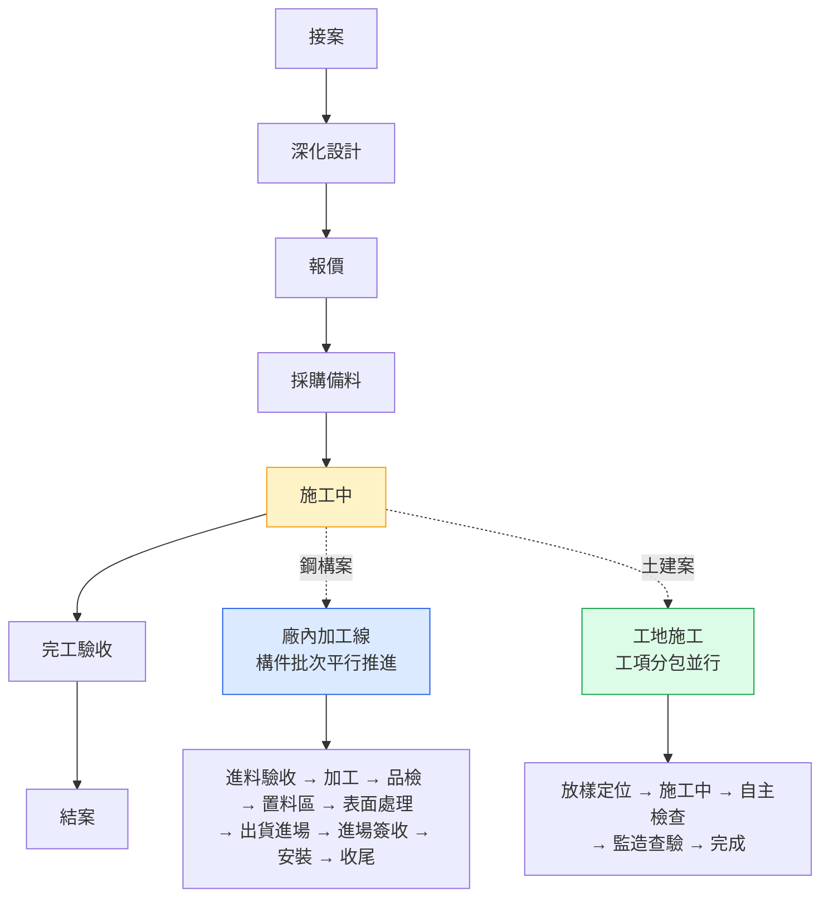
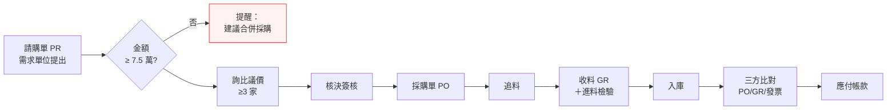
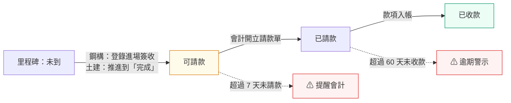
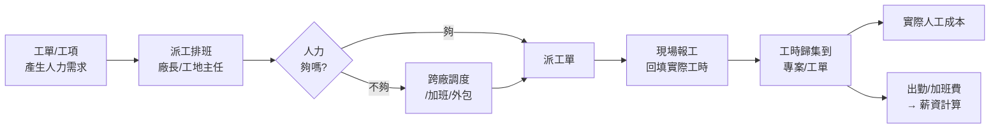

# 01 — 營運流程盤點與角色權限

> 鐵正綱工程 內部管理系統
> 版本 v0.1｜2026-08-01｜狀態：**待確認**

---

## 1. 業務全貌

鐵正綱同時承攬**土建**與**鋼構**。兩者的商業流程相同（接案→交付→收款），但**中間的生產方式完全不同**：



**關鍵特徵：主線只有一條，底下的追蹤單元有很多條、且各自進度不同。**

這是 POC 已驗證的模型，也是整個系統的核心。一個專案在「施工中」階段時，底下可能同時有：
- 第一期樓板鋼樑 → 送外廠噴砂（表面處理）
- 第一期樓梯鋼構 → 已加工完，堆在置料區
- 第二期 2F 鋼柱 → 廠內二次加工線

**傳統的「專案完成 65%」這種單一數字，完全無法反映真實狀況。**

---

## 2. 專案主線流程（7 階段）

適用所有專案類型。系統中以「階段模板：專案主線」管理。

| # | 階段 | 主要活動 | 產出 | 主責角色 | 系統支援（階段） |
|---|---|---|---|---|---|
| 1 | **接案** | 業主詢價、現勘、可行性評估 | 案件登錄 | 經營者、專案負責人 | 建立專案（P1） |
| 2 | **深化設計** | 結構計算、施工圖、材料規格確認 | 深化圖說、BOM | 工程 | 圖紙連結、BOM（P1 存連結／P2 存 BOM） |
| 3 | **報價** | 成本估算、目標毛利、報價單、議價 | 報價單、合約 | 專案負責人、經營者 | 完全成本試算、報價版本（P2） |
| 4 | **採購備料** | 請購、詢比議價、下單、追料 | 採購單、到料 | 採購 | 採購模組（P2） |
| 5 | **施工中** | **鋼構**：廠內加工＋現場安裝<br>**土建**：工地施工 | 追蹤單元推進 | 廠長、工地主任 | **進度追蹤（P1 核心）** |
| 6 | **完工驗收** | 會同驗收、缺失改善、驗收單 | 驗收文件 | 專案負責人、品保 | 驗收紀錄（P3） |
| 7 | **結案** | 尾款請領、保固啟動、成本結算檢討 | 專案損益表 | 會計、經營者 | 專案損益、差異分析（P2） |

### 2.1 每個階段的「卡住」訊號（系統要抓出來的）

| 階段 | 卡住的樣子 | 系統偵測條件 |
|---|---|---|
| 深化設計 | 圖說遲遲未定，後段全部延後 | 停留超過預計天數 |
| 報價 | 報價出去沒回音 | 停留 > 14 天且無異動 |
| 採購備料 | 料沒到，廠內開天窗 | 有追蹤單元卡在「進料驗收」> 7 天 |
| 施工中 | 某批構件卡住 | 追蹤單元狀態 = 注意／延誤 |
| 完工驗收 | 缺失改善拖延 | 預計完工日已過但未結案 |
| 結案 | 尾款收不回來 | 里程碑「已請款」超過 60 天未收款 |

---

## 3. 鋼構：構件批次流程（9 階段）

系統中以「階段模板：鋼構構件批次」管理。以 POC 驗證的流程為底，**2026-08-02 依決議新增第 7 站「進場簽收」**。


| # | 階段 | 說明 | 特殊旗標 | 主責 |
|---|---|---|---|---|
| 1 | 進料驗收 | 鋼板／型鋼到廠，檢驗、入庫 | — | 倉管、品保 |
| 2 | **加工** | 雷射切割→CNC 鑽孔→組裝焊接 | `is_core`（核心加值） | 廠長、師傅 |
| 3 | 品檢 | 尺寸、焊道、非破壞檢測 | — | 品保 |
| 4 | 置料區 | 加工完成，等待下一步 | **`is_hold`**（等待中，不計產能） | 倉管 |
| 5 | 表面處理 | 噴砂、噴漆／鍍鋅 | **`is_outsource`**（通常外包，需填協力廠與進出廠日） | 廠長、採購 |
| 6 | 出貨進場 | 裝車運至工地 | — | 廠長、運輸行 |
| 7 | **進場簽收** ★ | **等業主／監造在工地點收** | **`requires_signoff` ＋ `is_billing_trigger`**（**登錄簽收後觸發請款**） | 工地主任、專案負責人 |
| 8 | 安裝 | 現場吊裝、組立、鎖固 | — | 工地主任 |
| 9 | 收尾 | 補漆、清理、缺失改善 | — | 工地主任 |

> 💡 **為什麼把簽收獨立成一站**：簽收是業主的動作，不是我們能控制的。
> 獨立成一欄後，看板上「**已送到工地但業主還沒簽**」的批次會堆在那裡——
> **請款卡在哪，一眼就看見**。若併在「出貨進場」裡，這個訊號會被藏起來。

### 3.1 旗標的意義（系統行為）

| 旗標 | 系統行為 |
|---|---|
| **`requires_signoff`** ★ | 此階段需登錄簽收資料（簽收日／簽收人／單號／簽收單掃描） |
| `is_billing_trigger` | 此階段的完成條件達成 → 對應請款里程碑從「未到」轉「**可請款**」並通知會計。<br>**與 `requires_signoff` 併用時，改為「登錄簽收後」才觸發，而非進入階段就觸發** |
| `is_outsource` | 表單自動展開「協力廠／進廠日／出廠日」欄位；出廠日逾期未填 → 列入需關注 |
| `is_hold` | 此階段的批次不計入產能佔用；停留超過 N 天 → 列入需關注（呆滯風險） |
| `is_core` | 此階段的工時計入 OEE 與加工成本（手冊第 10 章，占總成本 38%） |

**兩種觸發模式的差別**

| 情境 | 旗標組合 | 觸發時機 |
|---|---|---|
| 鋼構「進場簽收」 | `requires_signoff` ＋ `is_billing_trigger` | **登錄簽收資料時**（進入階段不觸發） |
| 土建「完成」 | 只有 `is_billing_trigger` | **進入階段時**（監造查驗通過即可計價，不需另簽） |

### 3.2 平行與回退

- **平行**：同一專案的多個批次可同時在不同階段（POC 已驗證）
- **回退**：品檢不合格 → 退回「加工」重工。系統允許往回推，但**必須填原因**，並記入品質失敗成本（P3 的 PAF 統計來源）

---

## 4. 土建：工項流程（5 階段，預設模板可調整）

系統中以「階段模板：土建工項」管理。**這是提議的預設值，請依實際作業校正。**


| # | 階段 | 說明 | 特殊旗標 | 主責 |
|---|---|---|---|---|
| 1 | 放樣定位 | 測量放樣、假設工程、材料進場 | — | 工地主任 |
| 2 | 施工中 | 分包商施作，回報完成百分比 | `is_core` | 工地主任、分包商 |
| 3 | 自主檢查 | 施工單位自主檢查表 | — | 工地主任、品保 |
| 4 | 監造查驗 | 監造／業主查驗 | — | 專案負責人 |
| 5 | 完成 | 查驗通過，可計價 | `is_billing_trigger` | 專案負責人 |

### 4.1 與鋼構的差異

| 面向 | 鋼構構件批次 | 土建工項 |
|---|---|---|
| 進度表達 | **完成數量 / 總數量**（如 48/80 支） | **完成百分比**（如 65%） |
| 執行者 | 廠內師傅（自行）或外包協力廠 | **分包商** |
| 地點 | 工廠 → 工地 | 工地 |
| 特殊欄位 | 單位、外包廠、進出廠日、運輸廠商 | 分包商、契約金額 |
| 階段數 | 9 | 5 |

**但兩者共用同一張資料表**（`TrackingUnit`），靠 `unit_type` 與 `stage_template` 區分——詳見 `../開發/02_資料模型.md`。

---

## 5. 六大成本階段對照

手冊定義的六大成本階段，與上述流程的對應關係。**這是 P2/P3 成本歸集的依據**。

| 手冊成本階段 | 年度成本 | 占比 | 對應到系統的哪裡 |
|---|---:|---:|---|
| ① 原物料採購 | 500 萬 | 6% | 專案主線「採購備料」＋ 採購模組（M4） |
| ② 入庫驗收 | 500 萬 | 6% | 批次階段「進料驗收」＋「置料區」＋ 庫存模組（M5） |
| ③ 生產準備 | 505 萬 | 6% | 工單開立前的換線／工程設計（M6） |
| ④ **加工製造** | **3,331 萬** | **38%** | 批次階段「加工」＋「表面處理」＋ 生產模組（M6） |
| ⑤ 品質檢驗 | 998 萬 | 12% | 批次階段「品檢」＋ 品質模組（M7） |
| ⑥ 成品交付 | 1,149 萬 | 13% | 批次階段「出貨進場」「安裝」「收尾」＋ 交付模組（M8） |
| 其他間接 | 1,700 萬 | 19% | 管銷費用分攤 |

> **手冊第 16 章的結論：加工製造占 38%，是其他單一階段的 6 倍，改善槓桿最大。**
> 因此 P3 的重點是把「加工」階段的 OEE、換線、工時全部量化。

---

## 6. 三條跨模組流程

### 6.1 採購流程（P2）



**手冊帶入的規則**：
- 單筆採購人力成本固定約 **NT$3,780**（10 工時 × 真實時薪 378）→ 金額 5,000 元的採購，人力成本占 76%，嚴重不合算
- 系統在請購金額 < 7.5 萬時**主動提醒合併採購**（手冊 7.4）
- 供應商評分：交期 25%、品質 30%、財務 20%、服務 15%、**價格只占 10%**（手冊 7.6 — 因為單價便宜但不良率高的供應商，總成本反而更貴）
- 進料檢驗 ABC 分級：A 類全檢、B 類抽驗、C 類免檢（手冊 8.5 — 未分級約 30% 檢驗是浪費）

### 6.2 請款收款流程（P1 追蹤 / P2 完整）



**這是 P1 就要做的關鍵自動化**：工地主任在現場登錄業主簽收 → 里程碑自動轉「可請款」→ 通知會計。
現況是靠人記得，常常簽收後隔數週才想起請款，白白拖延現金流。

另外，**在「進場簽收」階段停留超過 7 天仍未簽收 → 列入需關注**（`awaiting_signoff`）——
這是「請款卡住」最早的訊號，比等到月底對帳才發現早得多。

### 6.3 人力調度流程（P4）



**手冊帶入的規則**：成本計算一律用**真實時薪**（月薪×13.5÷1600×(1+附加率)），約為表面時薪的 1.7–1.9 倍。
月薪 4 萬的技工，真實時薪約 412 元——每浪費 1 小時（等待、找料、無效會議）就損失 412 元。

---

## 7. 角色定義

公司規模約 25–50 人，**一個人常兼多個角色**（例如老闆兼專案負責人）。因此系統設計為：
**一個使用者可掛多個角色，權限取聯集。**

| 代號 | 角色 | 職責 | 主要裝置 |
|---|---|---|---|
| `owner` | 經營者 | 全局決策、核決、看損益與 KPI | 桌機＋手機 |
| `pm` | 專案負責人 | 對單一專案負全責，對客戶窗口 | 桌機＋手機 |
| `plant_mgr` | 廠長／生產經理 | 廠內排產、批次推進、產線與設備 | 桌機 |
| `site_mgr` | 工地主任 | 工地施工、工項進度、分包商管理 | **手機** |
| `purchaser` | 採購 | 請購、詢比議、供應商管理、追料 | 桌機 |
| `qc` | 品保 | 進料／製程／出貨檢驗、不良處理 | 平板＋桌機 |
| `warehouse` | 倉管 | 入出庫、盤點、呆滯料 | 平板＋桌機 |
| `finance` | 會計／財務 | 請款、應收應付、成本核算、現金流 | 桌機 |
| `hr` | 人資／行政 | 出勤、請假、薪資、簽核流程、SOP | 桌機 |
| `worker` | 現場人員 | 回報自己負責的加工／施工進度、報工 | **手機** |
| `admin` | 系統管理員 | 帳號、權限、主檔、階段模板設定 | 桌機 |

---

## 8. 角色 × 功能權限矩陣

**符號**：`C` 新增｜`R` 檢視｜`U` 修改｜`D` 刪除｜`A` 核准｜`—` 無權限｜`R*` 僅限相關資料（見 §9）

### 8.1 P1 模組（第一階段）

| 功能 | owner | pm | plant_mgr | site_mgr | purchaser | qc | warehouse | finance | hr | worker | admin |
|---|:--:|:--:|:--:|:--:|:--:|:--:|:--:|:--:|:--:|:--:|:--:|
| 專案主檔 | CRUD | CRU* | R | R* | R | R | R | R | R | — | CRUD |
| 專案主線推進 | U | U* | — | — | — | — | — | — | — | — | U |
| 合約／報價資訊 | CRUD | CRU* | R | — | R | — | — | R | — | — | CRUD |
| 追蹤單元（批次／工項） | CRUD | CRU* | CRUD | CRU* | R | R | R | R | — | R* | CRUD |
| 階段推進 | U | U* | U | U* | — | U | U | — | — | **U\*** | U |
| 請款里程碑 | CRUD | CRU* | R | R* | — | — | — | CRUD | — | — | CRUD |
| 里程碑狀態轉換 | U | U* | — | — | — | — | — | U | — | — | U |
| 產線狀態 | R | R | CRUD | — | — | R | — | — | — | R | CRUD |
| 客戶主檔 | CRUD | CRU | R | R | R | — | — | R | — | — | CRUD |
| 廠商主檔 | CRUD | R | R | R* | CRUD | R | R | R | — | — | CRUD |
| 儀表板總覽 | R | R | R | R* | R | R | R | R | R | — | R |
| 需要關注清單 | R | R* | R | R* | R | R | R | R | — | — | R |
| 稽核軌跡 | R | — | — | — | — | — | — | R | — | — | R |
| 使用者／角色管理 | R | — | — | — | — | — | — | — | R | — | CRUD |
| 階段模板設定 | R | — | R | — | — | — | — | — | — | — | CRUD |

### 8.2 P2–P4 模組（規劃）

| 功能 | owner | pm | plant_mgr | site_mgr | purchaser | qc | warehouse | finance | hr | worker | admin |
|---|:--:|:--:|:--:|:--:|:--:|:--:|:--:|:--:|:--:|:--:|:--:|
| 請購單 | A | CRU* | CRU | CRU | CRUD | CRU | CRU | R | CRU | — | R |
| 採購單 | A | R* | R | R | CRUD | R | R | R | — | — | R |
| 供應商評分 | R | R | R | — | CRUD | CU | CU | R | — | — | R |
| 收料／入庫 | R | R* | R | R | R | CRU | CRUD | R | — | — | R |
| 庫存異動／盤點 | R | R | R | — | R | R | CRUD | R | — | — | R |
| 應收帳款 | R | R* | — | — | — | — | — | CRUD | — | — | R |
| 應付帳款 | A | R* | — | — | R | — | — | CRUD | — | — | R |
| 專案損益 | R | R* | R | — | — | — | — | CRUD | — | — | R |
| 成本 KPI 儀表板 | R | R* | R | R* | R | R | R | R | — | — | R |
| 工單／派工 | R | R* | CRUD | CRUD | — | R | R | — | — | R* | R |
| 報工（工時回填） | R | R* | CRU | CRU | — | — | — | R | R | **CRU\*** | R |
| 設備 OEE | R | R | CRUD | — | — | R | — | R | — | R | R |
| 檢驗紀錄 | R | R* | R | R | R | CRUD | R | — | — | — | R |
| 不良／重工／報廢 | R | R* | CRU | CRU | R | CRUD | R | R | — | R* | R |
| 出貨單 | R | R* | CRU | R* | — | R | CRU | R | — | — | R |
| 出勤／請假／加班 | A | R* | A | A | — | — | — | R | CRUD | **CRU\*** | R |
| 排班派駐 | R | R* | CRUD | CRUD | — | — | — | — | CRU | R* | R |
| 薪資計算 | R | — | — | — | — | — | — | R | CRUD | **R\*** | — |
| 員工主檔／證照 | R | R | R | R | — | — | — | R | CRUD | R* | R |
| 簽核流程 | A | A* | A | A | A | A | A | A | CRUD | CR | CRUD |
| SOP 知識庫 | R | R | CRU | CRU | CRU | CRU | CRU | CRU | CRUD | R | CRUD |

> **注意 `finance` 不能改薪資、`hr` 不能看應收應付**——職能分離（Segregation of Duties），避免一人獨攬金流。

---

## 9. 資料可見範圍規則（`R*` 的定義）

權限矩陣控制「能不能用這個功能」，**可見範圍**控制「看得到哪些資料」。

| 角色 | 可見範圍 |
|---|---|
| `owner`、`admin` | **全部資料** |
| `finance` | 全部專案的財務資料；專案／進度資料唯讀 |
| `pm` | **自己是負責人的專案**：完整權限<br>其他專案：僅唯讀基本資訊（案名、客戶、狀態），看不到金額 |
| `site_mgr` | **自己派駐工地的專案**與其工項 |
| `plant_mgr` | 全部**鋼構**專案的批次與產線；土建案唯讀 |
| `purchaser`、`warehouse`、`qc` | 全部專案的採購／庫存／品質資料；專案財務資料不可見 |
| `hr` | 全部人員資料；專案資料僅看得到「誰被派到哪」 |
| `worker` | **只看得到指派給自己的追蹤單元與工單**，以及自己的出勤薪資 |

### 9.1 實作方式

- Django 的 `Group` + `Permission` 處理**功能權限**（§8 的矩陣）
- 自訂 QuerySet Mixin 處理**資料範圍**（§9 的規則），在 ViewSet 的 `get_queryset()` 統一套用
- **絕不在前端過濾**——後端沒回傳的資料，前端就拿不到

```python
# 概念示意
class ScopedQuerySetMixin:
    def get_queryset(self):
        qs = super().get_queryset()
        user = self.request.user
        if user.has_role('owner', 'admin', 'finance'):
            return qs
        if user.has_role('pm'):
            return qs.filter(Q(owner=user) | Q(visibility='basic'))
        if user.has_role('worker'):
            return qs.filter(assignee=user)
        ...
```

---

## 10. 本文件的確認方式

- [ ] §2 專案主線 7 階段，跟你們實際作業一致嗎？有沒有漏掉的階段
- [x] §3 鋼構批次已於 2026-08-02 改為 9 階段（新增「進場簽收」）。「置料區」「表面處理」的位置仍需確認
- [ ] §4 **土建工項 5 階段是我提議的預設值，請務必校正**——你們實際上怎麼切工項、怎麼認定完成
- [ ] §6.1 採購流程要幾家比價？金額多少以上要老闆簽？（核決權限表）
- [ ] §6.2 請款自動觸發的邏輯正確嗎？出貨進場就可以請款，還是要業主簽收才算
- [ ] §7 11 個角色，跟公司實際編制對得起來嗎？誰兼誰
- [ ] §8 權限矩陣有沒有給太多或給太少的地方
- [ ] §9 資料可見範圍，特別是「專案負責人看不看得到別人的專案金額」

---

## 相關文件

`../系統目的與範圍.md`｜`../封存/02_Use_Case規格.md`｜`../開發/02_資料模型.md`
