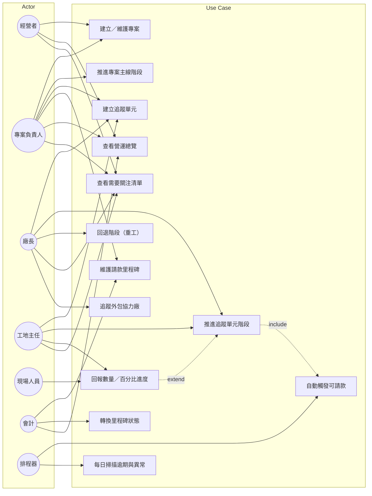
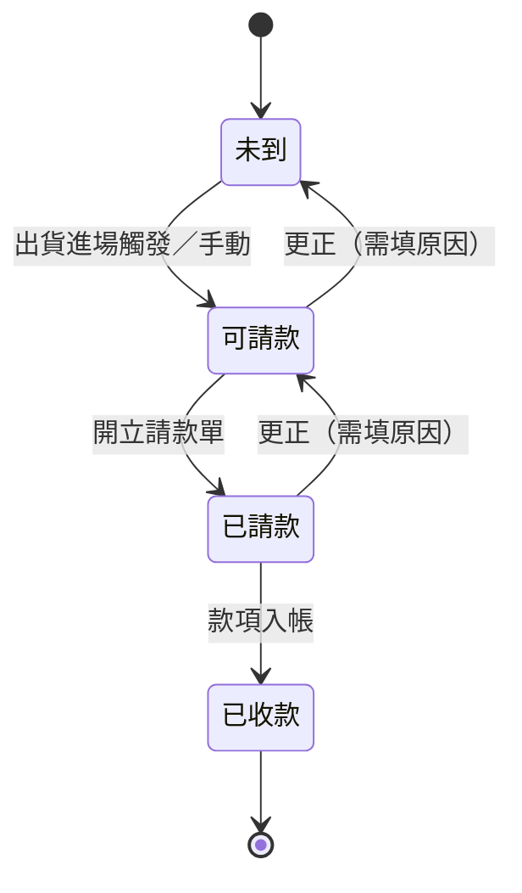

# 02 — Use Case 規格

> 鐵正綱工程 內部管理系統
> 版本 v0.1｜2026-08-01｜狀態：**待確認**

---

## 1. Actor 清單

### 1.1 主要 Actor（人）

| Actor | 代號 | 說明 |
|---|---|---|
| 經營者 | `owner` | 全局決策、核決 |
| 專案負責人 | `pm` | 對單一專案負全責 |
| 廠長／生產經理 | `plant_mgr` | 廠內排產與批次推進 |
| 工地主任 | `site_mgr` | 工地施工與工項進度 |
| 採購 | `purchaser` | 請購、詢比議、追料 |
| 品保 | `qc` | 檢驗與不良處理 |
| 倉管 | `warehouse` | 入出庫、盤點 |
| 會計／財務 | `finance` | 請款、應收應付、成本 |
| 人資／行政 | `hr` | 出勤、薪資、簽核、SOP |
| 現場人員 | `worker` | 回報自己的進度與工時 |
| 系統管理員 | `admin` | 帳號、權限、主檔設定 |

### 1.2 系統 Actor（非人）

| Actor | 代號 | 說明 |
|---|---|---|
| **排程器** | `scheduler` | 宿主機 cron 每日觸發：KPI 計算、逾期掃描、到期提醒 |
| 會計軟體 | `ext_acct` | 接收本系統匯出的 CSV（P2） |

---

## 2. P1 Use Case 總圖

---

## 3. 全模組 Use Case 清單

### P1（第一階段）

| UC 編號 | 名稱 | 主要 Actor | 詳細規格 |
|---|---|---|---|
| **M0 平台基礎** | | | |
| UC-M0-01 | 登入與取得可見範圍 | 全體 | §4.1 ✅ |
| UC-M0-02 | 維護使用者與角色 | admin | — |
| UC-M0-03 | 維護部門組織 | admin, hr | — |
| UC-M0-04 | 維護階段模板 | admin | §4.2 ✅ |
| UC-M0-05 | 維護客戶主檔 | pm, admin | — |
| UC-M0-06 | 維護廠商主檔 | purchaser, admin | — |
| UC-M0-07 | 上傳／檢視附件 | 全體 | — |
| UC-M0-08 | 檢視稽核軌跡 | owner, admin, finance | — |
| UC-M0-09 | 檢視站內通知 | 全體 | — |
| **M1 專案管理** | | | |
| UC-M1-01 | 建立專案 | pm, owner | §4.3 ✅ |
| UC-M1-02 | 維護專案基本資料與合約 | pm | — |
| UC-M1-03 | 推進／退回專案主線階段 | pm, owner | §4.4 ✅ |
| UC-M1-04 | 建立期別／標段 | pm | — |
| UC-M1-05 | 登錄變更追加單 | pm | — |
| UC-M1-06 | 檢視專案摘要 | 全體 | — |
| UC-M1-07 | 結案 | pm, owner | — |
| **M2 進度追蹤** | | | |
| UC-M2-01 | 建立構件批次（鋼構） | plant_mgr, pm | §4.5 ✅ |
| UC-M2-02 | 建立工項（土建） | site_mgr, pm | §4.6 ✅ |
| UC-M2-03 | **推進追蹤單元階段** | plant_mgr, site_mgr, worker | §4.7 ✅ **核心** |
| UC-M2-04 | 回退階段（重工／退回） | plant_mgr, qc | §4.8 ✅ |
| UC-M2-05 | 回報數量／百分比進度 | worker, site_mgr | §4.9 ✅ |
| UC-M2-06 | 標記外包並追蹤協力廠 | plant_mgr | §4.10 ✅ |
| UC-M2-07 | 檢視階段看板 | plant_mgr, pm | — |
| UC-M2-08 | 檢視階段異動歷程 | 全體（依範圍） | — |
| UC-M2-09 | 檢視「我的工作」 | worker, site_mgr | §4.11 ✅ |
| UC-M2-10 | 維護產線狀態 | plant_mgr | — |
| **M3 請款收款（P1 僅追蹤）** | | | |
| UC-M3-01 | 維護請款里程碑 | pm, finance | — |
| UC-M3-02 | **自動觸發「可請款」** | scheduler / 系統 | §4.12 ✅ **核心** |
| UC-M3-03 | 轉換里程碑狀態 | finance | §4.13 ✅ |
| **M12 儀表板** | | | |
| UC-M12-01 | 檢視營運總覽 | owner, pm, plant_mgr | §4.14 ✅ |
| UC-M12-02 | 檢視需要關注清單 | 全體（依範圍） | §4.15 ✅ |
| UC-M12-03 | 每日掃描逾期與異常 | scheduler | §4.16 ✅ |

### P2–P4（後續階段，僅列清單）

展開 P2–P4 Use Case 清單（共 62 項）

| UC 編號 | 名稱 | 主要 Actor | 階段 |
|---|---|---|---|
| **M4 採購與供應商** | | | |
| UC-M4-01 | 提出請購單 | 全體需求單位 | P2 |
| UC-M4-02 | 請購金額門檻提醒（< 7.5 萬建議合併） | 系統 | P2 |
| UC-M4-03 | 詢比議價 | purchaser | P2 |
| UC-M4-04 | 採購單核決簽核 | owner, 主管 | P2 |
| UC-M4-05 | 開立採購單 | purchaser | P2 |
| UC-M4-06 | 追料與到期提醒 | purchaser, scheduler | P2 |
| UC-M4-07 | 維護供應商五維度評分 | purchaser, qc, warehouse | P2 |
| UC-M4-08 | 供應商總成本比較分析 | purchaser | P2 |
| UC-M4-09 | 框架合約管理 | purchaser | P2 |
| UC-M4-10 | EOQ 經濟訂購量建議 | 系統 | P2 |
| **M5 倉儲庫存** | | | |
| UC-M5-01 | 收料與進料檢驗（ABC 分級） | warehouse, qc | P2 |
| UC-M5-02 | 入庫 | warehouse | P2 |
| UC-M5-03 | 領料出庫 | warehouse, worker | P2 |
| UC-M5-04 | 庫存移轉 | warehouse | P2 |
| UC-M5-05 | 盤點 | warehouse | P2 |
| UC-M5-06 | 批號／材質證明追溯 | qc, warehouse | P2 |
| UC-M5-07 | 呆滯料分級與掃描 | scheduler | P2 |
| UC-M5-08 | 呆滯料處置決策 | warehouse, owner | P2 |
| UC-M5-09 | 庫存週轉率與資金占用計算 | 系統 | P2 |
| **M3 財務（完整）** | | | |
| UC-M3-04 | 開立請款單 | finance | P2 |
| UC-M3-05 | 應收帳款追蹤與逾期提醒 | finance, scheduler | P2 |
| UC-M3-06 | 應付帳款與三方比對 | finance | P2 |
| UC-M3-07 | 費用報銷 | 全體 | P2 |
| UC-M3-08 | 現金流預測 | finance, owner | P2 |
| UC-M3-09 | 專案損益表 | finance, owner | P2 |
| UC-M3-10 | 匯出至會計軟體 | finance | P2 |
| **M12 成本與 KPI** | | | |
| UC-M12-04 | 完全成本核算 | finance | P2 |
| UC-M12-05 | 標準 vs 實際差異分析 | finance, owner | P2 |
| UC-M12-06 | 六階段成本地圖 | owner | P2 |
| UC-M12-07 | 18 項 KPI 儀表板 | owner, 各主管 | P2 |
| UC-M12-08 | 隱性成本追蹤 | owner | P2 |
| UC-M12-09 | ABC 作業基礎成本分析 | finance | P3 |
| UC-M12-10 | 改善行動追蹤（第 22 章） | owner | P3 |
| UC-M12-11 | 季度棄舊檢視 | owner | P4 |
| **M6 生產製造** | | | |
| UC-M6-01 | 開立工單 | plant_mgr | P3 |
| UC-M6-02 | 維護工序途程 | plant_mgr, admin | P3 |
| UC-M6-03 | 派工 | plant_mgr | P3 |
| UC-M6-04 | 現場報工（工時回填） | worker | P3 |
| UC-M6-05 | 記錄換線整備（SMED） | plant_mgr, worker | P3 |
| UC-M6-06 | 設備主檔與保養 | plant_mgr | P3 |
| UC-M6-07 | OEE 資料採集與計算 | worker, 系統 | P3 |
| UC-M6-08 | 六大損失分析 | plant_mgr | P3 |
| UC-M6-09 | 材料利用率（套料）追蹤 | plant_mgr | P3 |
| **M7 品質管理** | | | |
| UC-M7-01 | 進料檢驗 IQC | qc | P3 |
| UC-M7-02 | 製程檢驗 IPQC | qc | P3 |
| UC-M7-03 | 出貨檢驗 OQC | qc | P3 |
| UC-M7-04 | 開立不良單 | qc, worker | P3 |
| UC-M7-05 | 重工／報廢處理 | qc, plant_mgr | P3 |
| UC-M7-06 | 客訴處理與 8D | qc, pm | P3 |
| UC-M7-07 | PAF 品質成本歸集 | 系統 | P3 |
| UC-M7-08 | 1-10-100 分析 | qc, owner | P3 |
| **M8 出貨交付** | | | |
| UC-M8-01 | 開立出貨單 | plant_mgr, warehouse | P3 |
| UC-M8-02 | 記錄裝載率 | warehouse | P3 |
| UC-M8-03 | 運輸安排與追蹤 | plant_mgr | P3 |
| UC-M8-04 | 簽收確認 | site_mgr | P3 |
| UC-M8-05 | OTD 準時交貨率計算 | 系統 | P3 |
| UC-M8-06 | 交付失敗紀錄 | pm | P3 |
| **M9 人力與薪資** | | | |
| UC-M9-01 | 維護員工主檔 | hr | P4 |
| UC-M9-02 | 證照管理與到期提醒 | hr, scheduler | P4 |
| UC-M9-03 | 排班派駐 | plant_mgr, site_mgr | P4 |
| UC-M9-04 | 出勤紀錄（打卡匯入） | hr | P4 |
| UC-M9-05 | 請假申請與簽核 | worker, 主管 | P4 |
| UC-M9-06 | 加班申請與簽核 | worker, 主管 | P4 |
| UC-M9-07 | 薪資計算（勞健保／勞退／所得稅） | hr | P4 |
| UC-M9-08 | 薪資單發放 | hr | P4 |
| UC-M9-09 | 真實時薪回饋成本 | 系統 | P4 |
| **M10 行政簽核** | | | |
| UC-M10-01 | 設計簽核表單 | admin | P4 |
| UC-M10-02 | 維護核決權限表 | admin, owner | P4 |
| UC-M10-03 | 提出申請 | 全體 | P4 |
| UC-M10-04 | 簽核／退回 | 各級主管 | P4 |
| UC-M10-05 | 代理人設定 | 全體 | P4 |
| **M11 SOP 知識庫** | | | |
| UC-M11-01 | 建立／編輯 SOP 文件 | hr, 各單位 | P4 |
| UC-M11-02 | SOP 版本控管 | hr | P4 |
| UC-M11-03 | 掛勾流程節點 | admin | P4 |
| UC-M11-04 | 閱讀確認紀錄 | 全體 | P4 |

---

## 4. 核心 Use Case 詳細規格（P1）

---

### 4.1 UC-M0-01 登入與取得可見範圍

| 項目 | 內容 |
|---|---|
| **主要 Actor** | 全體使用者 |
| **目標** | 通過身分驗證，並取得該使用者的功能權限與資料可見範圍 |
| **前置條件** | 使用者帳號已由 admin 建立且為啟用狀態 |
| **觸發** | 使用者開啟系統網址 |

**主流程**
1. 系統顯示登入畫面（帳號、密碼）
2. 使用者輸入帳號密碼並送出
3. 系統驗證憑證
4. 系統建立 Session，寫入 HttpOnly Cookie
5. 系統回傳使用者資料：姓名、部門、**角色清單**、**可見專案 ID 清單**
6. 前端依角色決定顯示哪些導航分頁
7. 導向該角色的預設首頁

**替代流程**
- 3a. 帳號或密碼錯誤 → 顯示「帳號或密碼錯誤」（**不揭露是哪個錯**），連續 5 次失敗鎖定 15 分鐘
- 3b. 帳號已停用 → 顯示「此帳號已停用，請聯絡管理員」
- 7a. `worker` 角色 → 預設首頁為「我的工作」，不是總覽

**後置條件** Session 建立，有效期 8 小時（可設定），閒置 2 小時自動登出

**業務規則**
- BR-01 一個使用者可有多個角色，權限取**聯集**
- BR-02 資料可見範圍在**後端** `get_queryset()` 過濾，前端拿不到範圍外資料
- BR-03 密碼最少 8 碼；首次登入強制修改

**裝置** 全部

---

### 4.2 UC-M0-04 維護階段模板

| 項目 | 內容 |
|---|---|
| **主要 Actor** | admin |
| **目標** | 設定「專案主線」「鋼構構件批次」「土建工項」各自的階段流程 |
| **前置條件** | 具 admin 角色 |
| **觸發** | 導入初期設定，或流程調整時 |

**主流程**
1. admin 進入「設定 → 階段模板」
2. 選擇或新增模板，指定**適用類型**（專案主線／鋼構批次／土建工項）
3. 逐一新增階段：名稱、順序、顏色
4. 為階段勾選**特殊旗標**：
   - `is_billing_trigger` 觸發請款
   - `is_outsource` 需填協力廠
   - `is_hold` 等待中（不計產能）
   - `is_core` 核心加值（計入 OEE 與加工成本）
5. 儲存

**替代流程**
- 4a. 同一模板勾選**兩個以上** `is_billing_trigger` → 系統警告「一個模板建議只有一個請款觸發點」，但允許儲存
- 5a. 模板已被使用中的追蹤單元引用 → **不允許刪除階段**，只允許停用；系統提示「有 N 筆資料正使用此階段」

**後置條件** 模板生效，新建立的追蹤單元套用此模板

**業務規則**
- BR-04 **已在使用的模板，修改階段順序不會影響既有資料的階段歷程**（歷程記錄的是當時的階段快照）
- BR-05 每個專案類型至少要有一個預設模板

**裝置** 桌機

---

### 4.3 UC-M1-01 建立專案

| 項目 | 內容 |
|---|---|
| **主要 Actor** | pm、owner |
| **目標** | 在系統中登錄一個新承攬案 |
| **前置條件** | 已登入且具建立專案權限；客戶主檔已存在（或可即時新增） |
| **觸發** | 接到新案或準備投標 |

**主流程**
1. 使用者點「新增專案」
2. 系統顯示表單，**只問必填欄位**：
   - 案名、客戶、**專案類型（土建／鋼構／混合）**、合約總額、負責人、預計工期（起／迄）
3. 使用者選擇專案類型
4. **系統依專案類型自動帶入對應的階段模板**（鋼構→構件批次模板；土建→工項模板；混合→兩者皆可用）
5. 使用者填寫並儲存
6. 系統產生專案編號（格式：`P-YYYY-NNN`）
7. 系統將主線階段設為「接案」，狀態設為「正常」
8. 系統寫入稽核軌跡與活動動態

**替代流程**
- 2a. 進階欄位（合約條款、報價資訊、圖紙連結、備註）收在「**更多設定**」中，預設收合
- 5a. 案名重複 → 警告但允許（可能有同名不同期的案子）
- 5b. 合約總額為 0 或空白 → 允許（投標中尚未確定金額），但標記為「金額待確認」

**後置條件** 專案建立，出現在專案清單與總覽

**業務規則**
- BR-06 專案編號由系統產生，不可修改
- BR-07 **混合型專案**同時可建立構件批次與工項兩種追蹤單元
- BR-08 合約總額為所有請款里程碑金額計算的基礎

**裝置** 桌機優先；手機可用但欄位單欄堆疊

---

### 4.4 UC-M1-03 推進／退回專案主線階段

| 項目 | 內容 |
|---|---|
| **主要 Actor** | pm（限自己負責的專案）、owner |
| **目標** | 將專案主線推進到下一階段，或退回上一階段 |
| **前置條件** | 專案存在且未結案 |
| **觸發** | 階段性工作完成（如報價送出、開工） |

**主流程**
1. 使用者在專案卡片點「推進主線」
2. 系統顯示確認：「將『固越企業總部案』從『報價』推進至『採購備料』？」
3. 使用者確認（可填備註）
4. 系統更新 `main_stage`，寫入階段異動歷程（誰、何時、從→到、備註）
5. 系統寫入活動動態
6. 畫面即時更新進度條

**替代流程**
- 1a. 已在最後階段「結案」→ 推進按鈕停用
- 1b. 退回：點「←」按鈕，**必須填寫原因**（推進可不填，退回必填）
- 3a. 推進至「結案」時，系統檢查：
   - 有未收款的請款里程碑 → 警告「尚有 X 筆款項未收，共 NT$ Y，確定結案？」
   - 有未完成的追蹤單元 → 警告「尚有 N 個追蹤單元未完成」
   - 使用者可選擇繼續或取消

**後置條件** 階段更新，歷程可查

**業務規則**
- BR-09 只能一次推進／退回一個階段，不可跳階
- BR-10 **所有階段異動都必須留下歷程紀錄**（誰、何時、從→到）——這是 P1 最重要的可追溯性要求
- BR-11 退回必填原因

**裝置** 全部

---

### 4.5 UC-M2-01 建立構件批次（鋼構）

| 項目 | 內容 |
|---|---|
| **主要 Actor** | plant_mgr、pm |
| **目標** | 為鋼構專案建立一批要追蹤的構件 |
| **前置條件** | 專案存在且類型為鋼構或混合 |
| **觸發** | 深化設計完成，確定要分幾批生產 |

**主流程**
1. 使用者在專案下點「新增批次」
2. 系統顯示表單（必填）：批次名稱、總數量、單位（支／組／噸／片／件）、負責人
3. 系統自動套用「鋼構構件批次」階段模板，起始階段 = 進料驗收
4. 使用者選擇**作業方式**：鐵正綱自行 ／ 外包協力廠
5. 若選外包 → 展開協力廠名稱、預計進廠日、預計出廠日
6. 儲存

**替代流程**
- 2a. 進階欄位（預計起迄、運輸廠商、備註）收在「更多設定」
- 5a. 選「自行」時，協力廠欄位**完全隱藏**（不是 disabled，是不顯示）

**後置條件** 批次建立，出現在專案展開層與批次看板的「進料驗收」欄

**業務規則**
- BR-12 批次名稱建議格式：`{期別}-{位置}{構件類型}`，如「第一期-1F鋼柱」
- BR-13 總數量必須 > 0
- BR-14 已完成數量預設 0，不可大於總數量

**裝置** 桌機優先

---

### 4.6 UC-M2-02 建立工項（土建）

| 項目 | 內容 |
|---|---|
| **主要 Actor** | site_mgr、pm |
| **目標** | 為土建專案建立一個要追蹤的施工項目 |
| **前置條件** | 專案存在且類型為土建或混合 |
| **觸發** | 工程分項確定，準備發包或施作 |

**主流程**
1. 使用者在專案下點「新增工項」
2. 系統顯示表單（必填）：工項名稱、**分包商**、預計起迄日
3. 系統自動套用「土建工項」階段模板，起始階段 = 放樣定位
4. 使用者填寫並儲存
5. 完成百分比預設 0%

**替代流程**
- 2a. 分包商可選「自行施作」（不指定廠商）
- 2b. 進階欄位（分包契約金額、備註）收在「更多設定」

**後置條件** 工項建立，可在工項清單追蹤

**業務規則**
- BR-15 工項與構件批次**共用同一張資料表**，靠 `unit_type` 區分
- BR-16 工項用**完成百分比**表達進度；構件批次用**完成數量／總數量**
- BR-17 分包商必須是廠商主檔中 `vendor_type` 含「分包商」的廠商

**裝置** 桌機優先；工地主任也常用手機建立

---

### 4.7 UC-M2-03 推進追蹤單元階段 ★核心

| 項目 | 內容 |
|---|---|
| **主要 Actor** | plant_mgr、site_mgr、worker（限被指派的單元） |
| **目標** | 把一個構件批次或工項推進到下一個階段 |
| **前置條件** | 追蹤單元存在且未在最終階段 |
| **觸發** | 現場實際完成該階段工作 |
| **重要性** | **這是整個系統被使用最頻繁的操作，也是所有資料的來源** |

**主流程**
1. 使用者在批次卡片／工項卡片點「下一步」
2. 系統顯示確認：「『第一期-1F鋼柱』從『品檢』進入『置料區』？」
3. 使用者可選填備註
4. 使用者確認
5. 系統更新 `current_stage`
6. **系統寫入 `TrackingUnitStageLog`**：單元、從、到、操作者、時間、備註
7. **系統檢查新階段的旗標並執行對應動作**：
   - `is_billing_trigger` → 觸發 UC-M3-02（自動標記可請款）
   - `is_outsource` → 提示填寫協力廠與進出廠日
   - `is_hold` → 開始計算停留天數
8. 系統寫入活動動態
9. 畫面即時更新（卡片移到下一欄）

**替代流程**
- 1a. 已在最終階段 → 「下一步」按鈕停用
- 3a. 進入 `is_outsource` 階段但未填協力廠 → **不阻擋推進**，但該單元立即列入「需要關注」
- 4a. worker 嘗試推進**非指派給自己**的單元 → 後端回 403，前端該按鈕本來就不顯示
- 7a. 觸發請款時找不到對應的里程碑 → 記錄警告到系統日誌，不中斷推進

**例外流程**
- 5a. 資料庫寫入失敗 → 整個操作 rollback（`transaction.atomic`），顯示「操作失敗，請重試」，**絕不出現階段變了但歷程沒寫的狀況**

**後置條件**
- 階段已更新，歷程已寫入
- 若觸發請款，對應里程碑已轉為「可請款」且會計已收到通知

**業務規則**
- BR-18 **一次只能推進一個階段**，不可跳階
- BR-19 階段變更與歷程寫入必須在同一個交易內
- BR-20 `worker` 只能推進被指派給自己的單元
- BR-21 推進備註選填；**回退備註必填**（見 UC-M2-04）

**非功能需求**
- 手機上「下一步」按鈕觸控區域 ≥ 44px
- 操作到畫面更新 ≤ 1 秒
- 網路不穩時顯示明確的失敗訊息，不可靜默失敗

**裝置** **手機優先**——現場人員是主要操作者

---

### 4.8 UC-M2-04 回退階段（重工／退回）

| 項目 | 內容 |
|---|---|
| **主要 Actor** | plant_mgr、qc |
| **目標** | 品檢不合格或發現問題時，把追蹤單元退回前一階段 |
| **前置條件** | 追蹤單元不在第一個階段 |
| **觸發** | 品檢不合格、施工缺失、監造退件 |

**主流程**
1. 使用者點「←」（退回）
2. 系統顯示表單，**原因為必填**
3. 使用者選擇原因類別：品檢不合格／尺寸錯誤／材料問題／施工缺失／業主變更／其他，並填寫說明
4. 使用者確認
5. 系統更新階段（往前一階段）
6. 系統寫入歷程，標記 `is_rollback = true`
7. **系統將該單元狀態自動設為「注意」**
8. 系統寫入活動動態並通知專案負責人

**替代流程**
- 3a. 選「品檢不合格」→ P3 階段將自動開立不良單，並歸入品質失敗成本（PAF）

**後置條件** 階段已退回，狀態變為「注意」，相關人員收到通知

**業務規則**
- BR-22 **回退原因必填**——這是品質成本統計的資料來源（手冊 11.2 PAF 模型）
- BR-23 回退次數會被統計，同一單元回退 ≥ 2 次自動升級為「延誤」
- BR-24 回退不刪除原有歷程，是**新增一筆**方向相反的歷程

**裝置** 全部

---

### 4.9 UC-M2-05 回報數量／百分比進度

| 項目 | 內容 |
|---|---|
| **主要 Actor** | worker、site_mgr |
| **目標** | 更新追蹤單元的完成量，不改變階段 |
| **前置條件** | 追蹤單元已指派給該使用者，或使用者為主管 |
| **觸發** | 每日收工前回報今日進度 |

**主流程**
1. 使用者在「我的工作」點該單元
2. 系統依 `unit_type` 顯示對應輸入：
   - 構件批次 → 數字輸入「已完成 __ / 80 支」，附快速按鈕 `+1` `+5` `+10`
   - 工項 → 百分比滑桿或數字輸入「完成 __ %」
3. 使用者輸入並送出
4. 系統更新完成量，寫入歷程
5. 進度條即時更新

**替代流程**
- 3a. 構件批次輸入值 > 總數量 → 阻擋並提示「已完成數量不可超過總數量」
- 3b. 工項百分比 > 100 → 阻擋
- 3c. 輸入值**小於**目前值 → 允許（可能是修正誤填），但要求填備註
- 4a. 構件批次完成量達 100% → 系統提示「已達 100%，是否推進至下一階段？」

**後置條件** 完成量已更新

**業務規則**
- BR-25 完成量的更新獨立於階段推進——**批次可以在「加工」階段做到 60%，不代表要進下一階段**
- BR-26 回報時間戳記為系統時間，不可由使用者指定（避免補登造假）

**非功能需求**
- 手機上必須能**單手完成**：大按鈕、數字鍵盤自動彈出
- 快速按鈕 `+1/+5/+10` 讓師傅不用打字

**裝置** **手機優先**

---

### 4.10 UC-M2-06 標記外包並追蹤協力廠

| 項目 | 內容 |
|---|---|
| **主要 Actor** | plant_mgr |
| **目標** | 記錄構件送到協力廠（如噴砂廠）的進出廠日，避免料在外面失聯 |
| **前置條件** | 追蹤單元存在 |
| **觸發** | 構件要送外廠做表面處理 |

**主流程**
1. 使用者編輯批次，將作業方式改為「外包協力廠」
2. 系統展開欄位：協力廠、預計進廠日、預計出廠日
3. 使用者填寫並儲存
4. 構件實際送出時，使用者填「實際進廠日」
5. 構件回廠時，使用者填「實際出廠日」，並將作業方式改回「自行」或推進階段

**替代流程**
- 5a. **預計出廠日已過但實際出廠日空白** → 系統每日掃描（UC-M12-03）將其列入「需要關注」，狀態設為「注意」
- 5b. 超過預計出廠日 7 天 → 升級為「延誤」，通知廠長與專案負責人

**後置條件** 協力廠資訊已記錄，逾期會被自動偵測

**業務規則**
- BR-27 協力廠必須是廠商主檔中 `vendor_type` 含「外包加工」的廠商
- BR-28 **料在外面是最容易失聯的狀態**——這個 UC 的存在就是為了防止「東西送出去忘了追」

**裝置** 桌機優先

---

### 4.11 UC-M2-09 檢視「我的工作」

| 項目 | 內容 |
|---|---|
| **主要 Actor** | worker、site_mgr |
| **目標** | 一眼看到今天該做什麼，不用在全公司資料裡找 |
| **前置條件** | 已登入 |
| **觸發** | worker 登入後的預設首頁 |

**主流程**
1. 使用者登入，系統導向「我的工作」
2. 系統顯示**只屬於這個人**的追蹤單元清單，依優先序排：
   - 🔴 延誤的
   - 🟡 需要注意的
   - ⚪ 正常進行中的
3. 每張卡片顯示：單元名稱、專案、目前階段、進度、狀態燈號
4. 每張卡片有兩個操作：「回報進度」「下一步」

**替代流程**
- 2a. 沒有任何指派 → 顯示「目前沒有指派給你的工作」，不顯示空表格

**後置條件** —

**業務規則**
- BR-29 這個畫面**只顯示 `assignee = 當前使用者` 的單元**
- BR-30 **不顯示金額**——現場人員不需要看到合約金額

**非功能需求**
- 這是 `worker` 唯一常用的畫面，必須在手機上單手可操作
- 卡片數量通常 < 10，不需分頁

**裝置** **手機專屬設計**

---

### 4.12 UC-M3-02 自動觸發「可請款」★核心

| 項目 | 內容 |
|---|---|
| **主要 Actor** | 系統（由 UC-M2-03 include） |
| **目標** | 構件出貨進場時，自動把對應請款里程碑標記為可請款，並通知會計 |
| **前置條件** | 專案有設定請款里程碑；階段模板有標記 `is_billing_trigger` |
| **觸發** | 追蹤單元被推進到帶有 `is_billing_trigger` 旗標的階段 |
| **重要性** | **解決「出貨後隔數週才想起請款」的現金流問題** |

**主流程**
1. UC-M2-03 偵測到新階段有 `is_billing_trigger` 旗標
2. 系統依專案 + 期別，找出對應的請款里程碑
3. 系統檢查該里程碑目前狀態
4. 若狀態為「未到」→ 更新為「**可請款**」
5. 系統寫入活動動態：「固越案·第一期請款 已達可請款條件（NT$ 2,400 萬）」
6. 系統建立站內通知給所有 `finance` 角色使用者
7. 系統寫入稽核軌跡

**替代流程**
- 2a. **找不到對應里程碑** → 記錄警告到系統日誌，**不中斷階段推進**；該專案出現在「需要關注」提示「已出貨但未設定請款里程碑」
- 3a. 里程碑已是「已請款」或「已收款」→ 不做任何事（避免重複觸發）
- 2b. 一個專案有多個期別 → 依 `ProjectPhase` 對應；若批次未指定期別，取該專案**最早的「未到」狀態里程碑**

**例外流程**
- 4a. 更新失敗 → 不影響階段推進（兩者不在同一交易），但記錄錯誤供人工補處理

**後置條件** 里程碑狀態 = 可請款；會計已收到通知

**業務規則**
- BR-31 **同一里程碑只會被觸發一次**（狀態非「未到」就跳過）
- BR-32 觸發是**建議**不是**執行**——系統不會自動開立請款單，仍需會計確認
- BR-33 「可請款」超過 7 天未轉「已請款」→ 每日掃描時提醒會計

> 📌 **2026-08-02 決議：改為「要業主簽收才能請款」。**
> 因此鋼構新增第 7 站「進場簽收」，`is_billing_trigger` ＋ `requires_signoff` 掛在該階段，
> 觸發時機改為**登錄簽收資料時**（見下方 UC-M2-11），而非推進到某階段時。
> 土建維持「完成」階段進入即觸發（監造查驗通過即可計價）。

**裝置** 無介面（系統自動）；通知在全裝置顯示

---

### 4.12b UC-M2-11 登錄進場簽收 ★核心（2026-08-02 新增）

| 項目 | 內容 |
|---|---|
| **主要 Actor** | site_mgr、pm、plant_mgr |
| **目標** | 記錄業主／監造在工地的點收，並據此啟動請款 |
| **前置條件** | 追蹤單元位於帶 `requires_signoff` 旗標的階段（鋼構「進場簽收」） |
| **觸發** | 業主／監造在工地簽下簽收單 |

**主流程**
1. 使用者在該批次卡片點「登錄簽收」
2. 系統顯示表單：簽收日（預設今天）、簽收人姓名、簽收單號、簽收單掃描（選填）
3. 使用者填寫並確認
4. 系統寫入 `signoff_date`／`signoff_by_name`／`signoff_doc_no`
5. **系統檢查該階段是否帶 `is_billing_trigger`** → 是
6. 系統依專案＋期別找出對應請款里程碑，狀態「未到」→ 轉「**可請款**」
7. 系統通知所有 `finance` 角色，並寫入 `BillingMilestoneLog`（`is_auto=true`、記錄觸發來源批次）
8. 系統寫入活動動態
9. 前端跳出提示：「已觸發第一期請款 2,400 萬，已通知會計」

**替代流程**
- 3a. 未填簽收日或簽收人 → 阻擋，提示「登錄簽收時必須填寫簽收日與簽收人」
- 3b. 該單元已簽收過 → 阻擋，提示「此追蹤單元已於 2026-06-15 完成簽收」（防重複觸發請款）
- 3c. 單元不在需簽收的階段 → 阻擋，提示「此追蹤單元目前不在需要簽收的階段」
- 6a. 找不到對應里程碑 → **不中斷簽收**，記錄警告，該專案列入需關注（`no_milestone`）
- 6b. 里程碑已是「已請款」或「已收款」→ 不做任何事

**後置條件** 簽收已記錄；請款里程碑已轉可請款；會計已收到通知

**業務規則**
- BR-31b **一個期別的里程碑只觸發一次**——第一批構件簽收即觸發，後續同期別批次簽收不重複觸發
- BR-32b 觸發是**建議**不是**執行**：系統只把狀態改成「可請款」，仍需會計確認後開立請款單
- BR-33b **在「進場簽收」階段停留超過 7 天仍未簽收** → 列入需關注（`awaiting_signoff`），代表請款卡住
- BR-34b 簽收後階段**不自動推進**——是否進入「安裝」由現場決定

**裝置** **手機優先**（工地主任在現場當場登錄）

---

### 4.13 UC-M3-03 轉換里程碑狀態

| 項目 | 內容 |
|---|---|
| **主要 Actor** | finance |
| **目標** | 將請款里程碑往下一個狀態推進，記錄請款日與收款日 |
| **前置條件** | 里程碑存在 |
| **觸發** | 開立請款單、款項入帳 |

**主流程**
1. 會計在請款畫面點狀態徽章
2. 系統顯示可轉換的狀態
3. 會計選擇目標狀態
4. 系統依狀態要求日期：
   - → 已請款：要求「請款日」（預設今天）
   - → 已收款：要求「收款日」（預設今天）
5. 系統更新狀態與日期，寫入歷程
6. 系統更新專案的已收款金額與資金收攏率

**狀態機**

**替代流程**
- 3a. 往回轉（如「已請款」退回「可請款」）→ **必填原因**，並通知專案負責人
- 4a. 收款日早於請款日 → 阻擋並提示

**後置條件** 狀態已更新，儀表板的資金收攏率即時反映

**業務規則**
- BR-34 里程碑金額 = 專案合約總額 × 該里程碑百分比（**自動計算，不可手改**；若有變更追加，以變更後金額重算）
- BR-35 所有里程碑百分比加總應為 100%，不足或超過時在專案畫面顯示警告

**裝置** 桌機

---

### 4.14 UC-M12-01 檢視營運總覽

| 項目 | 內容 |
|---|---|
| **主要 Actor** | owner、pm、plant_mgr |
| **目標** | 一個畫面回答「公司現在整體狀況如何」 |
| **前置條件** | 已登入 |
| **觸發** | 管理層登入後的預設首頁 |

**主流程**
1. 系統顯示 5 張 KPI 卡片（P1）：
   - 進行中專案數
   - 需要關注項目數
   - 資金收攏率（已收款 ÷ 合約總額）
   - 應收未收金額
   - 平均產線稼動率
2. 系統顯示各案收款進度條
3. 系統顯示需要關注清單（前 6 筆）
4. 系統顯示追蹤單元階段分布
5. 系統顯示最近動態（前 7 筆）

**替代流程**
- 1a. 依角色調整可見卡片：`plant_mgr` 看不到「資金收攏率」與「應收未收」
- 3a. 沒有需關注項目 → 顯示「一切正常 ✓」

**後置條件** —

**業務規則**
- BR-36 **一頁最多 7 個資訊區塊**（目前 5 個）——UI 節制原則
- BR-37 所有數字都可點擊下鑽到明細

**非功能需求**
- 首屏載入 ≤ 2 秒
- 手機上卡片改為 2 欄；階段分布圖橫向捲動

**裝置** 桌機優先；手機可看但簡化

---

### 4.15 UC-M12-02 檢視需要關注清單

| 項目 | 內容 |
|---|---|
| **主要 Actor** | 全體（依可見範圍） |
| **目標** | 讓「有問題的事」自己浮出來，而不是靠人記憶 |
| **前置條件** | 已登入 |
| **觸發** | 從總覽點入，或直接開啟 |

**主流程**
1. 系統列出所有狀態非「正常」的項目，依嚴重度排序
2. 每筆顯示：項目名稱、所屬專案、目前階段、問題描述、狀態燈號
3. 使用者點擊 → 直接跳到該項目

**關注項目的來源（P1）**

| 來源 | 判定條件 |
|---|---|
| 專案狀態異常 | `status != ontrack` |
| 追蹤單元狀態異常 | `status != ontrack` |
| 專案逾期 | 預計完工日已過且未結案 |
| 外包逾期未回廠 | 有預計出廠日但實際出廠日空白且已過期 |
| 停滯過久 | 追蹤單元在同一階段停留 > N 天（N 依階段設定） |
| 請款逾時 | 「可請款」> 7 天未請款；「已請款」> 60 天未收款 |
| 出貨未設里程碑 | 已觸發請款但找不到對應里程碑 |

**業務規則**
- BR-38 清單依可見範圍過濾——`site_mgr` 只看到自己工地的
- BR-39 **每一筆都要能一鍵跳到該項目**，不能只是顯示訊息

**裝置** 全部

---

### 4.16 UC-M12-03 每日掃描逾期與異常

| 項目 | 內容 |
|---|---|
| **主要 Actor** | scheduler（cron） |
| **目標** | 每天自動掃描一次，把該提醒的事推給該知道的人 |
| **前置條件** | cron 已設定 |
| **觸發** | 每日 08:00 |

**主流程**
1. cron 執行 `python manage.py scan_alerts`
2. 系統依序掃描：
   - 專案逾期未結案
   - 追蹤單元停滯超時
   - 外包逾期未回廠
   - 可請款超過 7 天未請款
   - 已請款超過 60 天未收款
   - （P2+）呆滯料、證照到期、採購交期逾期
3. 對每個命中項目：
   - 更新該項目 `status`（正常 → 注意 → 延誤）
   - 建立站內通知給相關角色
4. 記錄執行結果到日誌

**替代流程**
- 3a. 同一項目連續多日命中 → **不重複發通知**（每項目每 3 天最多提醒一次），避免通知疲勞

**後置條件** 狀態已更新，通知已送達

**業務規則**
- BR-40 掃描是**冪等**的——重複執行不會產生重複資料
- BR-41 只在**工作日**執行（週末不發通知）
- BR-42 執行時間 ≤ 60 秒；超過表示查詢需要優化

**非功能需求** 記憶體用量 ≤ 200MB（8GB 機器限制），大量資料用 `iterator()` 分批處理

**裝置** 無介面

---

## 5. 本文件的確認方式

- [ ] §3 P1 的 27 個 UC，有沒有漏掉你每天在做的事？
- [ ] §4.7 推進階段——實務上是誰在做這個動作？師傅自己？還是回報給廠長統一登打？
- [ ] §4.9 回報進度——師傅願意每天用手機填嗎？還是要改成班長代填？
- [ ] §4.12 ⚠️ **請確認：出貨進場就可請款，還是要業主簽收才能請款？**
- [ ] §4.15 需要關注的判定條件，「停滯過久」的天數門檻各階段應該設多少？
- [ ] §4.16 每日 08:00 掃描的時間合適嗎？

---

## 相關文件

`../開發/01_業務流程與權限.md`｜`../封存/03_User_Story與驗收條件.md`｜`../封存/05_API規格.md`
