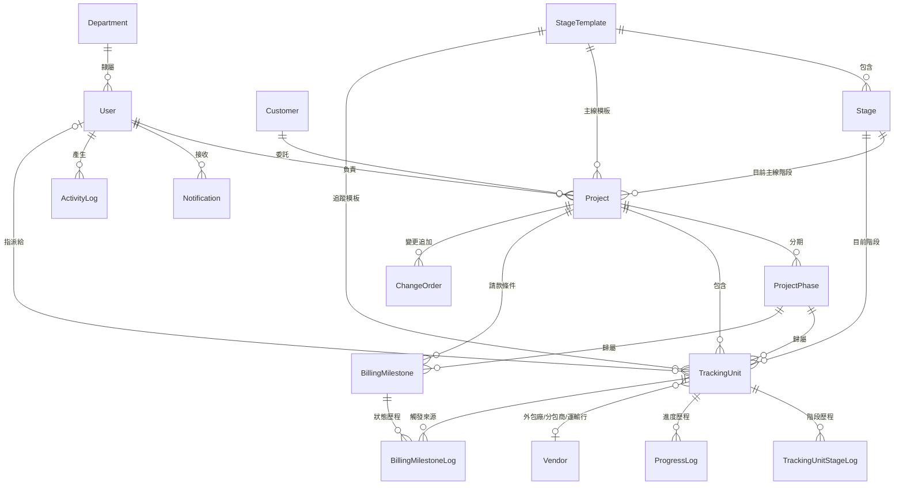

# 04 — 資料庫規劃

> 鐵正綱工程 內部管理系統｜PostgreSQL 16 + Django 5 ORM
> 版本 v0.1｜2026-08-01｜狀態：**待確認**

> 📌 **v0.3 變更（2026-08-02）**：請款模型改為兩層——
> `BillingMilestone`（合約條件：比例、觸發方式、指定交貨地點）＋ **`BillingClaim`（實際請款事件，新表）**。
> 里程碑新增 `trigger_type`（手動／該期全部簽收／累計重量達門檻／每批分批請）、`threshold_pct`、
> `target_location` 與三個累計金額欄位；追蹤單元新增 `total_weight_kg`、`signoff_location`。
> **完整欄位定義以 `鐵正綱ERP_資料庫設計.xlsx` 為準**，本文件保留設計理由與脈絡。

---

## 1. 設計原則

| 原則 | 說明 |
|---|---|
| **一張表吃兩種業務** | 構件批次與土建工項共用 `TrackingUnit`，靠 `unit_type` ＋ `stage_template` 區分——不寫兩套 |
| **流程可設定** | 階段不寫死在程式裡，存在 `StageTemplate` / `Stage`，改流程不用改程式 |
| **歷程不可變** | 階段異動與進度回報只新增不修改，且**記錄階段名稱快照**，模板日後改了歷程也不失真 |
| **金額用 Decimal** | 一律 `DecimalField`，絕不用 `FloatField`——浮點數會算錯錢 |
| **刪除用 PROTECT** | 主檔被引用時禁止刪除，只能停用；避免孤兒資料 |
| **稽核自動化** | 用 `django-simple-history`，不手寫稽核表 |
| **軟性欄位少用** | 不用 JSON 欄位存業務資料（查詢與約束都會失控），只用於少量設定值 |

---

## 2. App 切分

依貴公司 `docs/../開發/07_Django程式規範.md` 規範，模組一律放在 `main/apps/` 底下，
且**每張表一個 python 檔**（`models/{table_name}.py`，由 `models/__init__.py` 匯出）：

```
main/apps/
├─ core/         User, Department, Attachment, Notification,
│                ActivityLog, SystemParameter
├─ masters/      Customer, Vendor, StageTemplate, Stage
├─ projects/     Project, ProjectPhase, ChangeOrder
├─ tracking/     TrackingUnit, TrackingUnitStageLog, ProgressLog   ★核心
├─ billing/      BillingMilestone, BillingMilestoneLog
├─ production/   ProductionLine
└─ analytics/    KpiSnapshot
```

```
main/apps/tracking/models/
├─ __init__.py                    # from .tracking_unit import *  …
├─ tracking_unit.py
├─ tracking_unit_stage_log.py
└─ progress_log.py
```

App 邊界即未來的模組邊界：P2 加 `procurement/` `inventory/` `finance/`，
P3 加 `manufacturing/` `quality/` `delivery/`，P4 加 `hr/` `workflow/` `sop/`。

---

## 3. ERD（P1）



### 3.1 核心關係的白話解釋

```
一個「專案」
  ├─ 走一條「主線階段流程」（7 階段）
  ├─ 可分成幾個「期別」（選填）
  ├─ 底下有很多「追蹤單元」   ← 鋼構叫批次、土建叫工項，同一張表
  │    ├─ 各自走一條「階段流程」（鋼構 9 階段 / 土建 5 階段）
  │    ├─ 每次階段異動 → 寫一筆「階段歷程」（不可改）
  │    └─ 每次回報數量 → 寫一筆「進度歷程」（不可改）
  └─ 有幾筆「請款里程碑」
       └─ 當追蹤單元推進到帶「觸發請款」旗標的階段
          → 里程碑自動變「可請款」，寫一筆「狀態歷程」
```

---

## 4. 資料表規格

### 4.1 `core_user`（擴充 Django AbstractUser）

| 欄位 | 型別 | 約束 | 說明 |
|---|---|---|---|
| `id` | BigAutoField | PK | |
| `username` | varchar(50) | UNIQUE, NOT NULL | 登入帳號 |
| `password` | varchar(128) | NOT NULL | Django PBKDF2 雜湊 |
| `employee_no` | varchar(20) | UNIQUE, NULL | 員工編號 |
| `name` | varchar(50) | NOT NULL | 姓名（中文） |
| `department_id` | FK → `core_department` | SET_NULL, NULL | 所屬部門 |
| `title` | varchar(50) | NULL | 職稱 |
| `phone` | varchar(20) | NULL | 手機 |
| `email` | varchar(254) | NULL | |
| `is_active` | boolean | DEFAULT true | 停用而非刪除 |
| `must_change_password` | boolean | DEFAULT true | 首次登入強制改密碼 |
| `is_staff` / `is_superuser` | boolean | | Django Admin 存取權 |
| `date_joined` / `last_login` | timestamptz | | |

**角色**：用 Django 內建 `auth_group`，group name 對應角色代號（`owner`/`pm`/`plant_mgr`/…），透過 `auth_user_groups` 多對多。**一人可多角色，權限取聯集。**

```python
class User(AbstractUser):
    def has_role(self, *codes):
        return self.groups.filter(name__in=codes).exists()
```

**索引**：`employee_no`、`department_id`、`is_active`

---

### 4.2 `core_department`

| 欄位 | 型別 | 約束 | 說明 |
|---|---|---|---|
| `id` | BigAutoField | PK | |
| `code` | varchar(20) | UNIQUE | 部門代號 |
| `name` | varchar(50) | NOT NULL | 部門名稱 |
| `parent_id` | FK → self | SET_NULL, NULL | 上層部門 |
| `manager_id` | FK → `core_user` | SET_NULL, NULL | 部門主管 |
| `sort_order` | smallint | DEFAULT 0 | 顯示順序 |
| `is_active` | boolean | DEFAULT true | |

---

### 4.3 `core_attachment`（泛用附件）

| 欄位 | 型別 | 約束 | 說明 |
|---|---|---|---|
| `id` | BigAutoField | PK | |
| `content_type_id` | FK → `django_content_type` | CASCADE | 掛在哪種物件上 |
| `object_id` | bigint | NOT NULL | 該物件的 id |
| `file` | varchar(300) | NOT NULL | 檔案路徑（**檔案存檔案系統，DB 只存路徑**） |
| `original_name` | varchar(255) | NOT NULL | 原始檔名 |
| `size_bytes` | bigint | NOT NULL | 檔案大小 |
| `mime_type` | varchar(100) | | |
| `uploaded_by_id` | FK → `core_user` | SET_NULL, NULL | |
| `uploaded_at` | timestamptz | auto_now_add | |
| `note` | varchar(200) | NULL | |

**索引**：`(content_type_id, object_id)`
**限制**：單檔 ≤ 20MB；允許 pdf/jpg/png/xlsx/dwg
**儲存路徑**：`attachments/%Y/%m/<uuid>.<ext>`（不用原始檔名，避免中文檔名與碰撞問題）

---

### 4.4 `core_notification`

| 欄位 | 型別 | 約束 | 說明 |
|---|---|---|---|
| `id` | BigAutoField | PK | |
| `recipient_id` | FK → `core_user` | CASCADE | 收件者 |
| `title` | varchar(200) | NOT NULL | |
| `body` | text | NULL | |
| `link_url` | varchar(500) | NULL | 前端路由（點擊跳轉） |
| `category` | varchar(20) | ENUM | `billing`/`tracking`/`alert`/`system` |
| `is_read` | boolean | DEFAULT false | |
| `read_at` | timestamptz | NULL | |
| `dedup_key` | varchar(150) | NULL | **防重複通知的鍵** |
| `created_at` | timestamptz | auto_now_add | |

**索引**：`(recipient_id, is_read, created_at DESC)`、`(dedup_key, created_at)`

> 💡 **`dedup_key` 的用途**：每日掃描時，key 設為 `alert:outsource_overdue:unit_123`。
> 建立前先查「同 key 在 3 天內是否已有紀錄」，有就跳過——避免同一件事天天轟炸（US-060）。

---

### 4.5 `core_activitylog`（動態）

| 欄位 | 型別 | 約束 | 說明 |
|---|---|---|---|
| `id` | BigAutoField | PK | |
| `actor_id` | FK → `core_user` | SET_NULL, NULL | 誰做的（系統自動時為 NULL） |
| `verb` | varchar(300) | NOT NULL | 顯示文字，如「固越案·第一期-1F鋼柱 進入 置料區」 |
| `category` | varchar(20) | ENUM | `project`/`tracking`/`billing`/`line`/`system` |
| `project_id` | FK → `projects_project` | SET_NULL, NULL | **用於資料範圍過濾** |
| `content_type_id` / `object_id` | | NULL | 指向來源物件 |
| `created_at` | timestamptz | auto_now_add | |

**索引**：`(created_at DESC)`、`(project_id, created_at DESC)`

> ⚠️ **`ActivityLog` 與稽核軌跡是兩回事**：
> - `ActivityLog` = **給人看的動態**，人類可讀的一句話，顯示在儀表板
> - 稽核軌跡 = **給查核用的欄位級變更紀錄**，由 `django-simple-history` 自動產生 `*_historical` 表

---

### 4.6 `masters_customer`

| 欄位 | 型別 | 約束 | 說明 |
|---|---|---|---|
| `id` | BigAutoField | PK | |
| `code` | varchar(20) | UNIQUE | 客戶代號 |
| `name` | varchar(100) | NOT NULL | 客戶名稱 |
| `tax_id` | varchar(8) | NULL | 統一編號 |
| `contact_name` / `contact_phone` | varchar(50)/(30) | NULL | 聯絡窗口 |
| `address` | varchar(200) | NULL | |
| `note` | text | NULL | |
| `is_active` | boolean | DEFAULT true | |
| `created_at` / `updated_at` | timestamptz | | |

---

### 4.7 `masters_vendor`（廠商總表）

| 欄位 | 型別 | 約束 | 說明 |
|---|---|---|---|
| `id` | BigAutoField | PK | |
| `code` | varchar(20) | UNIQUE | 廠商代號 |
| `name` | varchar(100) | NOT NULL | 廠商名稱 |
| `tax_id` | varchar(8) | NULL | 統一編號 |
| `vendor_types` | **ArrayField(varchar(20))** | NOT NULL | **可多選**：`supplier`/`subcontractor`/`outsource`/`transport` |
| `contact_name` / `contact_phone` | | NULL | |
| `address` | varchar(200) | NULL | |
| `payment_terms` | varchar(100) | NULL | 付款條件（P2 用） |
| `note` | text | NULL | |
| `is_active` | boolean | DEFAULT true | |

**索引**：`vendor_types` 用 **GIN 索引**（PostgreSQL ArrayField）

> 💡 **為何用一張表而非四張**：現實中「全興噴砂廠」可能同時是外包加工廠與供應商。
> 分成四張表會重複建檔、統編對不起來。用 `vendor_types` 陣列一次解決。
>
> 查詢範例：`Vendor.objects.filter(vendor_types__contains=['outsource'])`

---

### 4.8 `masters_stagetemplate`

| 欄位 | 型別 | 約束 | 說明 |
|---|---|---|---|
| `id` | BigAutoField | PK | |
| `code` | varchar(30) | UNIQUE | 如 `steel_batch` |
| `name` | varchar(50) | NOT NULL | 如「鋼構構件批次」 |
| `applies_to` | varchar(20) | ENUM | `project_main`/`steel_batch`/`civil_work_item` |
| `is_default` | boolean | DEFAULT false | 該類型的預設模板 |
| `is_active` | boolean | DEFAULT true | |
| `note` | text | NULL | |

**約束**：每個 `applies_to` 至多一個 `is_default = true`（PostgreSQL partial unique index）

---

### 4.9 `masters_stage`

| 欄位 | 型別 | 約束 | 說明 |
|---|---|---|---|
| `id` | BigAutoField | PK | |
| `template_id` | FK → `masters_stagetemplate` | CASCADE | |
| `seq` | smallint | NOT NULL | 順序（1 起） |
| `code` | varchar(30) | NOT NULL | 如 `deliver` |
| `name` | varchar(30) | NOT NULL | 如「出貨進場」 |
| `color` | varchar(7) | DEFAULT `#64748b` | `#RRGGBB` |
| **`is_billing_trigger`** | boolean | DEFAULT false | **此階段完成條件達成 → 觸發請款** |
| **`requires_signoff`** ★ | boolean | DEFAULT false | **此階段需登錄簽收資料。與 `is_billing_trigger` 併用時，改為「登錄簽收後」才觸發，而非進入階段就觸發** |
| **`is_outsource`** | boolean | DEFAULT false | 需填協力廠與進出廠日 |
| **`is_hold`** | boolean | DEFAULT false | 等待狀態，不計產能 |
| **`is_core`** | boolean | DEFAULT false | 核心加值（計入 OEE 與加工成本） |
| `stall_days` | smallint | NULL | **停留超過幾天列入需關注**（NULL = 不檢查） |
| `is_active` | boolean | DEFAULT true | |

**約束**：`UNIQUE(template_id, seq)`、`UNIQUE(template_id, code)`

**P1 預載資料**（`seed_masters` management command）

<details>
<summary>三組預設階段模板</summary>

**模板 1：專案主線（`project_main`）**

| seq | code | name | color | 旗標 |
|---|---|---|---|---|
| 1 | lead | 接案 | `#6366f1` | |
| 2 | design | 深化設計 | `#3b82f6` | stall_days=30 |
| 3 | quote | 報價 | `#0ea5e9` | stall_days=14 |
| 4 | purchase | 採購備料 | `#14b8a6` | |
| 5 | build | 施工中 | `#f59e0b` | |
| 6 | verify | 完工驗收 | `#10b981` | |
| 7 | close | 結案 | `#64748b` | |

**模板 2：鋼構構件批次（`steel_batch`）— 9 階段**

| seq | code | name | 旗標 | stall_days |
|---|---|---|---|---|
| 1 | receive | 進料驗收 | | 7 |
| 2 | fab | 加工 | `is_core` | |
| 3 | qc | 品檢 | | 3 |
| 4 | staging | 置料區 | **`is_hold`** | 14 |
| 5 | surface | 表面處理 | **`is_outsource`**, `is_core` | |
| 6 | deliver | 出貨進場 | | 3 |
| **7** | **signoff** | **進場簽收** ★ | **`requires_signoff`** ＋ **`is_billing_trigger`** | **7** |
| 8 | install | 安裝 | | |
| 9 | finish | 收尾 | | 14 |

**模板 3：土建工項（`civil_work_item`）— 5 階段**

| seq | code | name | 旗標 | stall_days |
|---|---|---|---|---|
| 1 | layout | 放樣定位 | | |
| 2 | construct | 施工中 | `is_core` | |
| 3 | selfcheck | 自主檢查 | | 7 |
| 4 | inspect | 監造查驗 | | 14 |
| 5 | done | 完成 | **`is_billing_trigger`**（進入即觸發，不需另簽） | |

</details>

> 📌 **2026-08-02 決議**：鋼構由 8 階段改為 9 階段，新增第 7 站「進場簽收」；
> 請款改為**登錄簽收資料後**觸發。土建維持「完成」階段進入即觸發（監造查驗通過即可計價）。
> 完整階段設定見 **`鐵正綱ERP_資料庫設計.xlsx` → ⑤ 階段模板**。

---

### 4.10 `projects_project`

| 欄位 | 型別 | 約束 | 說明 |
|---|---|---|---|
| `id` | BigAutoField | PK | |
| `code` | varchar(20) | UNIQUE, NOT NULL | `P-2026-001`，系統產生不可改 |
| `name` | varchar(200) | NOT NULL | 案名 |
| `project_type` | varchar(10) | ENUM | `civil`/`steel`/`mixed` |
| `customer_id` | FK → `masters_customer` | **PROTECT** | |
| `contract_amount` | **numeric(14,2)** | NULL | **單位：新台幣元** |
| `owner_id` | FK → `core_user` | **PROTECT** | 專案負責人 |
| `start_date` / `due_date` | date | NULL | 開工／預計完工 |
| `actual_end_date` | date | NULL | 實際完工 |
| `main_template_id` | FK → `masters_stagetemplate` | PROTECT | 主線模板 |
| `main_stage_id` | FK → `masters_stage` | PROTECT | 目前主線階段 |
| `status` | varchar(10) | ENUM, DEFAULT `ontrack` | `ontrack`/`atrisk`/`delayed` |
| `is_closed` | boolean | DEFAULT false | |
| `note` | varchar(500) | NULL | |
| `contract_terms` | text | NULL | 合約條款（工期、請款、罰則、保固） |
| `quote_info` | text | NULL | 報價資訊 |
| `doc_links` | text | NULL | 文件連結 |
| `created_by_id` | FK → `core_user` | SET_NULL | |
| `created_at` / `updated_at` | timestamptz | | |

**索引**：`(status)`、`(is_closed, due_date)`、`(owner_id)`、`(project_type)`、`(customer_id)`

**衍生值（不存欄位，即時計算）**
- 有效合約額 = `contract_amount` + 已核准變更單金額合計
- 已收款 = 該案 `state='received'` 的里程碑金額合計
- 資金收攏率 = 已收款 ÷ 有效合約額

---

### 4.11 `projects_projectphase`

| 欄位 | 型別 | 約束 | 說明 |
|---|---|---|---|
| `id` | BigAutoField | PK | |
| `project_id` | FK → `projects_project` | CASCADE | |
| `seq` | smallint | NOT NULL | |
| `name` | varchar(50) | NOT NULL | 如「第一期」 |
| `note` | varchar(200) | NULL | |

**約束**：`UNIQUE(project_id, seq)`

---

### 4.12 `projects_changeorder`

| 欄位 | 型別 | 約束 | 說明 |
|---|---|---|---|
| `id` | BigAutoField | PK | |
| `code` | varchar(30) | UNIQUE | `CO-2026-001` |
| `project_id` | FK → `projects_project` | CASCADE | |
| `title` | varchar(200) | NOT NULL | |
| `amount` | numeric(14,2) | NOT NULL | **可正可負**（追加為正、減帳為負） |
| `reason` | text | NOT NULL | |
| `status` | varchar(10) | ENUM, DEFAULT `draft` | `draft`/`submitted`/`approved`/`rejected` |
| `approved_by_id` | FK → `core_user` | SET_NULL, NULL | |
| `approved_at` | timestamptz | NULL | |
| `created_by_id` / `created_at` | | | |

> ⚠️ **只有 `status='approved'` 的變更單才計入有效合約額**，並連帶重算所有里程碑金額。

---

### 4.13 `tracking_trackingunit` ★核心表

| 欄位 | 型別 | 約束 | 說明 |
|---|---|---|---|
| `id` | BigAutoField | PK | |
| `code` | varchar(30) | UNIQUE | `B-2026-0001` / `W-2026-0001` |
| `project_id` | FK → `projects_project` | CASCADE | |
| `phase_id` | FK → `projects_projectphase` | SET_NULL, NULL | 所屬期別 |
| **`unit_type`** | varchar(12) | ENUM, NOT NULL | **`batch` 構件批次 ／ `work_item` 土建工項** |
| `name` | varchar(200) | NOT NULL | |
| `template_id` | FK → `masters_stagetemplate` | PROTECT | |
| `current_stage_id` | FK → `masters_stage` | PROTECT | |
| `stage_entered_at` | timestamptz | NOT NULL | **進入目前階段的時間**（停滯判定用） |
| `assignee_id` | FK → `core_user` | SET_NULL, NULL | 指派給誰（「我的工作」的依據） |
| `status` | varchar(10) | ENUM, DEFAULT `ontrack` | `ontrack`/`atrisk`/`delayed` |
| **— 鋼構專用 —** | | | |
| `qty_total` | numeric(12,2) | NULL | 總數量 |
| `qty_done` | numeric(12,2) | DEFAULT 0 | 已完成數量 |
| `unit_of_measure` | varchar(10) | NULL | 支／組／噸／片／件 |
| **— 土建專用 —** | | | |
| `progress_pct` | numeric(5,2) | NULL | 完成百分比 0–100 |
| `subcontractor_id` | FK → `masters_vendor` | SET_NULL, NULL | 分包商 |
| `subcontract_amount` | numeric(14,2) | NULL | 分包契約金額 |
| **— 外包 —** | | | |
| `work_mode` | varchar(12) | ENUM, DEFAULT `self` | `self` 自行 ／ `outsource` 外包 |
| `outsource_vendor_id` | FK → `masters_vendor` | SET_NULL, NULL | 協力廠 |
| `outsource_in_date` | date | NULL | 實際進廠日 |
| `outsource_due_date` | date | NULL | **預計出廠日**（逾期判定用） |
| `outsource_out_date` | date | NULL | 實際出廠日 |
| **— 運輸 —** | | | |
| `transport_vendor_id` | FK → `masters_vendor` | SET_NULL, NULL | 運輸廠商 |
| **— 進場簽收 ★（2026-08-02 新增）—** | | | |
| **`signoff_date`** | date | NULL, 索引 | **業主／監造簽收日。登錄後觸發請款** |
| **`signoff_by_name`** | varchar(50) | NULL | **簽收人姓名（業主方人員，非系統使用者，故存文字）** |
| **`signoff_doc_no`** | varchar(40) | NULL | **簽收單號。簽收單掃描檔用 `core_attachment` 掛在本表上** |
| **— 日期 —** | | | |
| `plan_start` / `plan_end` | date | NULL | 預計起迄 |
| `actual_start` / `actual_end` | date | NULL | 實際起迄 |
| **— 其他 —** | | | |
| `rollback_count` | smallint | DEFAULT 0 | 回退次數（≥2 自動升級延誤） |
| `note` | varchar(500) | NULL | |
| `created_by_id` / `created_at` / `updated_at` | | | |

**CHECK 約束（在資料庫層強制）**

```sql
-- 構件批次必須有數量與單位
CHECK (unit_type <> 'batch' OR (qty_total IS NOT NULL AND unit_of_measure IS NOT NULL))
-- 土建工項必須有百分比
CHECK (unit_type <> 'work_item' OR progress_pct IS NOT NULL)
-- 數量不可為負、不可超過總數
CHECK (qty_done >= 0)
CHECK (qty_total IS NULL OR qty_done <= qty_total)
-- 百分比範圍
CHECK (progress_pct IS NULL OR (progress_pct >= 0 AND progress_pct <= 100))
-- 總數量必須大於 0
CHECK (qty_total IS NULL OR qty_total > 0)
-- 出廠日不可早於進廠日
CHECK (outsource_out_date IS NULL OR outsource_in_date IS NULL OR outsource_out_date >= outsource_in_date)
```

**索引**

| 索引 | 用途 |
|---|---|
| `(project_id, unit_type)` | 專案展開層列出批次／工項 |
| `(current_stage_id)` | 看板依階段分欄 |
| `(status)` | 需要關注清單 |
| `(assignee_id, status)` | 「我的工作」 |
| `(stage_entered_at)` | 停滯掃描 |
| `(work_mode, outsource_due_date) WHERE outsource_out_date IS NULL` | **部分索引**：只掃還沒回廠的外包 |
| `(project_id, phase_id)` | 期別對應請款 |

> 💡 **部分索引（Partial Index）的價值**：外包逾期掃描只關心「還沒回廠的」，
> 建部分索引讓這個每日查詢只掃幾十筆而非全表——這是 8GB 機器上的效能關鍵。

---

### 4.14 `tracking_trackingunitstagelog`（階段歷程，不可變）

| 欄位 | 型別 | 約束 | 說明 |
|---|---|---|---|
| `id` | BigAutoField | PK | |
| `unit_id` | FK → `tracking_trackingunit` | CASCADE | |
| `from_stage_id` | FK → `masters_stage` | SET_NULL, NULL | 建立時為 NULL |
| `to_stage_id` | FK → `masters_stage` | PROTECT | |
| **`from_stage_name`** | varchar(30) | NULL | **階段名稱快照** |
| **`to_stage_name`** | varchar(30) | NOT NULL | **階段名稱快照** |
| `direction` | varchar(10) | ENUM | `create`/`forward`/`backward` |
| `reason_category` | varchar(20) | NULL | **回退時必填**（見 §5.4） |
| `note` | varchar(500) | NULL | |
| `moved_by_id` | FK → `core_user` | SET_NULL, NULL | |
| `moved_at` | timestamptz | NOT NULL, auto_now_add | |

**索引**：`(unit_id, moved_at DESC)`、`(moved_at)`、`(direction, moved_at)`

> 💡 **為何要存階段名稱快照**：若日後把「品檢」改名為「品質檢驗」，
> 歷史紀錄應該顯示當時的名稱。只存 FK 會讓所有歷史紀錄跟著變——那是竄改歷史。

**不可變性**：模型層覆寫 `save()`，`pk` 存在時直接拋 `ValidationError`；不提供 UPDATE/DELETE 的 API 端點。

---

### 4.15 `tracking_progresslog`（進度回報歷程，不可變）

| 欄位 | 型別 | 約束 | 說明 |
|---|---|---|---|
| `id` | BigAutoField | PK | |
| `unit_id` | FK → `tracking_trackingunit` | CASCADE | |
| `qty_before` / `qty_after` | numeric(12,2) | NULL | 構件批次用 |
| `pct_before` / `pct_after` | numeric(5,2) | NULL | 土建工項用 |
| `delta` | numeric(12,2) | NOT NULL | 增減量（可為負） |
| `note` | varchar(500) | NULL | **往回改時必填** |
| `reported_by_id` | FK → `core_user` | SET_NULL, NULL | |
| `reported_at` | timestamptz | NOT NULL, auto_now_add | **系統時間，不可由使用者指定** |

**索引**：`(unit_id, reported_at DESC)`、`(reported_by_id, reported_at DESC)`

> 💡 這張表未來是**日報表與人員產出分析**的資料來源（P3 報工的前身）。

---

### 4.16 `billing_billingmilestone`（合約條件層）

| 欄位 | 型別 | 約束 | 說明 |
|---|---|---|---|
| `id` | BigAutoField | PK | |
| `project_id` | FK → `projects_project` | CASCADE | |
| `phase_id` | FK → `projects_projectphase` | SET_NULL, NULL | 對應期別；**決定哪些批次的簽收會觸發它** |
| `seq` | smallint | NOT NULL | |
| `label` | varchar(100) | NOT NULL | 如「第一期請款」 |
| `trigger_desc` | varchar(200) | NULL | 合約原文，如「第一期構件全數運抵工地並經業主簽收」 |
| `percentage` | numeric(5,2) | CHECK 0–100 | 如 30.00 |
| `amount` | numeric(14,2) | NOT NULL | 系統計算 = 有效合約額 × 比例，**唯讀** |
| **`trigger_type`** ★ | varchar(20) | ENUM, 索引 | **`manual`／`all_signed`／`weight_threshold`／`per_batch`** |
| **`threshold_pct`** | numeric(5,2) | 條件必填 | `weight_threshold` 時必填，如 80.00 |
| **`target_location_id`** | FK → `inventory_location` | SET_NULL, NULL | **合約指定交貨地點**（施工案場／業主廠房） |
| **`claimable_amount`** | numeric(14,2) | DEFAULT 0 | 累計已達可請款的金額 |
| **`claimed_amount`** | numeric(14,2) | DEFAULT 0 | 累計已開單金額 |
| **`received_amount`** | numeric(14,2) | DEFAULT 0 | 累計已收款金額 |
| `state` | varchar(12) | ENUM, 索引 | 彙總狀態（由上述三金額推導）：`pending`／`claimable`／**`partial`**／`invoiced`／`received` |
| `claimable_at` | timestamptz | NULL | 首次轉可請款的時間 |

**四種觸發方式**

| `trigger_type` | 何時產生請款事件 | 產生幾筆 | 適用合約寫法 |
|---|---|---|---|
| `manual` | 會計人工建立 | 1 | 「簽約後支付訂金 30%」 |
| `all_signed` | 該期別**最後一批**簽收時 | 1（全額） | 「該期構件全數運抵並簽收後」 |
| `weight_threshold` | 累計簽收噸數佔比 ≥ `threshold_pct` | 1（全額） | 「該期交付達 80% 後」 |
| `per_batch` | **每批簽收各產生一筆** | N | 「按實際交付數量分批計價」 |

`per_batch` 的金額公式：
```
本筆金額 = 里程碑金額 × (該批 total_weight_kg ÷ 該期別所有批次的 total_weight_kg 合計)
```

> ⚠️ **分母會變動**：若該期日後又新增批次，先前算過的佔比會失準。
> 建議首次觸發時**鎖定分母快照**——這點列在待確認事項。

---

### 4.17 `billing_billingclaim`（實際請款層，新表）★

| 欄位 | 型別 | 約束 | 說明 |
|---|---|---|---|
| `id` | BigAutoField | PK | |
| `milestone_id` | FK → `billing_billingmilestone` | CASCADE | |
| `seq` | smallint | UNIQUE(milestone, seq) | 同里程碑下的序號 |
| `amount` | numeric(14,2) | CHECK > 0 | 本筆可請金額 |
| `source` | varchar(20) | ENUM | `auto_signoff` 簽收自動產生／`manual` 人工建立 |
| `triggered_by_unit_id` | FK → `tracking_trackingunit` | SET_NULL, 索引 | **哪一批的簽收產生了這筆** |
| `state` | varchar(12) | ENUM, 索引 | `claimable`／`invoiced`／`received` |
| `claimable_at` | timestamptz | NOT NULL, 索引 | 產生時間；逾 7 天未開單提醒會計 |
| `invoice_date` / `invoice_no` | date / varchar(30) | NULL | 請款日與單號 |
| `receive_date` | date | CHECK ≥ invoice_date | 收款日 |
| `weight_kg_snapshot` | numeric(12,2) | NULL | 產生當時該批噸數快照（供對帳） |

> 💡 **為什麼要拆表**：里程碑是**合約寫的條件**，請款事件是**實際發生的請款**。
> `per_batch` 一個條件會產生多筆請款，單一狀態機表達不了「部分已請、部分可請、部分未到」。
> 拆開後四種觸發方式共用同一套下游流程（開單 → 收款），P2 的應收帳款也直接接這張表。

---

### 4.17b `billing_billingclaimlog`（狀態歷程，不可變）

`claim_id`、`from_state`、`to_state`、`reason`（往回轉必填）、`is_auto`、`amount_snapshot`、`changed_by_id`、`changed_at`

---

### 4.18 `production_productionline`

| 欄位 | 型別 | 約束 | 說明 |
|---|---|---|---|
| `id` | BigAutoField | PK | |
| `code` | varchar(20) | UNIQUE | |
| `name` | varchar(50) | NOT NULL | 如「雷射切割線 (HSG TLS)」 |
| `status` | varchar(12) | ENUM, DEFAULT `idle` | `run`/`changeover`/`repair`/`idle` |
| `current_work` | varchar(100) | NULL | 當前工單（**P1 純文字，P3 改 FK**） |
| `utilization` | numeric(5,2) | DEFAULT 0 | 稼動率 %（**P1 人工填，P3 由報工自動算**） |
| `today_output` | varchar(50) | NULL | 今日產出（P1 純文字） |
| `sort_order` | smallint | DEFAULT 0 | |
| `is_active` | boolean | DEFAULT true | |
| `updated_by_id` | FK → `core_user` | SET_NULL, NULL | |
| `updated_at` | timestamptz | auto_now | |

---

## 5. 列舉值定義

集中管理，前後端共用（後端 `TextChoices`，前端由 OpenAPI 產生 TS enum）。

### 5.1 `project_type` 專案類型

| 值 | 顯示 | 說明 |
|---|---|---|
| `civil` | 土建 | 只有工項 |
| `steel` | 鋼構 | 只有構件批次 |
| `mixed` | 混合 | 兩種都能建立 |

### 5.2 `status` 狀態燈號（專案與追蹤單元共用）

| 值 | 顯示 | 顏色 | 底色 |
|---|---|---|---|
| `ontrack` | 正常 | `#059669` | `#ecfdf5` |
| `atrisk` | 注意 | `#d97706` | `#fffbeb` |
| `delayed` | 延誤 | `#dc2626` | `#fef2f2` |

### 5.3 `unit_type` / `work_mode`

| 欄位 | 值 | 顯示 |
|---|---|---|
| `unit_type` | `batch` | 構件批次 |
| | `work_item` | 土建工項 |
| `work_mode` | `self` | 鐵正綱自行 |
| | `outsource` | 外包協力廠 |

### 5.4 `reason_category` 回退原因（品質成本統計來源）

| 值 | 顯示 | 未來歸類（P3 PAF） |
|---|---|---|
| `qc_fail` | 品檢不合格 | 內部失敗成本 |
| `dimension_error` | 尺寸錯誤 | 內部失敗成本 |
| `material_issue` | 材料問題 | 內部失敗成本 |
| `workmanship` | 施工缺失 | 內部失敗成本 |
| `owner_change` | 業主變更 | 非品質成本（外部因素） |
| `other` | 其他 | 需人工歸類 |

> 💡 **這個列舉是為 P3 的 PAF 品質成本模型鋪路**（手冊 11.2）。
> P1 就開始收集，到 P3 才有一年的歷史資料可分析。

### 5.5 `state` 請款狀態

| 值 | 顯示 | 顏色 | 底色 |
|---|---|---|---|
| `pending` | 未到 | `#94a3b8` | `#f1f5f9` |
| `claimable` | 可請款 | `#d97706` | `#fffbeb` |
| `invoiced` | 已請款 | `#2563eb` | `#eff6ff` |
| `received` | 已收款 | `#059669` | `#ecfdf5` |

### 5.6 `vendor_types` 廠商類型（可多選）

| 值 | 顯示 | 用在哪 |
|---|---|---|
| `supplier` | 供應商 | 採購（P2） |
| `subcontractor` | 分包商 | 土建工項 |
| `outsource` | 外包加工 | 構件批次表面處理 |
| `transport` | 運輸行 | 出貨進場 |

### 5.7 `line_status` 產線狀態

| 值 | 顯示 | 顏色 |
|---|---|---|
| `run` | 運轉中 | `#059669` |
| `changeover` | 換線中 | `#d97706` |
| `repair` | 維修 | `#dc2626` |
| `idle` | 閒置 | `#94a3b8` |

---

## 6. 資料型別慣例

| 類型 | Django 欄位 | PostgreSQL | 說明 |
|---|---|---|---|
| **金額** | `DecimalField(max_digits=14, decimal_places=2)` | `numeric(14,2)` | **單位：新台幣元**，上限約 999 億 |
| **百分比** | `DecimalField(max_digits=5, decimal_places=2)` | `numeric(5,2)` | 0.00–100.00 |
| **數量** | `DecimalField(max_digits=12, decimal_places=2)` | `numeric(12,2)` | 支援「噸」等有小數的單位 |
| **日期** | `DateField` | `date` | 欄名後綴 `_date` |
| **時間戳** | `DateTimeField` | `timestamptz` | 欄名後綴 `_at`，**存 UTC** |
| **短文字** | `CharField(max_length=n)` | `varchar(n)` | |
| **長文字** | `TextField` | `text` | |
| **布林** | `BooleanField` | `boolean` | 欄名前綴 `is_`／`has_` |
| **列舉** | `CharField(choices=TextChoices)` | `varchar(n)` | **不用整數列舉**（可讀性 > 幾 byte） |

> ⚠️ **金額單位的重要決定**：POC 用「萬」為單位，**資料庫一律存「元」**。
> 前端顯示時才轉換為「萬／億」。理由：避免小數精度損失，且與發票、會計系統對接時單位一致。

**時區**：`USE_TZ=True`，資料庫存 UTC，`TIME_ZONE='Asia/Taipei'` 顯示時轉換。

---

## 7. 資料完整性策略

### 7.1 什麼放資料庫約束、什麼放應用層

| 規則 | 放哪 | 理由 |
|---|---|---|
| 已完成數量 ≤ 總數量 | **DB CHECK** | 資料正確性的最後防線 |
| 百分比 0–100 | **DB CHECK** | 同上 |
| 收款日 ≥ 請款日 | **DB CHECK** | 同上 |
| 唯一編號 | **DB UNIQUE** | 併發下唯一有效的保證 |
| 主檔被引用時禁止刪除 | **DB FK PROTECT** | 同上 |
| 回退必填原因 | 應用層 | 需要友善錯誤訊息 |
| 里程碑百分比總和 = 100 | 應用層（**僅警告**） | 實務上可能真的不是 100（如保留款另計） |
| 只能推進一階 | 應用層 | 業務規則，非資料規則 |
| worker 只能動自己的 | 應用層（QuerySet 過濾） | 權限規則 |

### 7.2 交易邊界

**必須在同一個 `transaction.atomic()` 內**：

```python
# 階段推進（UC-M2-03）
with transaction.atomic():
    unit.current_stage = to_stage
    unit.stage_entered_at = timezone.now()
    unit.save()
    TrackingUnitStageLog.objects.create(...)   # 歷程
    ActivityLog.objects.create(...)            # 動態
# ↑ 三者同生共死，絕不會出現「階段變了但沒歷程」
```

**刻意放在交易外**（失敗不影響主流程）：
- 請款自動觸發（UC-M3-02）——觸發失敗只記警告，不能讓推進失敗
- 站內通知建立

### 7.3 併發控制

| 場景 | 策略 |
|---|---|
| 兩人同時推進同一單元 | `select_for_update()` 加行鎖；後到者看到「階段已被他人變更，請重新整理」 |
| 產生流水編號 | 用 PostgreSQL sequence 或 `select_for_update` 鎖住計數表，**不用 `MAX(id)+1`** |
| 同時回報數量 | 用 `F()` 表達式做原子加減，避免 lost update |

---

## 8. 資料量估算與容量規劃

依現況（年營收約 1 億、3–5 個同時進行的案子）推算：

| 資料表 | 年新增 | **5 年累計** | 單筆約 | 5 年容量 |
|---|---:|---:|---:|---:|
| `project` | 50 | 250 | 2 KB | 0.5 MB |
| `trackingunit` | 1,500 | 7,500 | 1 KB | 7.5 MB |
| `trackingunitstagelog` | 20,000 | 100,000 | 300 B | 30 MB |
| `progresslog` | 25,000 | 125,000 | 250 B | 31 MB |
| `billingmilestone` | 200 | 1,000 | 500 B | 0.5 MB |
| `activitylog` | 50,000 | 250,000 | 400 B | 100 MB |
| `notification` | 20,000 | 100,000 | 400 B | 40 MB |
| `*_historical`（稽核） | 80,000 | 400,000 | 1 KB | 400 MB |
| **合計** | | **< 100 萬筆** | | **≈ 610 MB** |

**結論：5 年後資料庫仍小於 1GB，8GB 機器綽綽有餘。**
加上索引與 PostgreSQL 內部開銷，估計 `shared_buffers=512MB` 就能把熱資料全放進記憶體。

### 8.1 資料保留政策

| 資料 | 保留 | 之後 |
|---|---|---|
| 專案、追蹤單元、里程碑 | **永久** | — |
| 階段歷程、進度歷程 | **永久** | 這是可追溯性的核心，不刪 |
| 稽核軌跡 | 7 年 | 歸檔到冷儲存 |
| `activitylog` | 2 年 | 刪除（有稽核軌跡就夠） |
| `notification` | 已讀後 6 個月 | 刪除 |
| 附件檔案 | 專案結案後 7 年 | 歸檔 |

清理由 `manage.py purge_old_logs` 每月執行一次。

---

## 9. 命名慣例

| 對象 | 慣例 | 範例 |
|---|---|---|
| 資料表 | Django 預設 `<app>_<model>` 全小寫 | `tracking_trackingunit` |
| 欄位 | `snake_case` | `outsource_due_date` |
| 外鍵 | Django 自動加 `_id` | `project_id` |
| 布林 | `is_` / `has_` 前綴 | `is_billing_trigger` |
| 日期 | `_date` 後綴 | `invoice_date` |
| 時間戳 | `_at` 後綴 | `created_at` |
| 數量 | `qty_` 前綴 | `qty_done` |
| 金額 | `_amount` 後綴 | `contract_amount` |
| 反向關聯 | `related_name` 用複數 | `project.units`、`unit.stage_logs` |

**編號格式**

| 對象 | 格式 | 範例 |
|---|---|---|
| 專案 | `P-YYYY-NNN` | `P-2026-015` |
| 構件批次 | `B-YYYY-NNNN` | `B-2026-0123` |
| 土建工項 | `W-YYYY-NNNN` | `W-2026-0045` |
| 變更單 | `CO-YYYY-NNN` | `CO-2026-003` |

---

## 10. 遷移策略

| 項目 | 做法 |
|---|---|
| Schema 變更 | Django migrations，全部進版控 |
| 種子資料 | `manage.py seed_masters`（階段模板、角色群組、部門）——**冪等，可重複執行** |
| 示範資料 | `manage.py seed_demo`（POC 的三個案例，僅開發環境） |
| 破壞性變更 | 刪欄位／改型別必須拆成三步：新增新欄位 → 雙寫 → 移除舊欄位 |
| 正式環境 | 上線前一律先備份：`pg_dump` → 執行 migrate → 驗證 |
| 回滾 | 每個 migration 都要能 `migrate <app> <前一個編號>` |

---

## 11. P2–P4 資料表預告

<details>
<summary>展開後續階段的資料表清單（約 55 張）</summary>

**P2 採購／庫存／財務（約 20 張）**
`PurchaseRequest` `PurchaseRequestLine` `Quotation` `PurchaseOrder` `PurchaseOrderLine` `GoodsReceipt` `GoodsReceiptLine` `VendorScore` `FrameContract`
`Material` `MaterialCategory` `Warehouse` `StockLot` `StockTransaction` `StockCount` `StockCountLine` `MillCertificate`
`Invoice` `Receivable` `Payable` `Expense` `CashFlowForecast` `CostSnapshot`

**P3 生產／品質／交付（約 20 張）**
`WorkOrder` `WorkOrderOperation` `Routing` `RoutingStep` `Equipment` `EquipmentMaintenance` `WorkReport` `ChangeoverLog` `OeeRecord` `OeeLoss`
`InspectionPlan` `InspectionRecord` `DefectRecord` `ReworkOrder` `ScrapRecord` `CustomerComplaint` `QualityCostEntry`
`Shipment` `ShipmentLine` `DeliveryReceipt`

**P4 人力／簽核／SOP（約 15 張）**
`Employee` `Certificate` `Shift` `Assignment` `Attendance` `LeaveRequest` `OvertimeRequest` `PayrollPeriod` `PayrollEntry` `PayrollItem` `SalaryGrade`
`FormTemplate` `FormField` `ApprovalFlow` `ApprovalStep` `ApprovalInstance` `AuthorityMatrix`
`SopDocument` `SopVersion` `SopReadReceipt`

</details>

---

## 12. 本文件的確認方式

- [ ] §4.9 **土建工項的 5 個階段是提議值，請務必校正**
- [ ] §4.9 各階段的 `stall_days`（停滯幾天算異常）設定合理嗎？
- [ ] §4.13 構件批次還需要哪些欄位？（材質、規格、重量、圖號？）
- [ ] §4.13 土建工項還需要哪些欄位？（工程項目編碼、契約單價、數量？）
- [ ] §4.16 里程碑百分比總和不是 100 的情況常見嗎？（如保留款）
- [ ] §5.4 回退原因的六個分類夠用嗎？
- [ ] §6 金額一律存「元」而非「萬」，可以接受嗎？
- [ ] §8.1 資料保留政策，`activitylog` 只留 2 年可以嗎？

---

## 相關文件

`../封存/02_Use_Case規格.md`｜`../封存/03_User_Story與驗收條件.md`｜`../封存/05_API規格.md`｜`../開發/05_KPI與成本公式.md`
