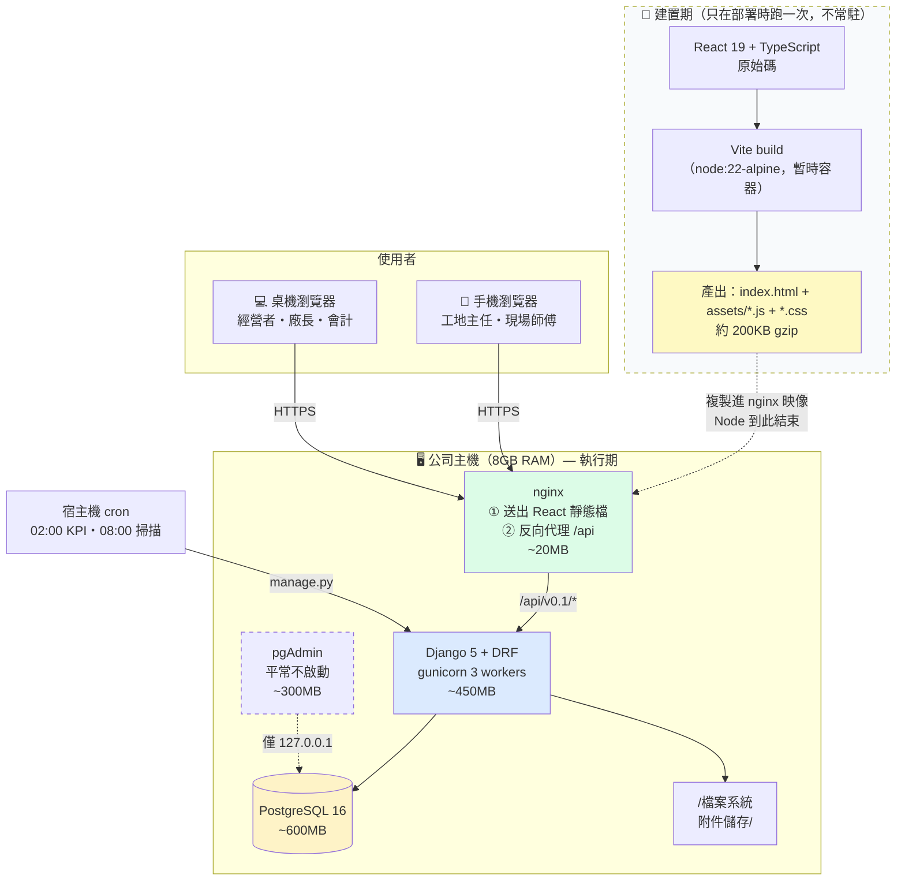

# 07 — 系統架構與開發路線圖

> 鐵正綱工程 內部管理系統
> 版本 v0.1｜2026-08-01｜狀態：**待確認**

---

## 1. 架構總覽



### 1.1 React 在哪裡？（常見疑問）

**React 存在，但它不是一個「執行中的服務」，所以不出現在執行期的方框裡。**

| | 建置期 | 執行期 |
|---|---|---|
| React 原始碼 | ✅ 存在（`web/src/`） | ❌ 不存在於伺服器 |
| Node.js | ✅ 跑 Vite 打包 | ❌ **完全沒有** |
| 產出 | `index.html` ＋ `assets/*.js` | ✅ nginx 直接送這些檔案 |
| 記憶體佔用 | 建置時約 1GB（暫時） | **0 MB**（靜態檔不佔記憶體） |

流程：
1. `docker compose build` 時，用 `node:22-alpine` 容器把 React 編譯成一堆 `.js` / `.css` / `.html` 靜態檔
2. 這些靜態檔**複製進 nginx 映像**，Node 容器隨即丟棄
3. 使用者開網頁 → nginx 送出這些檔案 → **React 在使用者的瀏覽器裡執行**
4. React 在瀏覽器中呼叫 `/api/v0.1/*` → nginx 轉給 Django

> 💡 **這正是「8GB 主機跑得動」的關鍵**。若改用 Next.js SSR，伺服器上就得常駐一個
> Node 程序（約 200MB）來即時算出每個頁面。現在的做法是——頁面早就算好了，
> nginx 只負責把檔案丟出去，而真正執行 React 的是使用者自己的手機和電腦。

**平常只跑 3 個服務，常駐約 1.1GB。**

---

## 2. 技術選型

### 2.1 選了什麼

| 層 | 技術 | 版本 | 為什麼 |
|---|---|---|---|
| 前端框架 | React | 19 | 沿用 POC，團隊已熟悉 |
| 建置工具 | **Vite** | 6 | 建置期產出靜態檔，**正式環境不需要 Node 程序** |
| 語言 | TypeScript | 5.7 | 型別由 OpenAPI 自動產生，前後端不脫鉤 |
| 樣式 | Tailwind CSS | 4 | POC 已用，且無執行期成本 |
| UI 元件 | shadcn/ui | — | **複製原始碼進專案**，不是套件依賴，可完全掌控 |
| 圖示 | lucide-react | — | POC 已用，可 tree-shake |
| 資料請求 | TanStack Query | 5 | 快取、重試、樂觀更新一次解決 |
| 路由 | React Router | 7 | — |
| 後端框架 | **Django** | 5.1 | Admin／權限／ORM／migration 全都現成 |
| API | Django REST Framework | 3.15 | — |
| API 文件 | drf-spectacular | — | **從程式碼產生 OpenAPI，永不過期** |
| 稽核 | django-simple-history | — | 欄位級變更紀錄，幾行設定搞定 |
| 篩選 | django-filter | — | — |
| 防暴力破解 | django-axes | — | 登入失敗鎖定 |
| 資料庫 | **PostgreSQL** | 16 | Decimal 精度、CHECK 約束、部分索引、ArrayField |
| WSGI | gunicorn | — | `gthread` worker，記憶體效率好 |
| 反向代理 | nginx | 1.27-alpine | — |
| 容器 | Docker Compose | — | 單機部署最單純的選擇 |
| 排程 | **宿主機 cron** | — | 不需要常駐 worker |

### 2.2 刻意不用什麼

| 不用 | 理由 |
|---|---|
| **Redis** | ERP 資料不適合放記憶體資料庫。唯一用途是 Celery 佇列，而我們用 cron。Session 與快取用 PostgreSQL 表即可。**省 ~100MB** |
| **Celery** | 目前所有背景工作都是「每天跑一次」，cron + management command 完全夠用。**省 ~250MB** |
| Next.js／SSR | 內部系統不需要 SEO 與首屏 SSR，且會在正式環境常駐 Node 程序。**省 ~200MB** |
| Elasticsearch | 資料量 5 年不到 100 萬筆，PostgreSQL 全文檢索綽綽有餘。**省 ~1GB** |
| Kubernetes／微服務 | 一台機器、一個團隊、50 個使用者。這是純粹的複雜度負債 |
| GraphQL | 只有一個前端 client，REST 更簡單且工具鏈成熟 |
| 前端狀態管理庫（Redux 等） | TanStack Query 管伺服器狀態，`useState` 管本地狀態，夠了 |
| Chart.js／D3／ECharts | P1 的圖表都是進度條與長條圖，**用 CSS 與 SVG 手刻**（POC 已證明可行）。**省 ~150KB bundle** |

> 💡 **每一項「不用」都是刻意的決定，不是遺漏。** 加回來的門檻是：
> 出現具體的、當前方案解不了的問題。

---

## 3. 8GB 主機的資源預算

### 3.1 記憶體分配

| 服務 | 預估 | **實測（2026-08-02）** | 控制手段 |
|---|---:|---:|---|
| nginx | 20 MB | **12.8 MB** | 只服務靜態檔與代理，不做運算 |
| Django × 3 workers | 450 MB | **164.4 MB** | `gthread` 2 threads／worker；`--max-requests 1000` 定期回收 |
| PostgreSQL | 600 MB | **45.3 MB** | `shared_buffers=512MB`、`max_connections=50` |
| **常駐小計** | ~1.1 GB | **222.5 MB** | **僅用掉預算的 18%** |

> 📌 **實測遠低於預估**。PostgreSQL 的 `shared_buffers` 是延遲配置的，
> 資料進來後會逐步成長到 512MB 上限；Django 目前只載入一個 app，
> W2 加入 15 張表與 Admin 後會再增加。即使兩者都吃到上限，
> 總量仍在 750MB 左右，離 1.5GB 目標有餘裕。
| pgAdmin（選用） | 300 MB | 400 MB | `profiles: [tools]`，**平常不啟動** |
| cron 任務（瞬時） | 200 MB | 200 MB | `iterator(chunk_size=500)` 分批處理 |
| **最壞情況** | | **~2.2 GB** | 仍留 5.8GB 給作業系統與檔案快取 |

### 3.2 PostgreSQL 調參

```conf
# deploy/postgres.conf — 針對 8GB 主機、~1GB 資料庫
shared_buffers = 512MB              # 熱資料幾乎全放得進來
effective_cache_size = 2GB          # 告訴查詢規劃器可用的 OS 快取
work_mem = 8MB                      # 單次排序／雜湊；× max_connections 要算得過來
maintenance_work_mem = 128MB        # VACUUM／建索引用
max_connections = 50                # gunicorn 3×2 + Admin + cron，50 綽綽有餘

wal_buffers = 16MB
checkpoint_completion_target = 0.9
min_wal_size = 512MB
max_wal_size = 2GB

random_page_cost = 1.1              # SSD
effective_io_concurrency = 200      # SSD

log_min_duration_statement = 500    # 記錄超過 500ms 的查詢
```

> ⚠️ `work_mem × max_connections = 8MB × 50 = 400MB` 是最壞情況，
> 加上 `shared_buffers` 512MB 仍在預算內。

### 3.3 gunicorn 設定

```bash
gunicorn tjg.wsgi:application \
  --bind 0.0.0.0:8000 \
  --workers 3 \
  --threads 2 \
  --worker-class gthread \
  --max-requests 1000 \
  --max-requests-jitter 100 \
  --timeout 60 \
  --graceful-timeout 30 \
  --access-logfile - --error-logfile -
```

| 參數 | 理由 |
|---|---|
| `--workers 3` | Django 是 I/O 密集（等資料庫），不需要 CPU 數 × 2 |
| `--threads 2` | `gthread` 用執行緒處理併發，比多開 process 省記憶體 |
| `--max-requests 1000` | **每個 worker 處理 1000 次請求後自動重啟**，杜絕記憶體緩慢累積 |
| `--max-requests-jitter 100` | 讓 3 個 worker 不同時重啟 |

### 3.4 映像檔大小

| 映像 | 基底 | 目標 | **實測** |
|---|---|---|---|
| `api` | `python:3.12-slim` | < 250 MB | **310 MB** ⚠️ |
| `web` | `nginx:1.27-alpine` + 建置產物 | < 60 MB | **74.5 MB**（尚未含前端產物） |
| `db` | `postgres:16-alpine` | ~250 MB | **420 MB** |

> ⚠️ **api 映像 310MB 超出原訂的 250MB。** 原目標訂得太樂觀——
> `python:3.12-slim` 基底就約 125MB，加上 Django、DRF、psycopg-binary
> 與 libmagic 後 300MB 左右是這個組合的合理下限。
> **映像大小不影響 8GB 的記憶體預算**（那是磁碟佔用），因此不打算為了
> 這 60MB 去換 alpine 基底——alpine 的 musl libc 會讓 psycopg 與
> python-magic 的安裝變複雜，得不償失。**目標修正為 < 350MB。**

前端用**多階段建置**：`node:22-alpine` 建置 → 產物複製到 nginx → **Node 完全不進最終映像**。

### 3.5 前端 Bundle 預算

| 項目 | 上限 |
|---|---|
| 初始 JS（gzip 後） | **< 200 KB** |
| 初始 CSS（gzip 後） | < 30 KB |
| 首屏渲染（4G 手機） | < 2 秒 |

做法：路由層級 code-split、圖示按需引入、不用重型圖表庫、Tailwind 自動 purge。

---

## 4. 專案結構

> ✅ **依貴公司既有的 `docs/../開發/07_Django程式規範.md` 規範**：專案命名 `{platform}-{system}`、
> 主資料夾 `main/`、模組放 `main/apps/`、settings 與 requirements 四分、
> app 內分 `actors / api / models / serializers / services / tests`。

```
tjg-inner/                          # {platform.name}-{system.name}
├─ .dockerignore  .gitignore  .env  .env.sample
├─ docker-compose.yml  Dockerfile
├─ manage.py                        # DJANGO_SETTINGS_MODULE 由環境變數決定
├─ README.MD                        # 含工作 log（時間／描述）
├─ logs/                            # 系統 log，按日分檔
├─ shell/
│  └─ create_django_app.sh
├─ requirements/
│  ├─ base.txt  local.txt  production.txt  test.txt
│
├─ main/                            # 專案主資料夾
│  ├─ settings/
│  │  ├─ base.py  local.py  production.py  test.py
│  ├─ urls.py                       # include 全部模組，前綴 api/v0.1
│  ├─ wsgi.py  asgi.py
│  ├─ utils/
│  │  ├─ logger.py                  # log decorator
│  │  ├─ permissions.py             # 角色權限
│  │  ├─ scoping.py                 # 資料可見範圍 Mixin
│  │  └─ exceptions.py              # 統一錯誤格式
│  └─ apps/                         # ★ 所有模組放這裡
│     ├─ core/                      # 帳號、部門、附件、通知、動態、系統參數
│     ├─ masters/                   # 客戶、廠商、階段模板、階段
│     ├─ projects/                  # 專案、期別、變更單
│     ├─ tracking/                  # 追蹤單元、階段歷程、進度歷程  ★核心
│     ├─ billing/                   # 請款里程碑、狀態歷程
│     ├─ production/                # 產線
│     └─ analytics/                 # KPI 快照、儀表板
│
└─ web/                             # React 前端（獨立資料夾）
   ├─ src/
   │  ├─ api/
   │  │  ├─ schema.d.ts             # ★ 由 OpenAPI 自動產生，不手改
   │  │  ├─ client.ts               # fetch wrapper（CSRF、錯誤處理）
   │  │  └─ hooks/                  # TanStack Query hooks
   │  ├─ components/ui/             # shadcn/ui
   │  ├─ components/domain/         # StatusBadge, StageChip, ProgressBar…
   │  ├─ pages/                     # Login, Dashboard, Projects,
   │  │                             # TrackingBoard, Billing, Lines, MyWork
   │  └─ lib/
   ├─ package.json  vite.config.ts  tailwind.config.ts
   └─ Dockerfile
```

### 4.1 單一模組的內部結構（依規範）

以核心模組 `tracking` 為例：

```
main/apps/tracking/
├─ actors/
│  └─ TrackingUnitManager.py       # CamelCase 檔名，一個 actor 一個檔
├─ api/
│  ├─ urls.py                      # 本模組的 API 路由（結尾不加 "/"）
│  └─ views/
│     └─ views.py
├─ models/                         # ★ 一張表一個檔
│  ├─ __init__.py                  # from .tracking_unit import *  …
│  ├─ tracking_unit.py
│  ├─ tracking_unit_stage_log.py
│  └─ progress_log.py
├─ serializers/
├─ services/                       # 可重複使用的商業邏輯（模組的 library）
│  ├─ stage_service.py             # move_stage() 等有副作用的操作
│  └─ progress_service.py
├─ migrations/
├─ tests/
│  ├─ test_actors.py               # 一個 actor 一個 class：Test<Actor.name>
│  └─ README.md                    # 測試案例說明（正常／邊界／異常）
├─ admin.py
├─ apps.py
└─ templates/
```

**分層原則**：業務邏輯放 `services/`，**不寫在 view 或 serializer 裡**。
理由：`move_stage()` 這種有副作用的操作，要能被 API、Django Admin、management command 三方共用——
這也正是規範所說「service 是模組的 library」。

### 4.2 API 路徑規範

```
<domain>/api/v0.1/<模組>/<資源>
```

版本從 **v0.1** 起（依規範），路徑結尾**不加** `/`。

### 4.3 與規範的三處待確認差異

| # | 項目 | 規範寫的 | 我的建議 | 為什麼 |
|---|---|---|---|---|
| 1 | **Swagger 套件** | `drf_yasg` | **`drf-spectacular`** | `drf_yasg` 只輸出 **Swagger 2.0**，不支援 OpenAPI 3。而「前端 TS 型別自動生成」需要 OpenAPI 3。若必須用 `drf_yasg`，前端型別就得手寫維護 |
| 2 | **Actor 是否用 DRF** | 範例註明「use django sdk，do not use restframe work」 | **用 DRF ViewSet** | 但規範同時要求 `serializers/` 與 `drf_yasg`（DRF 專用），推測該註記是針對特定情境。本系統有 38 個 CRUD 端點，用 DRF 可省大量樣板 |
| 3 | **測試框架** | `django.test.TestCase` | **依規範照做** | 無異議，改用 `TestCase` 與 `test_actors.py` 命名 |

> ⚠️ 第 1、2 項請確認要照規範還是照建議——這會影響前端型別同步與開發速度。

---

## 5. 部署

### 5.1 `docker-compose.yml`

```yaml
services:
  web:
    build: ./web
    ports: ["80:80", "443:443"]
    volumes:
      - ./deploy/nginx.conf:/etc/nginx/conf.d/default.conf:ro
      - media:/var/www/media:ro
    depends_on: [api]
    restart: unless-stopped
    mem_limit: 128m

  api:
    build: ./api
    env_file: [.env]
    volumes:
      - media:/app/media
      - ./logs:/app/logs
    depends_on:
      db: { condition: service_healthy }
    restart: unless-stopped
    mem_limit: 1g
    command: >
      gunicorn tjg.wsgi:application --bind 0.0.0.0:8000
      --workers 3 --threads 2 --worker-class gthread
      --max-requests 1000 --max-requests-jitter 100 --timeout 60

  db:
    image: postgres:16-alpine
    env_file: [.env]
    volumes:
      - pgdata:/var/lib/postgresql/data
      - ./deploy/postgres.conf:/etc/postgresql/postgresql.conf:ro
    command: postgres -c config_file=/etc/postgresql/postgresql.conf
    healthcheck:
      test: ["CMD-SHELL", "pg_isready -U $$POSTGRES_USER"]
      interval: 10s
      retries: 5
    restart: unless-stopped
    mem_limit: 1g

  pgadmin:
    image: dpage/pgadmin4:latest
    profiles: ["tools"]                 # ★ 平常不啟動
    ports: ["127.0.0.1:5050:80"]        # ★ 只綁本機，不對外
    env_file: [.env]
    volumes: [pgadmin:/var/lib/pgadmin]
    mem_limit: 512m

volumes:
  pgdata:
  media:
  pgadmin:
```

**啟動**

```bash
docker compose up -d                      # 平常：3 個服務
docker compose --profile tools up -d      # 需要看資料庫時才加 pgAdmin
```

### 5.2 cron 設定（宿主機）

```cron
# 每日 02:00 計算 KPI
0 2 * * * cd /opt/tjg && docker compose exec -T api python manage.py calc_daily_kpi >> logs/cron.log 2>&1

# 工作日 08:00 掃描逾期與異常
0 8 * * 1-5 cd /opt/tjg && docker compose exec -T api python manage.py scan_alerts >> logs/cron.log 2>&1

# 每日 01:00 備份
0 1 * * * /opt/tjg/deploy/backup.sh >> /opt/tjg/logs/backup.log 2>&1

# 每月 1 日 03:00 月度彙總
0 3 1 * * cd /opt/tjg && docker compose exec -T api python manage.py calc_monthly_kpi >> logs/cron.log 2>&1

# 每月 1 日 04:00 清理過期日誌
0 4 1 * * cd /opt/tjg && docker compose exec -T api python manage.py purge_old_logs >> logs/cron.log 2>&1
```

### 5.3 nginx 重點設定

```nginx
server {
    listen 443 ssl http2;
    server_name tjg.example.com;

    client_max_body_size 25M;          # 附件 20MB + 餘裕

    gzip on;
    gzip_types text/css application/javascript application/json image/svg+xml;
    gzip_min_length 1000;

    # 前端靜態檔（帶 hash 檔名，長快取）
    location /assets/ {
        root /usr/share/nginx/html;
        expires 1y;
        add_header Cache-Control "public, immutable";
    }

    # SPA 路由 fallback
    location / {
        root /usr/share/nginx/html;
        try_files $uri $uri/ /index.html;
        add_header Cache-Control "no-cache";
    }

    # API
    location /api/ {
        proxy_pass http://api:8000;
        proxy_set_header Host $host;
        proxy_set_header X-Real-IP $remote_addr;
        proxy_set_header X-Forwarded-For $proxy_add_x_forwarded_for;
        proxy_set_header X-Forwarded-Proto $scheme;
        proxy_read_timeout 60s;
    }

    # Django Admin
    location /admin/ { proxy_pass http://api:8000; ... }

    # API 文件：限內網
    location /api/schema/ {
        allow 192.168.0.0/16;
        allow 10.0.0.0/8;
        deny all;
        proxy_pass http://api:8000;
    }
}
```

> ⚠️ **附件不能用 nginx 直接服務靜態檔**——那樣任何人拿到 URL 就能下載合約。
> 附件必須經 Django view 檢查權限後，用 `X-Accel-Redirect` 交給 nginx 送出。

---

## 6. 安全性

| 面向 | 措施 |
|---|---|
| 傳輸 | 全站 HTTPS。對外用 Let's Encrypt；純內網用公司內部 CA 憑證 |
| Session | `HttpOnly` + `Secure` + `SameSite=Lax`；8 小時到期、2 小時閒置登出 |
| CSRF | Django CSRF middleware + `X-CSRFToken` header |
| 密碼 | Django PBKDF2；最少 8 碼；首次登入強制修改 |
| 暴力破解 | `django-axes`：連續 5 次失敗鎖 15 分鐘 |
| 權限 | 功能權限用 Django Group／Permission；**資料範圍在 `get_queryset()` 過濾** |
| 越權存取 | **無權限的資料回 404 而非 403**，不洩漏「存在但看不到」 |
| 檔案上傳 | 副檔名白名單 ＋ MIME 檢查 ＋ **magic bytes 驗證**；UUID 重新命名；20MB 上限 |
| 附件下載 | **經 Django view 檢查權限**，用 `X-Accel-Redirect` 交給 nginx |
| SQL Injection | 一律用 ORM；必要的 raw SQL 用參數化查詢 |
| XSS | React 預設跳脫；**禁用 `dangerouslySetInnerHTML`**（lint 規則強制） |
| 機密設定 | `SECRET_KEY`、DB 密碼放 `.env`，**`.env` 不進版控** |
| 正式環境 | `DEBUG=False`、`ALLOWED_HOSTS` 明確列舉、`SECURE_SSL_REDIRECT=True` |
| pgAdmin | 綁 `127.0.0.1`，需要時用 SSH tunnel 存取 |
| 稽核 | `django-simple-history` 記錄所有主檔與交易資料的欄位級變更 |

---

## 7. 備份與還原

### 7.1 `deploy/backup.sh`

```bash
#!/usr/bin/env bash
set -euo pipefail
BACKUP_DIR=/opt/tjg/backups
DATE=$(date +%Y%m%d_%H%M)

# 1. 資料庫
docker compose exec -T db pg_dump -U tjg -Fc tjg > "$BACKUP_DIR/db_$DATE.dump"

# 2. 附件（增量）
rsync -a --delete /var/lib/docker/volumes/tjg_media/_data/ "$BACKUP_DIR/media/"

# 3. 本機保留 14 天
find "$BACKUP_DIR" -name 'db_*.dump' -mtime +14 -delete

# 4. 異地（NAS 或雲端）
rsync -az "$BACKUP_DIR/" backup@nas:/volume1/tjg-backup/
```

### 7.2 還原演練

| 項目 | 規定 |
|---|---|
| 備份頻率 | 每日 01:00 |
| 本機保留 | 14 天 |
| 異地保留 | 90 天 |
| **還原演練** | **每季一次**，在測試環境完整還原並驗證資料 |
| RPO（可接受資料遺失） | 24 小時 |
| RTO（可接受停機時間） | 4 小時 |

> ⚠️ **沒有演練過的備份，等於沒有備份。** 每季演練是硬性規定。

**還原步驟**
```bash
docker compose down
docker volume rm tjg_pgdata && docker volume create tjg_pgdata
docker compose up -d db && sleep 10
docker compose exec -T db pg_restore -U tjg -d tjg --clean < backups/db_YYYYMMDD.dump
rsync -a backups/media/ /var/lib/docker/volumes/tjg_media/_data/
docker compose up -d
```

---

## 8. 監控

不裝 Prometheus／Grafana（那是另一套要養的系統）。用最輕的方式：

| 項目 | 做法 |
|---|---|
| 健康檢查 | `GET /api/health/` 回傳資料庫連線狀態與版本 |
| 資源監控 | `docker stats` ＋ 每日 cron 記錄到 `logs/resources.log` |
| 慢查詢 | PostgreSQL `log_min_duration_statement = 500`（記錄 >500ms） |
| 應用日誌 | Django logging → `logs/app.log`，按日輪替保留 30 天 |
| 錯誤追蹤 | 500 錯誤寫入 `logs/error.log`；**若量大再考慮 Sentry** |
| 磁碟空間 | cron 每日檢查，< 20% 時發信 |
| 服務存活 | `restart: unless-stopped` ＋ 每 5 分鐘 curl 健康檢查 |

```bash
# 每日資源記錄
0 * * * * docker stats --no-stream --format \
  "{{.Name}}\t{{.MemUsage}}\t{{.CPUPerc}}" >> /opt/tjg/logs/resources.log
```

---

## 9. 開發流程

### 9.1 本機開發

```bash
make dev          # 起 db + Django runserver + Vite dev server（HMR）
make migrate      # 套用 migration
make seed         # 載入階段模板與示範資料
make test         # pytest + vitest
make api-types    # 產生 OpenAPI → 前端 TS 型別
make lint         # ruff + eslint + tsc
```

### 9.2 型別同步（重要）

```makefile
api-types:
	docker compose exec -T api python manage.py spectacular --file /shared/openapi.yaml
	cd web && npx openapi-typescript ../shared/openapi.yaml -o src/api/schema.d.ts
```

**改完 serializer 就跑一次**。後端改欄位型別，前端 `tsc` 立刻報錯——不會等到上線才發現。

### 9.3 測試策略

| 層級 | 工具 | 覆蓋重點 |
|---|---|---|
| 單元測試 | pytest | **成本公式**（真實時薪、製造費用率、完全成本）、狀態機、權限判斷 |
| 整合測試 | pytest + DRF APIClient | 階段推進的交易完整性、請款自動觸發、可見範圍過濾 |
| 前端單元 | vitest | 格式化函式、進度計算 |
| 前端元件 | Testing Library | 表單驗證、條件顯示 |
| 效能測試 | locust（輕量） | 儀表板 p95 < 500ms、列表 p95 < 300ms |
| 記憶體測試 | `docker stats` | 壓測 30 分鐘後常駐 ≤ 1.5GB |

**必測的關鍵路徑**
1. 階段推進失敗時，階段與歷程一起回滾（不會出現階段變了但沒歷程）
2. 兩人同時推進同一單元 → 後到者收到 409
3. `worker` 呼叫他人單元的 API → 404
4. 請款自動觸發不重複、找不到里程碑時不中斷推進
5. `scan_alerts` 重複執行不產生重複通知

---

## 10. 開發路線圖

### 10.1 四階段總覽

| 階段 | 時程 | 內容 | 交付價值 |
|---|---|---|---|
| **P1** | **8–10 週** | 平台基礎 ＋ 專案管理 ＋ 進度追蹤 ＋ 請款追蹤 ＋ **資產清冊** | **進度資訊延遲從一週降到當日；請款不再漏掉；公司有什麼東西一目了然** |
| P2 | 6–8 週 | 採購 ＋ 庫存流程 ＋ 財務 ＋ 成本 KPI | 6 項 KPI 上線；庫存資金占用與過度檢驗現形 |
| P3 | 8–10 週 | 生產 ＋ 品質 ＋ 交付 | 16 項 KPI 上線；**六大隱性成本全部可視化** |
| P4 | 8–10 週 | 人力薪資 ＋ 行政簽核 ＋ SOP | 真實時薪自動化；流程電子化 |

**總計約 8–9 個月**（單人開發）。

> ⚠️ **P1 從 6–8 週調整為 8–10 週**：加入「資產清冊」（`../開發/06_資產與庫存.md` §11 方案 B）。
> 這是唯讀總覽 ＋ Django Admin 維護，不含出入庫流程；流程留在 P2。
> **此調整需你確認**——若選方案 A（維持原計畫），P1 回到 6–8 週，資產總覽延到第 14–16 週。

### 10.2 P1 週次分解

| 週 | 工作 | 產出 | 狀態 |
|---|---|---|---|
| **W1** | 專案骨架、Docker Compose、PostgreSQL 調參、Django 設定、CI | `docker compose up` 可跑；健康檢查通過 | ✔ |
| **W2** | 資料模型（31 張表）、migration、Django Admin、角色群組、`seed_masters` | 三組階段模板可在 Admin 維護 | ✔ |
| **W3** | 認證（登入／me／CSRF）、權限與可見範圍 Mixin、前端骨架與登入頁 | 三種角色登入看到不同導航 | ✔ |
| **W4** | 專案 API（CRUD／主線推進／summary）、前端專案頁 | US-010～US-014 完成 | ✔ |
| **W5** | **追蹤單元 API**（CRUD／move-stage／signoff／report-progress）、階段歷程、**追蹤看板** | US-020／021／030／031／033 完成 | ✔ |
| **W6** | 我的工作（手機）、外包追蹤、通知 | US-034／035／036／037 完成 | ✔ |
| **W7** | 請款里程碑、**自動觸發**、儀表板 API 與前端、產線、資產總覽 | US-040～US-043、US-050～052 完成 | ✔ |
| **W8** | 資產批次匯入（物品主檔、位置階層、既有工具建檔）、`scan_alerts` 每日掃描 | 現有料件與工具可全部建檔 | ☐ |
| **W9** | 測試補齊（pytest 覆蓋業務規則）、效能與記憶體驗收、響應式實測 | 上線驗收清單全過 | ☐ |
| **W10** | 部署到正式機、資料轉移、教育訓練 | **上線** | ☐ |

> W8–W10 尚未進行。W11–W14（下表）先做了，因為附件與現金流是每天會用到的功能，
> 而 W8 的資產批次匯入要等實際料件清單、W9 的 pytest 補齊不影響上線。

### 10.2b 附件與現金流

| 週 | 工作 | 規格 | 狀態 |
|---|---|---|---|
| **W11** | **附件上傳與預覽**（專案／追蹤單元／請款事件） | [08_附件與預覽.md](08_附件與預覽.md) | ✔ |
| **W12–13** | **分包合約 ＋ 應付款項** | [09_應付與現金流.md](09_應付與現金流.md) §5 | ✔ |
| **W14** | **現金流預測畫面** ＋ 專案損益 | [09_應付與現金流.md](09_應付與現金流.md) §7 | ✔ |

依規劃的順序做的：先分包合約與應付款項（基礎資料），再做預測畫面。
反過來的話，預測畫面只會是一張空表，還會讓人以為「系統做好了但沒東西」——
實際上是沒人輸入。`seed_demo` 會建示範用的合約與應付，所以新裝的系統
一打開現金流就看得到它長什麼樣（含一個缺口）。

新增一個 app：`main/apps/payables/`（Subcontract／Payable／PayableLog）。
刻意跟 billing 對稱，會計學會一邊就等於學會另一邊。

> ⚠️ **支票票期與含稅／未稅是照建議實作的，還沒跟老闆對過**（決策 D31／B1、B2）。
> 程式支援 `check_due_date` 與含稅換算，但**實際的票期長度與各客戶帳期還沒填**——
> 那是資料，不是程式。要對的三件事見 [09_應付與現金流.md](09_應付與現金流.md) §8。

> W5 原本只做 API、看板排在 W6；實作時發現看板與追蹤單元 API 是同一件事的兩面，
> 分兩週反而要做兩次收尾，因此合併。W6 空出來的時間移給資產與通知。
> 資產總覽（原 W9）因為 API 與畫面都比預估單純，提前在 W7 完成。

### 10.3 P1 里程碑檢核點

| 檢核點 | 週次 | 驗收標準 | 狀態 |
|---|---|---|---|
| **M1 環境就緒** | W1 末 | 三個服務啟動，`docker stats` 常駐 < 1.2GB | ✔ 實測 216 MB |
| **M2 資料模型定案** | W2 末 | 31 張表建立，示範資料可載入，Admin 可維護主檔 | ✔ |
| **M3 權限可驗證** | W3 末 | 三種角色登入，各自看到正確的導航與資料範圍 | ✔ 23/23 項 |
| **M4 核心流程貫通** | W5 末 | **能完整走完：建專案 → 建批次 → 推進 9 階段 → 登錄簽收 → 觸發請款** | ✔ |
| **M5 功能完備** | W7 末 | 七個畫面可用，端對端驗收全過 | ✔ 49/49 項 |
| **M6 上線** | W10 末 | 效能、記憶體、響應式、UI 節制四項驗收全過 | ☐ |

**M5 驗收涵蓋範圍**（49 項全過）：儀表板與需關注清單、專案清單與明細與主線推進、
看板九欄與卡片歸屬、四種角色的資料可見範圍、職能分離（廠長能填重量／會計不能，
會計能轉請款／廠長不能）、簽收觸發四種計價方式、分批金額按噸數佔比計算、
重量分母鎖定與解鎖限制、請款狀態機（不可跳階、往回轉需原因、不可竄改歷程）、
資產兩種追蹤模式、建材規格尺寸帶出。

### 10.4 上線驗收清單

```
□ 功能：28 則 User Story 的驗收條件全部通過
□ 效能：列表 p95 < 300ms、儀表板 p95 < 500ms
□ 記憶體：docker stats 觀察 30 分鐘，常駐 ≤ 1.5GB
□ 記憶體：跑一次全量匯出，程序記憶體不超過 200MB
□ 響應式：375px / 768px / 1440px 三個寬度無橫向捲軸
□ 響應式：手機上所有按鈕觸控區 ≥ 44px
□ UI 節制：實際畫面數 = 7，與規劃一致（多出的要說明理由）
□ 權限：三種角色各自登入，確認看不到不該看的資料
□ 安全：DEBUG=False、HTTPS、pgAdmin 未對外
□ 備份：執行一次完整備份與還原演練
□ 排程：cron 手動觸發一次，確認 KPI 與掃描正常
□ 文件：README 含啟動、備份、還原步驟
□ 教育訓練：每個角色至少一位使用者實際操作過
```

---

## 11. 風險與對策

| 風險 | 可能性 | 影響 | 對策 |
|---|:---:|:---:|---|
| **現場人員不願意用手機回報** | **高** | **高** | 手機介面必須比紙本快：大按鈕、快速增量、單手可操作。W8 教育訓練實地陪同。**若仍不行，改為班長代填** |
| 土建工項階段模板與實際不符 | 中 | 中 | 階段模板可設定，改流程不改程式。W2 里程碑前先與工地主任確認 |
| 請款觸發時機認定錯誤 | 中 | 高 | ⚠️ **已列入待確認事項**：出貨進場就可請款，還是要業主簽收？ |
| 8GB 主機不夠用 | 低 | 高 | 已列預算與上限；每週檢查 `docker stats`。真的不夠可先關 pgAdmin、降 worker 數 |
| 需求在開發中不斷擴張 | 中 | 高 | 文件先確認再開發；P1 範圍鎖定 28 則 Story，新需求排入 P2 |
| 主檔資料整理不及 | 中 | 中 | W2 前請公司提供客戶、廠商、員工清單（Excel 即可，可批次匯入） |
| 單人開發，人員風險 | 中 | 高 | 全部進版控、文件齊備、用主流技術棧（Django/React 好找人接手） |
| 與現有會計軟體對帳不一致 | 中 | 中 | 已明確定義為單向匯出，本系統不做正式帳務（見 `../系統目的與範圍.md` §6.3） |

---

## 12. 本文件的確認方式

- [ ] §2 技術選型有沒有你不放心的部分？
- [ ] §5 部署要放公司內部主機還是雲端 VPS？誰負責維護作業系統與更新？
- [ ] §6 對外開放嗎？（工地主任要在外面連進來的話需要 VPN 或公網 HTTPS）
- [ ] §7 備份要放哪裡？公司有 NAS 嗎？
- [ ] §10.2 P1 八週的排程，你這邊配合的人（廠長、工地主任、會計）能配合驗收嗎？
- [ ] §11 第一條風險（現場人員不願用手機）——你判斷實際狀況如何？

---

## 相關文件

`../系統目的與範圍.md`｜`../開發/02_資料模型.md`｜`../封存/05_API規格.md`｜`../開發/04_UI設計原則.md`
