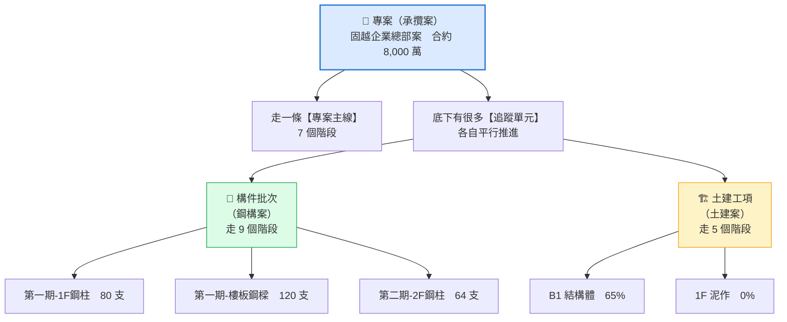
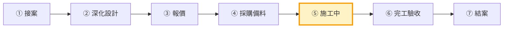
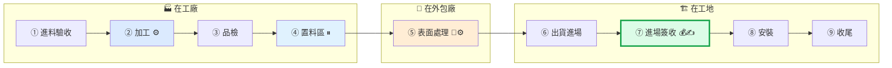
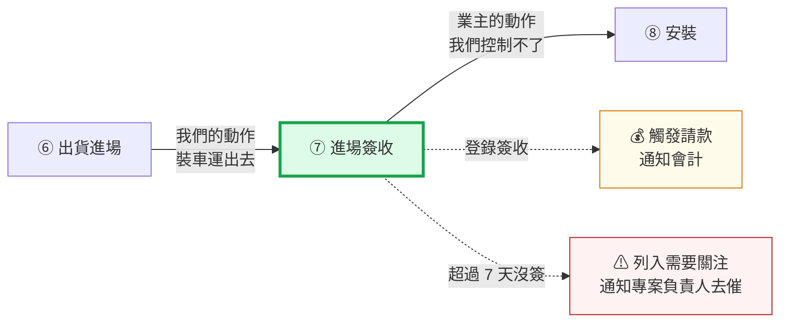
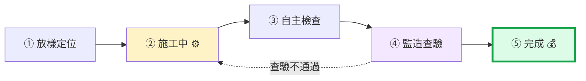
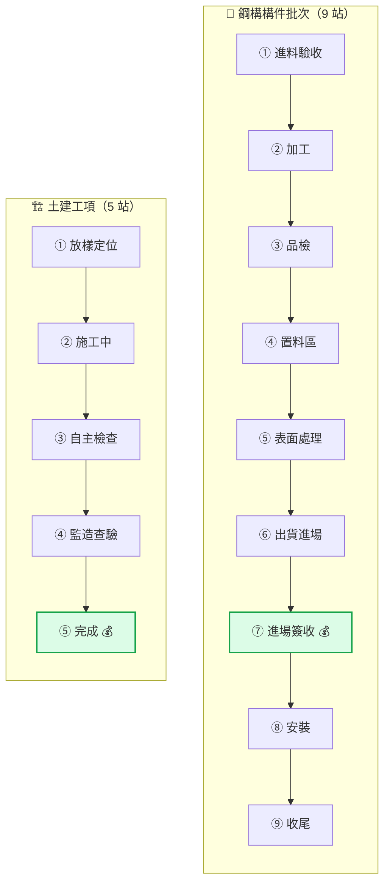
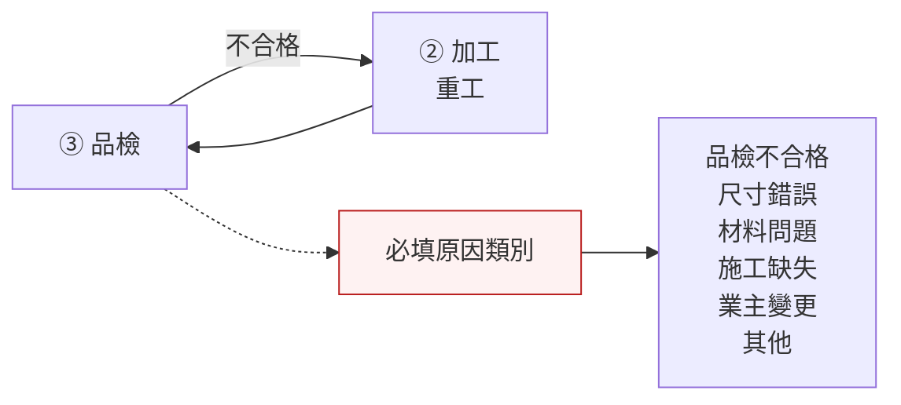
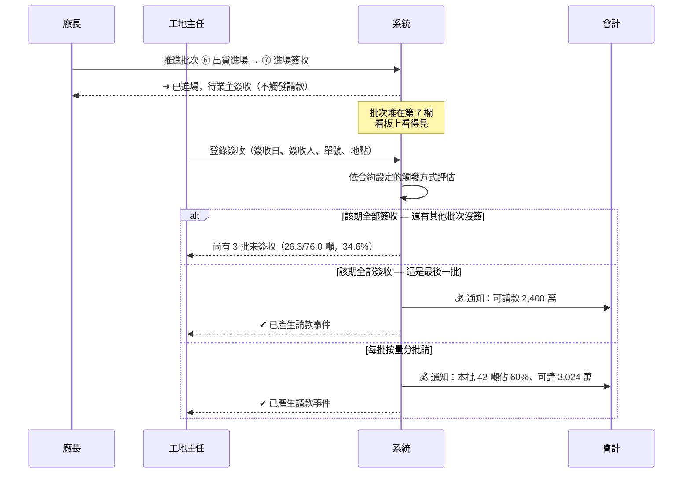

# 12 — 兩種追蹤單元與流程圖

> 鐵正綱工程 內部管理系統
> 2026-08-02｜用途：理解系統的核心設計，並校正流程是否符合實際作業

---

## 1. 為什麼會有「兩種」追蹤單元

因為你們同時做**鋼構**與**土建**，而這兩件事在管理上根本不同。

### 1.1 最根本的差別：一個是「東西」，一個是「事情」

```
構件批次  =  一批實體物件
            80 支 1F 鋼柱。它會被製造、被搬動、被運走、被簽收。
            隨時可以問：「做好幾支了？」→ 48/80 支

土建工項  =  一段現場作業
            B1 結構體。它不會移動，是人去那裡把它做出來。
            沒辦法問「做好幾個了」，只能問：「做到幾成？」→ 65%
```

**為什麼進度要用不同方式算**：灌漿灌到一半，你沒辦法說「完成了 0.5 座結構體」。但 80 支鋼柱做好 48 支，就是實實在在的 48 支。

### 1.2 完整對照

| 面向 | 🔩 構件批次（鋼構） | 🏗 土建工項 |
|---|---|---|
| **本質** | 實體物件的集合 | 一段施工作業 |
| **在哪發生** | 工廠 → 外包廠 → 工地 | **只在工地** |
| **會不會移動** | **會**，而且移動很多次 | 不會 |
| **誰執行** | 廠內師傅／外包協力廠 | **分包商** |
| **進度怎麼算** | 完成數量 ／ 總數量 | 完成百分比 |
| **顯示範例** | `48 / 80 支` | `65%` |
| **論什麼計價** | **論噸**（鋼構慣例） | 論工程數量或總價 |
| **品質關卡** | 廠內品檢 | 自主檢查 ＋ 監造查驗 |
| **誰驗收** | **業主簽收**（進場時） | **監造查驗**（完工時） |
| **階段數** | **9 站** | **5 站** |
| **專屬欄位** | 數量、單位、總重量、外包廠、進出廠日、運輸廠商、簽收四欄 | 分包商、分包契約金額 |

### 1.3 但它們共用同一張資料表

```
tracking_unit（追蹤單元）
  ├─ unit_type = 'batch'      → 構件批次
  └─ unit_type = 'work_item'  → 土建工項
```

**為什麼不分兩張表**：因為它們有 80% 是一樣的——都要指派負責人、都要推進階段、都要記錄歷程、都有狀態燈號、都會被指派給某個人、都可能觸發請款。

分兩張表的話，這 80% 的程式碼要寫兩遍，日後改一個地方要記得改兩處。共用一張表後：

- 「我的工作」畫面一次撈出兩種，師傅不用切換
- 「需要關注」清單一次列出兩種
- 階段推進、歷程、通知的邏輯只寫一份

差異只在**進度怎麼表達**，系統用一個統一欄位 `completion_ratio` 處理掉——構件批次算數量、土建工項用百分比，前端只要一個進度條元件。

---

## 2. 階段模板是什麼

### 2.1 一句話

> **階段模板就是「一條流程」，而且它是資料，不是程式碼。**

```
階段模板「鋼構構件批次」
  ├─ 第 1 站  進料驗收
  ├─ 第 2 站  加工
  ├─ 第 3 站  品檢
  ├─ …
  └─ 第 9 站  收尾
```

每個追蹤單元指向一個模板，然後沿著這個模板的階段往前走。

### 2.2 為什麼要做成「模板」而不是寫死

如果把 9 個階段寫死在程式裡：

- 你哪天想在「品檢」後面加一站「補漆」→ **要改程式、重新部署**
- 你想把「置料區」的停滯警示從 14 天改成 7 天 → **要改程式**
- 你接了一個特殊案子，流程跟平常不一樣 → **沒辦法**

做成資料之後，這些都在 Django Admin 點一點就好。**流程是會變的，程式不該跟著變。**

### 2.3 目前有三個模板

| 模板 | 用在哪 | 階段數 |
|---|---|---|
| **專案主線** | 每個專案本身 | 7 |
| **鋼構構件批次** | 鋼構案的追蹤單元 | **9** |
| **土建工項** | 土建案的追蹤單元 | **5** |

建立專案時選「鋼構」，系統就自動套用鋼構模板；選「土建」就套土建模板；選「混合」則兩種都能建。

### 2.4 每個階段可以帶五個旗標

階段不只是一個名字，它還告訴系統「到這一站要做什麼事」：

| 旗標 | 意義 | 用在哪一站 |
|---|---|---|
| 💰 **觸發請款** | 此站完成條件達成 → 請款里程碑轉「可請款」，通知會計 | 鋼構「進場簽收」、土建「完成」 |
| ✍ **需登錄簽收** | 要填簽收日／簽收人／單號。與 💰 併用時，改為**登錄簽收後**才觸發 | 鋼構「進場簽收」 |
| 🚚 **需填協力廠** | 沒填就自動列入「需要關注」 | 鋼構「表面處理」 |
| ⏸ **等待中** | 不計入產能佔用 | 鋼構「置料區」 |
| ⚙ **核心加值** | 工時計入 OEE 與加工成本 | 鋼構「加工」「表面處理」、土建「施工中」 |

另外每站可設 **停滯天數門檻**——停留超過這個天數，系統自動列入「需要關注」並通知。

---

## 3. 流程圖

### 3.1 全景：三層結構



**關鍵**：主線只有一條，底下的追蹤單元有很多條、且**各自進度不同**。

固越案現在在「施工中」，但底下同時有：1F鋼柱已運到工地、樓梯鋼構堆在置料區、2F鋼柱送外廠噴砂。

傳統的「專案完成 65%」這種單一數字，完全反映不出這個狀況。

---

### 3.2 專案主線（7 階段）— 所有專案共用



| # | 階段 | 誰負責 | 卡住的樣子 | 停滯警示 |
|---|---|---|---|---|
| 1 | 接案 | 經營者、專案負責人 | — | — |
| 2 | 深化設計 | 工程 | 圖說遲遲未定，後段全部延後 | 30 天 |
| 3 | 報價 | 專案負責人 | 報價出去沒回音 | 14 天 |
| 4 | 採購備料 | 採購 | 料沒到，廠內開天窗 | — |
| 5 | **施工中** | 廠長、工地主任 | **底下的追蹤單元在跑** | — |
| 6 | 完工驗收 | 專案負責人、品保 | 缺失改善拖延 | — |
| 7 | 結案 | 會計、經營者 | 尾款收不回來 | — |

> 💡 第 5 站「施工中」是主線停留最久的地方——**真正的細節在底下的追蹤單元**。

---

### 3.3 🔩 鋼構構件批次（9 階段）



**為什麼有 9 站？因為東西會移動，每次移動都是一個可能卡住的點。**

| # | 階段 | 東西在哪 | 誰負責 | 這一站可能卡什麼 | 旗標 | 停滯 |
|---|---|---|---|---|---|---|
| 1 | 進料驗收 | 工廠 | 倉管、品保 | 鋼材沒到、材質證明不齊 | | 7 天 |
| 2 | **加工** | 工廠 | 廠長、師傅 | 產能不足、機台故障、換線 | ⚙ | — |
| 3 | 品檢 | 工廠 | 品保 | 尺寸不合、焊道有瑕疵 | | 3 天 |
| 4 | 置料區 | 工廠 | 倉管 | **做好了但沒地方送**、等工地進度 | ⏸ | 14 天 |
| 5 | 表面處理 | **外包廠** | 廠長、採購 | **料送出去忘了追**、外包廠延誤 | 🚚⚙ | — |
| 6 | 出貨進場 | 運送中 | 廠長、運輸行 | 車調不到、工地無法收料 | | 3 天 |
| 7 | **進場簽收** | **工地** | 工地主任 | **業主遲遲不簽 → 請款卡住** | 💰✍ | **7 天** |
| 8 | 安裝 | 工地 | 工地主任 | 吊車排不到、天候 | | — |
| 9 | 收尾 | 工地 | 工地主任 | 缺失改善拖延 | | 14 天 |

#### 三站特別說明

**④ 置料區 ⏸** — 加工完成但還不能出貨（工地還沒準備好收）。標成「等待中」是為了**不計入產能佔用**，否則會誤以為產線很忙。停留 14 天以上代表積壓，要警示。

**⑤ 表面處理 🚚** — 通常送外包噴砂／鍍鋅。在傳統系統裡這叫「已出庫」，東西就從帳上消失了。這裡它**仍在帳上，只是位置變成「全興噴砂廠」**，並且系統會追「預計出廠日」——逾期沒回來就自動示警。

**⑦ 進場簽收 💰✍** — **這是整個系統最重要的一站。**

---

### 3.4 為什麼「簽收」要獨立成一站



如果把簽收併在「出貨進場」裡，**「已送到但業主還沒簽」這個訊號就被藏起來了**。

獨立成一站之後，看板上這些批次會**堆在第 7 欄**：

```
【⑥ 出貨進場 2】【⑦ 進場簽收 5】【⑧ 安裝 1】
                      ↑
              5 批卡在這裡沒簽收
              = 請款卡住，一眼看見
```

---

### 3.5 🏗 土建工項（5 階段）



**為什麼只有 5 站？因為東西不動，人去做。**

沒有「進料驗收」（材料是分包商自己準備）、沒有「置料區」（沒有東西要暫存）、沒有「出貨進場」（本來就在工地）、沒有「表面處理」（沒有外包加工）。

| # | 階段 | 誰負責 | 這一站可能卡什麼 | 旗標 | 停滯 |
|---|---|---|---|---|---|
| 1 | 放樣定位 | 工地主任 | 測量放樣、假設工程未就緒 | | — |
| 2 | **施工中** | 工地主任、分包商 | 分包商人力不足、天候、料未到 | ⚙ | — |
| 3 | 自主檢查 | 工地主任、品保 | 自主檢查表未完成 | | 7 天 |
| 4 | 監造查驗 | 專案負責人 | **監造排不出時間、查驗不通過** | | 14 天 |
| 5 | **完成** | 專案負責人 | — | 💰 | — |

#### 與鋼構的關鍵差異：什麼時候可以計價

```
鋼構：⑦ 進場簽收  →  需要「登錄簽收資料」才觸發   💰✍
土建：⑤ 完成      →  推進到這一站就直接觸發       💰
```

**為什麼土建不用另外簽收**：監造查驗通過本身就等同於鋼構的業主簽收。查驗通過 = 這個工項可以計價了，不需要再多一道手續。

---

### 3.6 兩種流程並排比較



| 對應關係 | 鋼構 | 土建 |
|---|---|---|
| 準備 | ① 進料驗收 | ① 放樣定位 |
| **做** | ② 加工 | ② 施工中 |
| 自己檢查 | ③ 品檢 | ③ 自主檢查 |
| 中間搬運 | ④ 置料區　⑤ 表面處理　⑥ 出貨進場 | **（無，東西不動）** |
| **對方驗收** | ⑦ 進場簽收 | ④ 監造查驗 |
| **可計價** | ⑦（登錄簽收後） | ⑤ 完成 |
| 收尾 | ⑧ 安裝　⑨ 收尾 | **（無，做完就是做完）** |

**鋼構多出來的四站，全部是因為「東西會移動」。**

---

### 3.7 回退：品質不合格怎麼辦

兩種流程都可以往回退：



**回退一定要填原因類別**，這不是為了追究責任，是為了**累積資料**：

- 回退一次 → 狀態自動轉「注意」
- 回退兩次以上 → 升級「延誤」並通知專案負責人
- 前四種原因會歸入 P3 的「品質失敗成本」（PAF 模型，手冊第 11 章）

P1 就開始收集，到 P3 才有一年份的歷史資料可以分析「我們的品質成本到底花在哪」。

---

## 4. 請款怎麼被觸發（完整時序）



四種觸發方式（**依合約逐筆設定**）：

| 觸發方式 | 何時產生請款 | 幾筆 | 適合的合約寫法 |
|---|---|---|---|
| **手動** | 會計自己建 | 1 | 「簽約後支付訂金 30%」 |
| **該期全部簽收** | 最後一批簽收時 | 1（全額） | 「該期構件全數運抵並簽收後」 |
| **累計重量達門檻** | 累計噸數 ≥ 門檻 | 1（全額） | 「該期交付達 80% 後」 |
| **每批按量分批請** | 每批簽收各產生一筆 | N | 「按實際交付數量分批計價」 |

---

## 5. 混合案怎麼辦

有些案子土建、鋼構都做（如彰化食品廠房擴建）。建立專案時選「**混合**」，底下就可以**同時建兩種追蹤單元**：

```
彰化食品廠房擴建（混合）
  ├─ 🔩 第一期-H型鋼柱　32 支　　→ 走鋼構 9 站
  └─ 🏗 B1 結構體　　　　65%　　 → 走土建 5 站
```

兩者在同一個專案下、同一個看板上，但各自走各自的流程。

---

## 6. 請你確認的事

這是這份文件真正的目的。

### 6.1 鋼構 9 站

- [ ] **順序對嗎？** 特別是「置料區」在品檢之後、表面處理之前
- [ ] **「進場簽收」的位置對嗎？** ⚠️ 最重要
      目前設在「出貨進場」之後、「安裝」之前——**東西送到工地，業主點收，然後才安裝**。
      若實務上是**安裝完才簽收**，這一站要移到第 8 站之後
- [ ] **有沒有漏掉的站？** 例如：預組、試組、鍍鋅、二次加工
- [ ] **有沒有多餘的站？** 例如：如果表面處理都自己做，這一站的 🚚 旗標可以拿掉

### 6.2 土建 5 站

- [ ] **這是我提議的預設值，最需要你校正**
- [ ] 你們實際上怎麼切工項？（依樓層？依工種？依區域？）
- [ ] 「自主檢查」與「監造查驗」是兩道分開的手續，還是合成一道？
- [ ] 有沒有「假設工程」「保護措施」這類該獨立成站的作業？

### 6.3 停滯天數門檻

| 階段 | 目前設定 | 合理嗎 |
|---|---|---|
| 鋼構 · 進料驗收 | 7 天 | ☐ |
| 鋼構 · 品檢 | 3 天 | ☐ |
| 鋼構 · 置料區 | 14 天 | ☐ |
| 鋼構 · 出貨進場 | 3 天 | ☐ |
| 鋼構 · **進場簽收** | **7 天** | ☐ |
| 鋼構 · 收尾 | 14 天 | ☐ |
| 土建 · 自主檢查 | 7 天 | ☐ |
| 土建 · 監造查驗 | 14 天 | ☐ |

### 6.4 進度表達方式

- [ ] 構件批次用「完成數量／總數量」，合理嗎？
- [ ] 土建工項用「完成百分比」，合理嗎？還是你們有更精確的方式（如工程數量計價）？

---

## 7. 怎麼改

**現在改成本最低**，因為還沒有真實資料。

改階段只要進 Django Admin：

```
http://localhost:30080/admin/masters/stagetemplate/
→ 點「鋼構構件批次」
→ 下方可以直接增刪階段、調順序、改旗標與停滯天數
```

改完之後**新建立的追蹤單元**就會走新流程。已存在的單元不受影響（它們的歷程記錄的是當時的階段名稱快照）。

如果要大幅調整，跟我說，我改 `seed_masters` 的定義，重跑一次指令就好。

---

## 相關文件

`../開發/01_業務流程與權限.md`｜`../員工手冊.md`｜`../決策紀錄.md`
