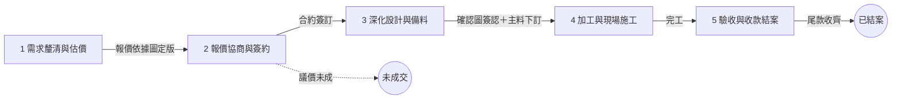

# 鋼構工程專案流程管理規範

版本 v1.0｜2026-08-14｜鐵正綱工程

---

## 0. 文件目的

定義本公司承接鋼構工程專案的完整流程分類：**五大階段、各階段工作項、每個工作項的工作內容與應產出文件**，作為專案管理系統（網站）的開發需求依據，供管理人員使用。

---

## 1. 設計原則（第一性原理）

1. **專案本質是四種轉換**：資訊（需求→圖說）、承諾（意向→合約）、實體（鋼料→結構物）、價值（工作→現金）。
2. **階段邊界＝門檻（gate），門檻判準＝產出物**：說不出跨過門檻時產生哪份文件，就不是階段邊界。
3. **階段與軌道分離**：互斥的事放「階段」；貫穿全程的事（金流、追加減、文件版本）放「平行軌」。
4. **狀態以完成條件定義，不以次數定義**：需求與圖面的往返迭代，交給文件版本號記錄。
5. **兩層追蹤**：專案有唯一「目前階段」；構件批次有獨立子管線，支援分批施工。
6. **階段＝專案重心，非嚴格線性**：個別工作項允許提前或延後完成（如基礎預埋常早於加工完成）。

---

## 2. 專案狀態（與階段正交）

| 狀態 | 說明 |
|------|------|
| 進行中 | 位於五大階段任一階段 |
| 已結案 | 尾款收齊且結案檢討完成 |
| 未成交 | 報價或議價後未簽約（流案），最小化欄位，避免死案殘留 |
| 暫停 | 業主因素暫停，保留現況待恢復 |

> v2 預留：「評估中」售前狀態與案源管理（見第 7 節）。

---

## 3. 五大階段總覽

| # | 階段 | 核心轉換 | 進入條件 | 出口門檻（產出物） |
|---|------|----------|----------|--------------------|
| 1 | 需求釐清與估價 | 資訊 | 接獲詢價 | 報價依據圖定版 |
| 2 | 報價協商與簽約 | 承諾 | 報價依據圖定版 | 合約簽訂（或→未成交） |
| 3 | 深化設計與備料 | 資訊→實體準備 | 合約簽訂 | 確認圖簽認＋主料下訂 |
| 4 | 加工與現場施工 | 實體 | 確認圖簽認 | 全部批次安裝完成 |
| 5 | 驗收與收款結案 | 價值 | 完工 | 尾款收齊＋結案檢討 |



> 金流軌、追加減軌、文件版本軌與主流程平行運作，見第 6 節。

---

## 4. 各階段工作項明細

每個工作項包含：**工作內容／產出物／完成條件**（完成條件即系統勾選判準）。

### 階段 1｜需求釐清與估價

目的：把模糊需求收斂到「可據以報價」的圖面與數量。

**1.1 需求訪談與現場勘查**
- 工作內容：與業主初談（用途、範圍、預算概念、時程期望），現場勘查與拍照。
- 產出物：需求紀錄表、現場照片。
- 完成條件：需求紀錄經內部確認，可安排丈量。

**1.2 估價放樣收點**
- 工作內容：現場丈量取得尺寸與點位，精度以「足以繪圖報價」為準。
- 產出物：丈量／收點紀錄。
- 完成條件：尺寸足以繪製估價圖。

**1.3 估價繪圖與收斂**
- 工作內容：繪製估價圖，與業主往返修改（迭代以版本號記錄 vE1、vE2⋯），計算數量。
- 產出物：估價圖 vEx、數量計算表。
- 完成條件：業主確認圖面可據以報價，標記為「報價依據圖定版」。

**【門檻 1：報價依據圖定版】**

### 階段 2｜報價協商與簽約

目的：鎖定價格、範圍、工期、付款條件。

**2.1 編制報價單與工期**
- 工作內容：依報價依據圖與數量表，編列材料明細與單價、工資、機具、利潤；排定工期。
- 產出物：報價單（詳細材料與單價列表）、甘特圖。
- 完成條件：報價單送出予業主。

**2.2 協商議價與合作模式界定**
- 工作內容：與業主議價；界定供料方（主料／輔料各由誰供）與工項範圍（哪些工程由我方承作）。
- 產出物：議價紀錄、供料與工項範圍界定表。
- 完成條件：雙方就價格與範圍達成一致。

**2.3 簽訂合約**
- 工作內容：擬約／審約，載明付款期別與觸發里程碑（寫入金流軌）。
- 產出物：合約書、付款期別條件。
- 完成條件：雙方用印。

**出口**：簽約完成 → 階段 3；議價未成 → 專案狀態＝未成交。

**【門檻 2：合約簽訂】**

### 階段 3｜深化設計與備料

目的：從「可報價」深化到「可加工、可施工」。

**3.1 施工放樣收點**
- 工作內容：簽約後赴現場精確放樣、收點，確認基準線與水平，供施工圖與預埋定位使用。
- 產出物：施工放樣紀錄、基準點資料。
- 完成條件：精度足以繪製加工圖。

**3.2 施工圖／加工圖繪製**
- 工作內容：繪製施工圖與加工詳圖（Tekla 建模），產出構件清單。
- 產出物：施工圖、加工圖、構件清單、NC1/DSTV 檔。
- 完成條件：圖面內部審核通過。

**3.3 業主圖面簽認【硬門檻】**
- 工作內容：送業主簽認。**未取得簽認不得下料加工**——此為爭議時的法律防線。
- 產出物：簽認確認圖。
- 完成條件：簽認圖簽回。

**3.4 訂料與採購**
- 工作內容：依構件清單開料單；每項料以「主料／輔料 × 業主供／我方採購」四象限管理；追蹤交期與進料驗收。業主供料者仍須追蹤到貨時程與數量點收。長交期料得於簽約後先行下訂（系統標記為例外提前）。
- 產出物：料單、採購單／叫料單、進料驗收紀錄。
- 完成條件：主料到位，可排入生產。

**【門檻 3：確認圖簽認＋主料下訂】**

### 階段 4｜加工與現場施工

目的：構件成形並安裝完成。本階段以「構件批次」為追蹤單位（見第 5 節）。

**4.1 廠內加工**
- 工作內容：下料、切割（TLS 雷射／CNC）、組立、焊接、廠內檢驗。
- 產出物：各批次加工進度回報、（視案件）檢驗紀錄。
- 完成條件：批次加工完成。

**4.2 表面處理**
- 工作內容：熱浸鍍鋅／烤漆／噴漆（自辦或委外），追蹤送出與回廠。
- 產出物：表處完成紀錄。
- 完成條件：批次表處完成。

**4.3 出貨運輸**
- 工作內容：排車、吊車、路線與交管協調。
- 產出物：出貨單。
- 完成條件：批次到場點交。

**4.4 基礎預埋**
- 工作內容：依簽認圖製作預埋件／錨定螺栓與模板，配合土建灌漿時程到場定位安裝。時間上通常為最早的現場工作，常於加工完成前施作；系統允許本項提前完成。
- 產出物：預埋圖（急件可先行送簽認）、預埋完成紀錄與照片。
- 完成條件：預埋完成且複測合格。

**4.5 現場吊裝安裝**
- 工作內容：各批次吊裝、鎖固、焊接、校正，每日回報。（視業主要求：勞安文件、吊裝計畫。）
- 產出物：施工日報、各批次安裝完成照片。
- 完成條件：全部批次安裝完成。

**【門檻 4：完工】**

### 階段 5｜驗收與收款結案

**5.1 完工自主檢查與初驗**
- 工作內容：完工後自主檢查，知會業主辦理初驗。
- 產出物：自主檢查表、初驗紀錄。
- 完成條件：初驗完成。

**5.2 缺失改善與複驗**
- 工作內容：缺失逐項列管、改善、複驗，至通過為止。
- 產出物：缺失清單、改善紀錄、驗收單。
- 完成條件：業主驗收通過。

**5.3 尾款請款與收款**
- 工作內容：依合約請領尾款。
- 產出物：請款單、收款紀錄。
- 完成條件：尾款入帳。

**5.4 結案檢討**
- 工作內容：實際成本 vs 報價逐項比對，檢討差異原因，回饋估價單價資料庫；專案文件歸檔。
- 產出物：成本差異分析表、結案歸檔清單。
- 完成條件：檢討會議完成。

**【結案條件：尾款收齊＋結案檢討完成】**

> 註：結案後業主再提追加工程／追加款項時，以「追加單掛原案」或另立小案處理，規則於 v2 界定（見第 7 節）。

---

## 5. 構件批次子管線

分批施工時，每一批次獨立走以下子管線：

```
待加工 → 加工中 → 加工完成 → 表處中 → 待出貨 → 已出貨 → 已安裝
```

- 專案階段回答「**案子走到哪**」；批次子管線回答「**每批貨走到哪**」。
- 階段 4 的完成條件＝所有批次到達「已安裝」。
- 子管線階段數可依廠內看板實務增減。

---

## 6. 橫跨全程的三條平行軌

### 6.1 金流軌

- 付款期別於簽約時定義（範例：簽約款 → 材料進場款 → 吊裝完成款 → 驗收尾款；實際依各合約）。
- 每期欄位：觸發里程碑、金額／比例、請款單、發票、收款紀錄、狀態（未達里程碑／可請款／已請款／已收款）。
- 里程碑由階段或批次事件自動觸發，例如：主料進料驗收完成 → 進場款轉為「可請款」；全部批次已安裝 → 吊裝完成款轉為「可請款」。

### 6.2 追加減軌

- 流程：變更發生（業主要求或現場狀況）→ 追加減估價 → 業主簽認追加減單【**未簽認不施作**】→ 執行 → 併入對應期別請款。
- 每筆欄位：事由、估價金額、簽認文件、執行狀態、併入合約總價之金額。
- 追加減可發生於簽約後任何時點，為本行業糾紛最大來源，每筆務必取得簽認。

### 6.3 文件版本軌

- 圖面為同一物件的版本演進：估價圖（vE）→ 施工／加工圖 → 簽認確認圖（vC，據以加工）→ 竣工圖（業主要求時）。
- 附掛檔案：NC1/DSTV 檔、數量計算表、構件清單。
- 規則：任何階段引用圖面，一律引用「目前有效版本」。

---

## 7. v2 擴充預留（本版不實作）

| 領域 | 內容 |
|------|------|
| 售前 | 「評估中」狀態、婉拒出口、售前工時成本統計（每張報價單的成本與成交率） |
| 售後 | 保留款／保固期追蹤（承接營造廠案時必要） |
| 品質 | 焊道／尺寸／膜厚檢驗模組（依案件等級） |
| 勞安 | 進場文件與教育訓練追蹤 |
| 結案後追加 | 追加單掛原案 vs 另立子案的判斷規則 |

---

## 8. 名詞定義

| 名詞 | 定義 |
|------|------|
| 估價放樣收點 | 簽約前之現場丈量，精度以「足以繪圖報價」為準 |
| 施工放樣收點 | 簽約後之精確放樣，精度以「足以加工與定位」為準 |
| 放樣／收點 | 放樣＝將圖面基準投放至現場；收點＝將現場尺寸點位量回圖面 |
| 主料／輔料 | 主料＝構成結構主體之鋼材（H 型鋼、C 型鋼、鋼板等）；輔料＝螺栓、焊材、油漆、五金等配件耗材 |
| 基礎預埋 | 澆置混凝土前埋入之錨定螺栓／預埋件，須配合土建時程 |
| 簽認 | 業主於文件上簽名確認，具契約效力之門檻文件 |
| 追加減 | 合約範圍外之增減工程，以業主簽認之追加減單為據 |
| 報價依據圖定版 | 業主確認可據以報價之圖面版本，為階段 1 之出口門檻 |
| 批次 | 依施工順序或運輸分割之構件群組，為階段 4 之追蹤單位 |

---

## 9. 版本紀錄

| 版本 | 日期 | 說明 |
|------|------|------|
| v1.0 | 2026-08-14 | 初版：五大階段＋三平行軌＋批次子管線架構定案 |